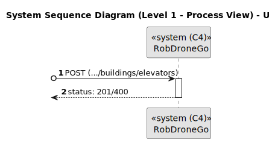
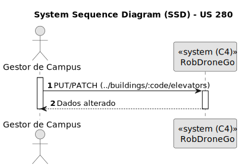
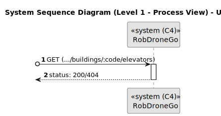
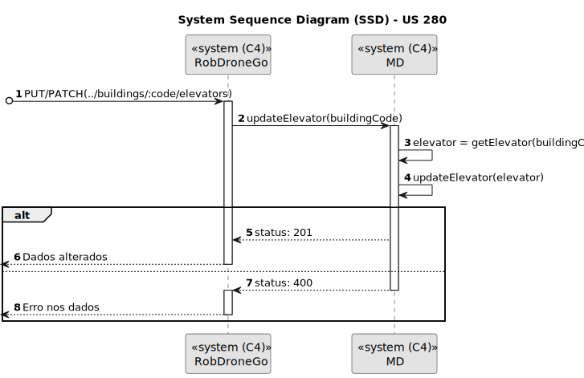
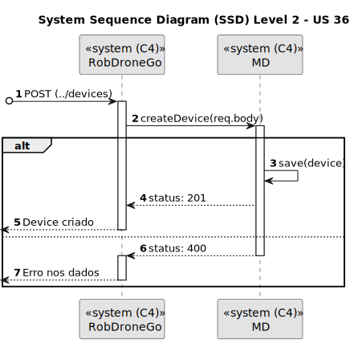
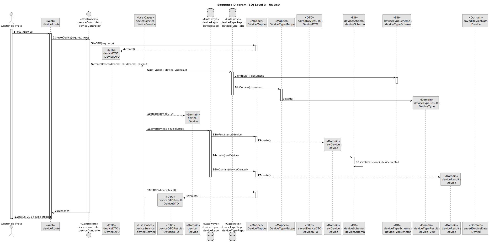

# Modelo de Domínio

# Diagrama de caso de uso

# Vistas

## Nível 1

### Vista Lógica

### Vista de Processos

#### SSD US150 - Criar edifício.

#### SSD US160 - Editar edifício.

#### SSD US170 - Listar todos os edifícios.

#### SSD US180 - Listar edifícios com min e max de pisos.

#### SSD US190 - Criar piso de edifício.

#### SSD U200 - Editar informação de piso de edifício.

#### SSD U210 - Listar todos os pisos de um edificio.

#### SSD U220 - Listar pisos de edifício com passagem para outros edifícios.

#### SSD US230 - Carregar mapa de piso.

#### SSD US240 - Criar passagem entre edifícios.

#### SSD US250 - Editar passagem entre edifícios.

#### SSD US260 - Listar passagens entre 2 edifícios.

#### SSD US270 - Criar elevador em edifício.

#### SSD US280 - Editar elevador em edifício.

#### SSD US290 - Listar elevadores em edifício.

#### SSD US310 - Criar sala de piso de edifício.

#### SSD US350 - Como gestor de frota pretendo adicionar um novo tipo de *robot* indicando a sua designação e que tipos de tarefas pode executar da lista prédefinida de tarefas.

#### SSD US360 - Como gestor de frota pretendo adicionar um novo robot à frota indicando o seu tipo, designação, etc.

#### SSD US370 - Como gestor de frota pretendo inibir um robot.

#### SSD US380 - Como gestor de frota, quero listar todos os pisos de um edificio.

## Nível 2

### Vista Lógica

### Vista de Processos

#### SSD US150 - Criar edifício.

#### SSD US160 - Editar edifício.

#### SSD US170 - Listar todos os edifícios.

#### SSD US180 - Listar edifícios com min e max de pisos.

#### SSD US190 - Criar piso de edifício.

#### SSD U200 - Editar informação de piso de edifício.

#### SSD U210 - Listar todos os pisos de um edificio.

#### SSD U220 - Listar pisos de edifício com passagem para outros edifícios.

#### SSD US230 - Carregar mapa de piso.

#### SSD US240 - Criar passagem entre edifícios.

#### SSD US250 - Editar passagem entre edifícios.

#### SSD US260 - Listar passagens entre 2 edifícios.

#### SSD US270 - Criar elevador em edifício.

#### SSD US280 - Editar elevador em edifício.

#### SSD US290 - Listar elevadores em edifício.

#### SSD US310 - Criar sala de piso de edifício.

#### SSD US350 - Como gestor de frota pretendo adicionar um novo tipo de *robot* indicando a sua designação e que tipos de tarefas pode executar da lista prédefinida de tarefas.

#### SSD US360 - Como gestor de frota pretendo adicionar um novo robot à frota indicando o seu tipo, designação, etc.

#### SSD US370 - Como gestor de frota pretendo inibir um robot.

#### SSD US380 - Como gestor de frota, quero listar todos os pisos de um edificio.

### Vista de Implementação

### Vista Física

### Vista Lógica e de Implementação

## Nível 3 - MD

### Vista Lógica

### Vista de Processos

#### SSD US150 - Criar edifício.

#### SSD US160 - Editar edifício.

#### SSD US170 - Listar todos os edifícios.

#### SSD US180 - Listar edifícios com min e max de pisos.

#### SSD US190 - Criar piso de edifício.

#### SSD U200 - Editar informação de piso de edifício.

#### SSD U210 - Listar todos os pisos de um edificio.

#### SSD U220 - Listar pisos de edifício com passagem para outros edifícios.

#### SSD US230 - Carregar mapa de piso.

#### SSD US240 - Criar passagem entre edifícios.

#### SSD US250 - Editar passagem entre edifícios.

#### SSD US260 - Listar passagens entre 2 edifícios.

#### SSD US270 - Criar elevador em edifício.

#### SSD US280 - Editar elevador em edifício.

#### SSD US290 - Listar elevadores em edifício.

#### SSD US310 - Criar sala de piso de edifício.

#### SSD US350 - Como gestor de frota pretendo adicionar um novo tipo de *robot* indicando a sua designação e que tipos de tarefas pode executar da lista prédefinida de tarefas.

#### SSD US360 - Como gestor de frota pretendo adicionar um novo robot à frota indicando o seu tipo, designação, etc.

#### SSD US370 - Como gestor de frota pretendo inibir um robot.

#### SSD US380 - Como gestor de frota, quero listar todos os pisos de um edificio.

### Vista de Implementação

