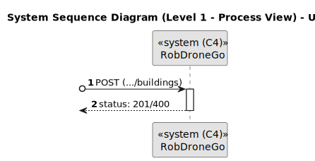
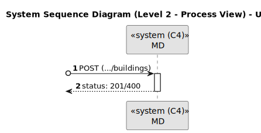

# US 150

Este documento contém a documentação relativa à *User Story (US)* 150.

## 1. Contexto

Esta *US* foi introduzida no *sprint* atual, e requer a funcionalidade de haver a possibilidade de criar edifícios. Esta *US* faz parte do módulo "1.2 Módulo Gestão de Campus".
Esta *US* pertence à unidade curricular de **ARQSI**.

## 2. Requisitos

***US 150*** - Criar um edifício.
__Observações:__ Pedido POST.

A respeito deste requisito, entendemos que deverá ser possível criar um edifício no sistema a desenvolver.

### 2.1. Dependências encontradas

Esta *US* não possui nenhuma dependência.

### 2.2. Critérios de aceitação

**CA 1:** O código do edifício é obrigatório, no máximo 5 caracteres, letras e digitos, podendo conter espaços no meio;
**CA 2:** O nome do edifício é opcional e pode ter no máximo 50 caracteres alfanuméricos;
**CA 3:** A descrição do edifício é opcional e pode ter no máximo 255 caracteres alfanuméricos;
**CA 4:** Deve ser possível indicar a dimensão máxima de cada piso em termos de células (por exemplo, 10 x 10).

## 3. Análise

### 3.1. Respostas do cliente

>**Questão:** "O nome do edifício tem limitações como, por exemplo, tem de ter uma letra e números? E para além do nome do edifício, que mais informação deve ser guardada sobre o edifício."
> 
>**Resposta:** "O código do edifício é obrigatório, no máximo 5 caracteres, letras e digitos, podendo conter espaços no meio. O nome do edifício é opcional, no máximo 50 caracteres alfanuméricos e com uma breve descrição (ex., "departamento de engenharia informática") indicando a dimensão máxima de cada piso em termos de células (ex., 10 x 10)"

>**Questão:** "Em relação à breve descrição, existe alguma regra em particular?"
> 
>**Resposta:** "É opcional, com o máximo de 255 caracteres."

**Nota:** Dada a resposta do cliente, apesar de não ser muito explícita nesse sentido, entendemos que as dimensões do edifício fazem todo o sentido serem obrigatórias.

### 3.2. Diagrama de Sequência do Sistema (Nível 1 - Vista de Processos)

### 3.3. Diagrama de Sequência do Sistema (Nível 2 - Vista de Processos)

## 4. Design

### 4.1. Diagrama de Sequência (Nível 3 - Vista de Processos)

### 4.2. Testes

Para esta *US* foram realizados testes unitários (com isolamento por duplos), testes de integração (com isolamento por duplos)
e testes de sistema/end-to-end (sem isolamento) através do *Postman*.

## 5. Implementação

## 5.1. Arquitetura Onion

### Camada de Domínio

Criou-se a entidade *Building* e os *value object* necessários.

### Camada de Aplicação

Utilizou-se o serviço *BuildingService*.

### Camada de Adaptadores de *Interface*

Utilizou-se o controlador *BuildingController* e o repositório *BuildingRepo*.

### Camada de *Frameworks* e *Drivers*

utilizou-se a persistência *IBuildingPersistence* e o *router* *BuildingRoute*.

## 5.2. Commits Relevantes

[Listagem dos Commits realizados](https://github.com/sem5pi/sem5pi-23-24-50/issues/1)

## 6. Integração/Demonstração

Para a criação de um edificio foi adicionada a rota **../buildings** do tipo *POST*.

Ao realizar o pedido deve ser indicado obrigatoriamente os campos *code*, *numXCells* e *numYCells*, opcionalmente pode ser indicado o campo *name* e *description*.

## 7. Observações

Não existem observações relevantes a acrescentar.
