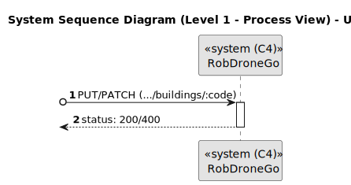
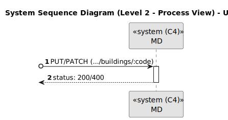
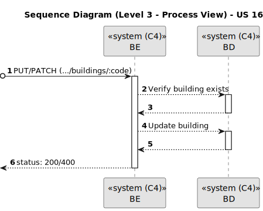

# US 160

Este documento contém a documentação relativa à *User Story (US)* 160.

## 1. Contexto

Esta *US* foi introduzida no *sprint* atual, e requer a funcionalidade de haver a possibilidade de alterar a informação de um edifício. 
Esta *US* faz parte do módulo "1.2 Módulo Gestão de Campus".
Esta *US* pertence à unidade curricular de **ARQSI**.

## 2. Requisitos

***US 160*** - Editar edifício.
__Observações:__ Pedido PUT/PATCH.

A respeito deste requisito, entendemos que deverá ser possível editar a informação de um edifício no sistema a desenvolver.

### 2.1. Dependências encontradas

- **US 150** - Criar um edifício.

	**Explicação:** Se não existir um edifício, não é possível editá-lo.

### 2.2. Critérios de aceitação

**CA 1:** O código do edifício não é passível de ser editado;

**CA 2:** O nome do edifício é opcional e pode ter no máximo 50 caracteres alfanuméricos;

**CA 3:** A descrição do edifício é opcional e pode ter no máximo 255 caracteres alfanuméricos;

**CA 4:** Deve ser possível indicar a dimensão máxima de cada piso em termos de células (por exemplo, 10 x 10).

## 3. Análise

### 3.1. Respostas do cliente

>**Questão:** "Em relação às User Stories de edição, temos já uma ideia das informações que são opcionais, mas queremos 
> ter a certeza daquilo que é editável ou não. Posto isto, poderia indicar que informações pretende editar nas US160...?"
> 
>**Resposta:** "requisito 160 - editar edificio - todas as informações à exceção do código do edificio..."

### 3.2. Diagrama de Sequência do Sistema (Nível 1 - Vista de Processos)

### 3.3. Diagrama de Sequência do Sistema (Nível 2 - Vista de Processos)

### 3.4. Classes de Domínio

## 4. Design

### 4.1. Diagrama de Sequência (Nível 3 - Vista de Processos)

### 4.2. Testes

Para esta *US* foram realizados testes unitários (com isolamento por duplos), testes de integração (com isolamento por duplos)
e testes de sistema/end-to-end (sem isolamento) através do *Postman*.

## 5. Implementação

## 5.1. Arquitetura Onion

### Camada de Domínio

Utilizou-se a entidade *Building* e os respetivos *value object* que já tinham sido criados por outra *US*.

### Camada de Aplicação

Utilizou-se o serviço *BuildingService*.

### Camada de Adaptadores de *Interface*

Utilizou-se o controlador *BuildingController* e o repositório *BuildingRepo*.

### Camada de *Frameworks* e *Drivers*

utilizou-se a persistência *IBuildingPersistence* e o *router* *BuildingRoute*.

## 5.2. Commits Relevantes

[Listagem dos Commits realizados](https://github.com/sem5pi/sem5pi-23-24-50/issues/2)

## 6. Integração/Demonstração

Para editar um edifício foi adicionada a rota **../buildings/:code** do tipo *PUT* ou *PATCH*.

Ao realizar o pedido *PUT* deve ser indicado obrigatoriamente os campos *numXCells* e *numYCells* que correspondem às dimensões 
máxima de cada piso, opcionalmente pode ser indicado o campo *name* e*description*.

Além disso deve ser indicado no *url* o código do edifício pretendido.

Ao realizar o pedido *PATCH* pode ser indicado apenas um dos campos que é pretendido editar.

## 7. Observações

Não existem observações relevantes a acrescentar.