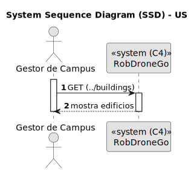
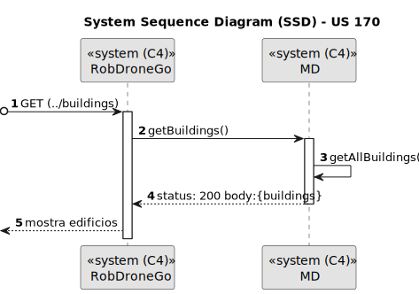
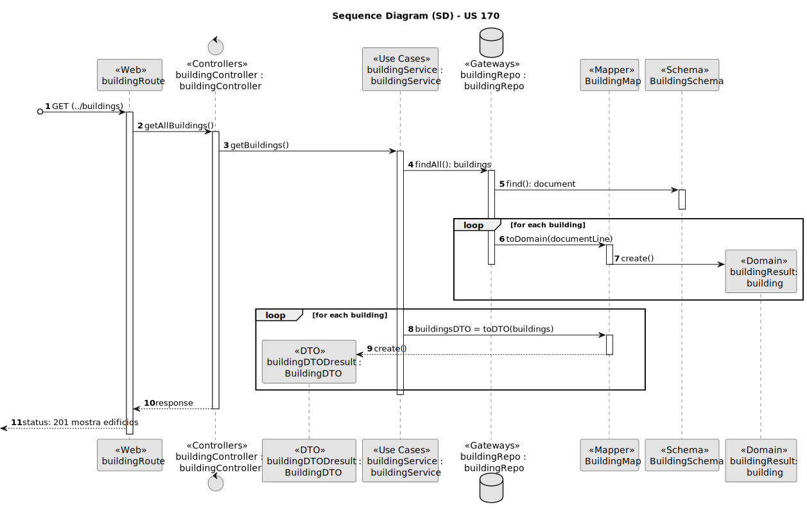

# US 170

Listar todos os edifícios

## 1. Contexto

Introduzida no sprint atual (A).

Faz parte do módulo "1.2 Módulo Gestão de Campus".

Pertence à unidade curricular de **ARQSI**.

## 2. Requisitos

Observações: GET

### 2.1. Dependências encontradas

Esta US depende da US 150, que permite criar edificios.

### 2.2. Critérios de aceitação

* Todos os edificios existentes devem ser listados.

## 3. Análise

### 3.1. Respostas do cliente

Não foram realizadas perguntas ao cliente.

### 3.2. Diagrama de Sequência do Sistema (Nível 1 - Vista de Processos)



### 3.3. Diagrama de Sequência do Sistema (Nível 2 - Vista de Processos)



### 3.4. Classes de Domínio


## 4. Design

### 4.1. Diagrama de Sequência (Nível 3 - Vista de Processos)



### 4.2. Testes

**Teste 1:** *Verifies that it is not possible to create an instance of the Example class with null values.*

```
@Test(expected = IllegalArgumentException.class)
public void ensureNullIsNotAllowed() {
	Example instance = new Example(null, null);
}

## 5. Implementação

*In this section the team should present, if necessary, some evidencies that the implementation is according to the design. It should also describe and explain other important artifacts necessary to fully understand the implementation like, for instance, configuration files.*

*It is also a best practice to include a listing (with a brief summary) of the major commits regarding this requirement.*

## 5.1. Arquitetura Onion
### Camada de Domínio

### Camada de Aplicação

### Camada de Adaptadores de *Interface*

### Camada de *Frameworks* e *Drivers*

## 5.2. Commits Relevantes

[Listagem dos Commits realizados](https://github.com/sem5pi/sem5pi-23-24-50/issues/NUMERO_DA_ISSUE)

*NUMERO_DA_ISSUE é o #número atribuido à issue pelo próprio GitHub*

## 6. Integração/Demonstração

*In this section the team should describe the efforts realized in order to integrate this functionality with the other parts/components of the system*

*It is also important to explain any scripts or instructions required to execute an demonstrate this functionality*

## 7. Observações

*This section should be used to include any content that does not fit any of the previous sections.*

*The team should present here, for instance, a critical prespective on the developed work including the analysis of alternative solutioons or related works*

*The team should include in this section statements/references regarding third party works that were used in the development this work.*