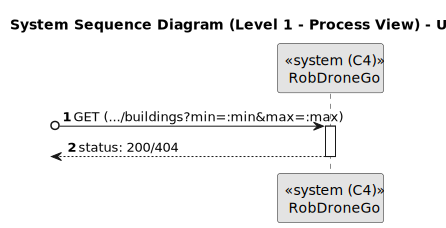
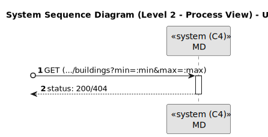
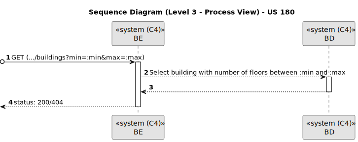

# US 180

Este documento contém a documentação relativa à *User Story (US)* 180.

## 1. Contexto

Esta *US* foi introduzida no *sprint* atual, e requer a funcionalidade de haver a possibilidade de listar edifícios que tenham um número de pisos compreendido entre um dado mínimo e máximo de pisos.
Esta *US* faz parte do módulo "1.2 Módulo Gestão de Campus".
Esta *US* pertence à unidade curricular de **ARQSI**.

## 2. Requisitos

***US 180*** - Como gestor de campus, quero listar edifícios com min e max de pisos.
__Observações:__ Pedido GET.

A respeito deste requisito, entendemos que deverá ser possível um gestor de campus listar os edifícios que contenham um número de pisos compreendido entre um determinado valor mínimo e máximo, no sistema a desenvolver.

### 2.1. Dependências encontradas

- **US 150** - Como gestor de campus, quero criar um edifício.

  **Explicação:** Se não existir edifícios, não é possível listá-los.

- **US 190** - Como gestor de campus, quero criar piso de edifício.

  **Explicação:** É necessário sabermos quantos pisos têm os edifícios para conseguirmos saber se ele tem uma quantidade de pisos compreendido entre um mínimo e um máximo.

### 2.2. Critérios de aceitação

**CA 1:** Os edifícios listados devem conter uma quantidade de pisos maior ou igual a um determinado mínimo, e menor ou igual a um determinado máximo.

**CA 2:** A listagem deve conter a seguinte informação sobre o edifício: código, nome, descrição, dimensões, quantidade de pisos e se contem ou não elevador.

**CA 3:** O caminho da URL deve conter obrigatoriamente os parâmetros referentes ao valor mínimo e máximo de floors, sendo que devem ser números inteiros.

**CA 4:** O número máximo de floors a verificar deve ser maior ou igual do que o número mínimo.

## 3. Análise

### 3.1. Respostas do cliente

**Não foi necessário realizar perguntas ao cliente em função da resolução desta *US*.**

### 3.2. Diagrama de Sequência do Sistema (Nível 1 - Vista de Processos)

### 3.3. Diagrama de Sequência do Sistema (Nível 2 - Vista de Processos)

### 3.4. Classes de Domínio

## 4. Design

### 4.1. Diagrama de Sequência (Nível 3 - Vista de Processos)

### 4.2. Testes

Para esta *US* foram realizados testes unitários (com isolamento por duplos), testes de integração (com isolamento por duplos) e testes de sistema/end-to-end (sem isolamento) através do *Postman*.

## 5. Implementação

## 5.1. Arquitetura Onion
### Camada de Domínio

Utilizou-se a entidade *Building* e *Floor* e os respetivos *value object* que já tinham sido criados por outra *US*.

### Camada de Aplicação

Utilizou-se o serviço *BuildingService*.

### Camada de Adaptadores de *Interface*

Utilizou-se o controlador *BuildingController* e o repositório *BuildingRepo*.

### Camada de *Frameworks* e *Drivers*

Utilizou-se a persistência *IBuildingPersistence* e o *router* *BuildingRoute*.

## 5.2. Commits Relevantes

[Listagem dos Commits realizados](https://github.com/sem5pi/sem5pi-23-24-50/issues/4)

## 6. Integração/Demonstração

Para listar edifícios com um número de pisos entre um determinado mínimo e máximo foi adicionada a rota **(.../buildings?min=:min&max=:max)** do tipo *GET*.

Ao realizar o pedido *GET* deve ser indicado no *url* o número mínimo e máximo de pisos que os edifícios a listar, podem ter.

## 7. Observações

Não existem observações relevantes a acrescentar.
