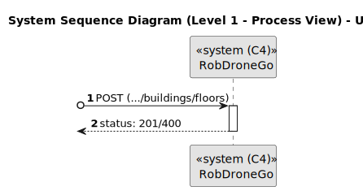

# US 190

Este documento contém a documentação relativa à *User Story (US)* 190.

## 1. Contexto

Esta *US* foi introduzida no *sprint* atual, e requer a funcionalidade de haver a possibilidade de criar pisos de edifícios. 
Esta *US* faz parte do módulo "1.2 Módulo Gestão de Campus".
Esta *US* pertence à unidade curricular de **ARQSI**.

## 2. Requisitos

***US 190*** - Criar piso de edifício.
__Observações:__ Pedido POST.

A respeito deste requisito, entendemos que deverá ser possível criar um piso de um edifício no sistema a desenvolver.

### 2.1. Dependências encontradas

- **US 150** - Criar edifício.

	**Explicação:** Se não existir um edifício, não é possível criar um piso de um edifício.

### 2.2. Critérios de aceitação

**CA 1:** O número do piso é obrigatório e não possui nenhum limite;

**CA 2:** A descrição do piso é opcional e pode ter no máximo 250 caracteres alfanuméricos.

## 3. Análise

### 3.1. Respostas do cliente

>**Questão:** "Não entendemos o que é pretendido com as us's 190..."
> 
>**Resposta:** "...o requisito 190 Criar piso permite definir um piso para um dos edificios criados anteriormente, por exemplo, o piso 1 do edificio B com uma breve descrição (ex., "salas TP")"

>**Questão:** "É esperado que seja imposto um limite aquando da criação de um piso? Ex: 0 <= andar piso <= 100, De forma a evitar valores irrealistas."
>
>**Resposta:** "Não existem limites. podem existir pisos subteraneos, ex., piso -1."
 
>**Questão:** "Relativamente à breve descrição, existirá alguma restrição quanto ao comprimento da mesma, como é o caso da descrição do edifício?"
>
>**Resposta:** "A breve descrição é opcional e no máximo terá 250 caracteres."

### 3.2. Diagrama de Sequência do Sistema (Nível 1 - Vista de Processos)

### 3.3. Diagrama de Sequência do Sistema (Nível 2 - Vista de Processos)

### 3.4. Classes de Domínio

## 4. Design

### 4.1. Diagrama de Sequência (Nível 3 - Vista de Processos)

### 4.2. Testes

Para esta *US* foram realizados testes unitários (com isolamento por duplos), testes de integração (com isolamento por duplos)
e testes de sistema/end-to-end (sem isolamento) através do *Postman*.

## 5. Implementação

## 5.1. Arquitetura Onion

### Camada de Domínio

Criou-se a entidade *Floor* e utilizou-se a entidade *Building* e o *value object* *Description* que já tinham sido criados por outra *US*.

### Camada de Aplicação

Utilizou-se o serviço *BuildingService*.

### Camada de Adaptadores de *Interface*

Utilizou-se o controlador *BuildingController* e o repositório *BuildingRepo*.

### Camada de *Frameworks* e *Drivers*

utilizou-se a persistência *IBuildingPersistence* e o *router* *BuildingRoute*.

## 5.2. Commits Relevantes

[Listagem dos Commits realizados](https://github.com/sem5pi/sem5pi-23-24-50/issues/5)

## 6. Integração/Demonstração

Para a criação de um piso foi adicionada a rota **../buildings/floors** do tipo *POST*.

Ao realizar o pedido deve ser indicado obrigatoriamente os campos *number* e *building*, opcionalmente pode ser indicado o campo *description*.

## 7. Observações

Não existem observações relevantes a acrescentar.