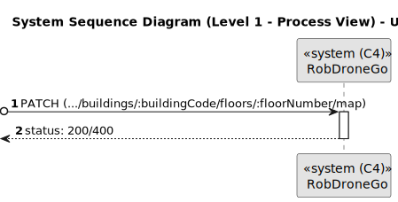
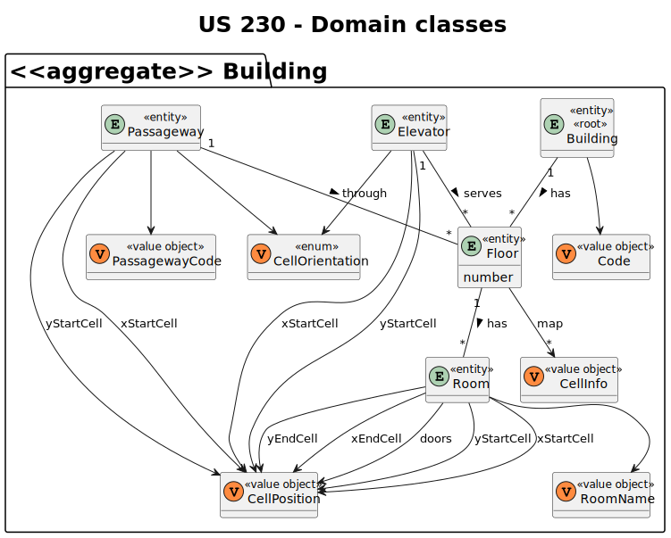
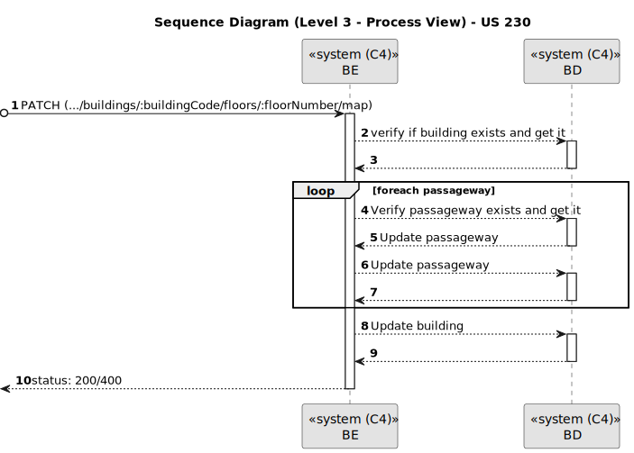

# US 230

Este documento contém a documentação relativa à *User Story (US)* 230.

## 1. Contexto

Esta *US* foi introduzida no *sprint* atual, e requer a funcionalidade de carregar para o sistema o mapa de um dado piso de um certo edifício. Esta *US* faz parte do módulo "1.2 Módulo Gestão de Campus".
Esta *US* pertence à unidade curricular de **ARQSI**.

## 2. Requisitos

***US 230*** - Como gestor de campus, quero carregar mapa de piso.
__Observações:__ Pedido PATCH.

A respeito desta *US* entendemos que deverá ser possível um gestor de campos realizar o carregamento de um mapa de piso de um dado edifício. Desta forma será possível saber qual é a estrutura do piso, ou seja, saber onde ficam as salas, o(s) elevadore(s) e as possíveis passagens entre edifícios.

### 2.1. Dependências encontradas

- **US 190** - Como gestor de campus, quero criar piso de edifício.

  **Explicação:** É necessário que exista um piso no edifício ao qual o mapa carregado irá corresponder.

- **US 150** - Como gestor de campus, quero criar um edifício.

  **Explicação:** Herdada da *US* 190.

- **US 240** - Como gestor de campus, quero criar passagem entre edifícios.

  **Explicação:**  É necessário que as possíveis passagens entre edifícios que estão representadas no mapa, estejam criadas no sistema.

- **US 270** - Como gestor de campus, quero criar elevador em edifício.

  **Explicação:** É necessário que o possível elevador que está representado no mapa, esteja criado no sistema.

- **US 310** - Como gestor de campus, quero criar sala de piso de edifício.

  **Explicação:** É necessário que as possíveis salas que estão representadas no mapa, estejam criadas no sistema.

### 2.2. Critérios de aceitação

**CA 1:** O edifício especificado deve existir.
**CA 2:** O tamanho do edifício especificado deve corresponder ao que está já guardado acerca desse mesmo edifício.
**CA 3:** O piso especificado deve existir no edifício especifícado.
**CA 4:** A(s) sala(s) especificada(s) devem pertencer ao piso específicado.
**CA 5:** O elevador especificado deve existir no edifício especificado.
**CA 6:** A(s) passagem(s) específicada(s) devem existir no piso especificado.
**CA 7:** A(s) sala(s) deve(m) ter no mínimo 1 célula.
**CA 8:** O carregamento do mapa é feito através do upload de um ficheiro que contém a informação necessária.
**CA 9:** O ficheiro carregado deve ser validado para garantir que contém a informação necessária.

## 3. Análise

### 3.1. Respostas do cliente

>**Questão:** "Pode explicar o que é pretendido mais concretamente com esta *US*?"
> 
>**Resposta:** "Permite ao utlizador fazer upload de um ficheiro descrevendo o mapa de um dado piso. esse ficheiro deve ser validado se tem a estrutura correta e se obdece ao tamanho máximo definido aquando da criação do edificio"

>**Questão:** "Quando nos referimos a um mapa de um determinado piso de um edifício, qual é, precisamente, o objetivo desse carregamento? Adicionar informações novas a esse piso?
Por exemplo, se considerarmos a situação em que temos um edifício A criado, ao carregar um mapa de piso é suposto criar o piso se ele não existir e adicionar as respetivas salas presentes nesse mapa?"
> 
>**Resposta:** "O edifício e o piso já devem estar criados. a funcionalidade de carregamento do mapa é complementar a esses dois requisitos e permite fazer o upload da planta (mapa) do piso para a posterior visualização"

>**Questão:** "Segundo o que já foi respondido, para carregar o mapa é necessário que já exista o edifício e o piso. Será necessário também ter os elevadores, as salas e as passagens já criadas?.
Assim dessa forma existiria um ficheiro só com as dimensões para a grelha."
> 
>**Resposta:** "Sim, é necessário que essa informação já esteja presente no sistema. quanto ao formato do mapa, será fornecido um projeto exemplo em SGRAI para desenho de labirintos que podme utilizar como base para o módulo de visualização. poderão adaptar o código e o formato de mapa de acordo com o que acharem mais adequado aos requisitos e às vossas decisões de design."

>**Questão:** "Em relação aos atributos que definem uma sala, quais são os limites desejados para o seu nome e descrição.
Ainda, existem algum tamanho mínimo para criar uma sala?"
> 
>**Resposta:** "nome - max 50 caracteres; descrição - max 250 caracteres; tamanho minimo da sala - 1 célula"

>**Questão:** "Gostaria de saber se quando uma sala e criada o mapa do piso deve ser alterado para adicionar está sala e por sua vez quando é carregado um mapa no sistema se as salas do piso devem ser alteradas (por exemplo se o mapa carregado tiver apenas 3 salas e o piso anteriormente tinha 4)"
> 
>**Resposta:** "No futuro existirá um editor de pisos que garantirá toda a consistência de informação. de momento não necessitam fazer tratamento adicional e podme assumir que o utilizador (ou o futuro editor) ntroduz essa informação de forma coerente."

### 3.2. Diagrama de Sequência do Sistema (Nível 1 - Vista de Processos)



### 3.3. Diagrama de Sequência do Sistema (Nível 2 - Vista de Processos)


### 3.4. Classes de Domínio



## 4. Design

### 4.1. Diagrama de Sequência (Nível 3 - Vista de Processos)



### 4.3. Testes

Para esta *US* foram realizados testes unitários (com isolamento por duplos), testes de integração (com isolamento por duplos) e testes de sistema/end-to-end (sem isolamento) através do *Postman*.

## 5. Implementação

## 5.1. Arquitetura Onion
### Camada de Domínio

Utilizou-se a entidade *Building*, *Floor*, *Passageway*, *Elevator* e os respetivos *value object* que já tinham sido criados por outra *US*.

### Camada de Aplicação

Utilizou-se o serviço *BuildingService*.

### Camada de Adaptadores de *Interface*

Utilizou-se o controlador *BuildingController* e o repositório *BuildingRepo*.

### Camada de *Frameworks* e *Drivers*

Utilizou-se a persistência *IBuildingPersistence* e o *router* *BuildingRoute*.

## 5.2. Commits Relevantes

[Listagem dos Commits realizados](https://github.com/sem5pi/sem5pi-23-24-50/issues/9)

## 6. Integração/Demonstração

Para fazer o carregamento do mapa de um piso foi adicionada a rota **.../buildings/:buildingCode/floors/:floorNumber/map** do tipo *PATCH*.

Para fazer este pedido, é necessário enviar um ficheiro com informação em formato JSON, e deve ainda ser indicado no *url* o código do building que contém o piso pretendido, e também o número do piso.


Exemplo de JSON presente no ficheiro enviado no pedido:
```
{
    "floor": {
        "size": {
            "numXCells": 9,
            "numYCells": 8
        },
        "map": [
            [3, 2, 2, 2, 2, 3, 2, 2, 1],
            [1, 0, 0, 0, 0, 1, 0, 0, 1],
            [2, 2, 2, 0, 2, 2, 0, 2, 0],
            [0, 0, 0, 0, 0, 0, 0, 0, 0],
            [3, 2, 2, 2, 2, 2, 0, 0, 1],
            [1, 0, 0, 0, 0, 0, 1, 0, 0],
            [1, 0, 0, 0, 0, 0, 1, 0, 0],
            [2, 2, 2, 2, 2, 2, 2 ,2 ,0]
        ],
        "passageways": [
            {
                "code": "nass",
                "xStartCell": 8,
                "yStartCell": 2,
                "cellOrientation": "west"
            }
        ],
        "elevator": {
            "xStartCell": 8,
            "yStartCell": 5,
            "cellOrientation": "west"
	    },
        "rooms": [
            {
                "name": "lala",
                "xStartCell": 2,
                "yStartCell": 3,
                "xEndCell": 4,
                "yEndCell": 2,
                "doors": [2, 5]
            }
        ]
    }
}
```

## 7. Observações

Não existem observações relevantes a acrescentar.
