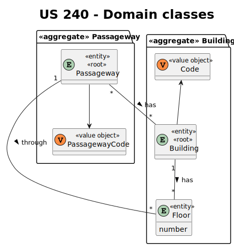
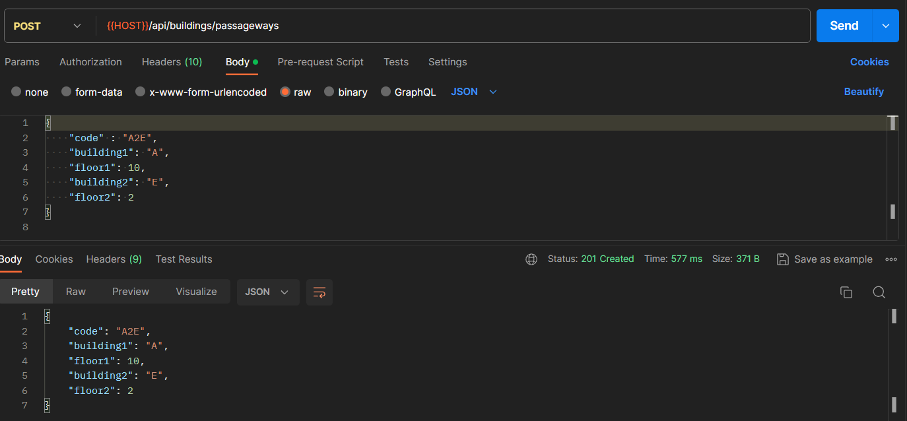

# US 240

Este documento contém a documentação relativa à *User Story (US)* 240.

## 1. Contexto

Esta *US* foi introduzida no *sprint* atual, e requer a funcionalidade de haver a possibilidade de criar passagem entre edifícios. 
Esta *US* faz parte do módulo "1.2 Módulo Gestão de Campus".
Esta *US* pertence à unidade curricular de **ARQSI**.

## 2. Requisitos

***US 240*** - Criar passagem entre edifícios.
__Observações:__ Pedido POST.

A respeito deste requisito, entendemos que deverá ser possível criar várias passagens entre edifícios no sistema a desenvolver.

### 2.1. Dependências encontradas

- **US 190** - Criar piso de edifício.

  **Explicação:** Se não existir um piso de edifício, não é possível criar passagens entre edifícios.

### 2.2. Critérios de aceitação

**CA 1:** Em cada piso podem existir várias passagens, cada uma para outro edificio.

**CA 2:** No mesmo edificio podem existir várias passagens para um outro edificio desde que em pisos diferentes.

## 3. Análise

### 3.1. Respostas do cliente

>**Questão:** "No mesmo edifício é possível ter duas passagens para outro edifício, em pisos diferentes? Por exemplo, do edifício B existir uma passagem para o edifício G no piso 2 e outra no piso 3 também para o G."
> 
>**Resposta:** "Sim, em cada piso podem existir várias passagens, cada uma para outro edificio, e no mesmo edificio podem existir várias passagens para um outro edificio desde que em pisos diferentes."

>**Questão:** "...haverão múltiplas passagens entre 2 edifícios, isto é (por exemplo), haverá múltiplas passagens entre os edifícios A e B em pisos diferentes ou até no mesmo piso?"
>
>**Resposta:** "Sim podem existir várias passagens entre edificios. Por exemplo, no edificio B do ISEP existe uma passagem no piso 2 para o edificio G, uma passagem no piso 3 para o edificio G e uma passagem no piso 3 para o edificio I. Notem que uma vez que as passagens são bidirecionais, uma passagem entre o edificio B e o I, significa que se pode atravessar de B para I ou de I para B."

>**Questão:** "Seria possível dizer o que pretende indicar no que se refere à passagem entre edifícios? Seria apenas os edifícios e os pisos referentes à mesma, ou deve ser dito mais alguma coisa acerca de uma passagem?"
>
>**Resposta:** "...apenas os edificios e os pisos que estão ligados por essa passagem."

### 3.2. Diagrama de Sequência do Sistema (Nível 1 - Vista de Processos)

### 3.3. Diagrama de Sequência do Sistema (Nível 2 - Vista de Processos)

### 3.4. Classes de Domínio

## 4. Design

### 4.1. Diagrama de Sequência (Nível 3 - Vista de Processos)

### 4.2. Testes

Para esta *US* foram realizados testes unitários (com isolamento por duplos), testes de integração (com isolamento por duplos) 
e testes de sistema/end-to-end (sem isolamento) através do *Postman*.

## 5. Implementação

## 5.1. Arquitetura Onion

### Camada de Domínio

Criou-se a entidade *Passageway* e o *value object* *PassagewayCode* e utilizou-se a entidade *Building* e *Floor* que já 
tinham sido criadas por outras *US*.

### Camada de Aplicação

Utilizou-se o serviço *BuildingService*.

### Camada de Adaptadores de *Interface*

Utilizou-se o controlador *BuildingController* e o repositório *BuildingRepo* e *PassagewayRepo*.

### Camada de *Frameworks* e *Drivers*

utilizou-se o *router* *BuildingRoute* e as persistências *IBuildingPersistence* e *IPassagewayPersistence*.

## 5.2. Commits Relevantes

[Listagem dos Commits realizados](https://github.com/sem5pi/sem5pi-23-24-50/issues/10)

## 6. Integração/Demonstração

Para a criação de uma passagem entre edifícios foi adicionada a rota **../buildings/passageways** do tipo *POST*.

Ao realizar o pedido deve ser indicado obrigatoriamente os campos *building1* e *floor1* relacionados ao edifício da passagem
e *building2* e *floor2* relacionados ao outro edifício.

## 7. Observações

Não existem observações relevantes a acrescentar.