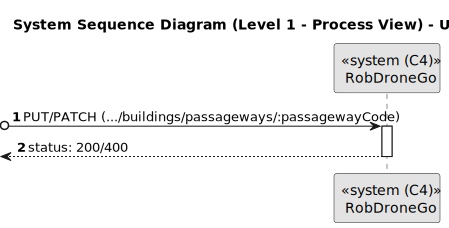
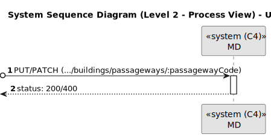
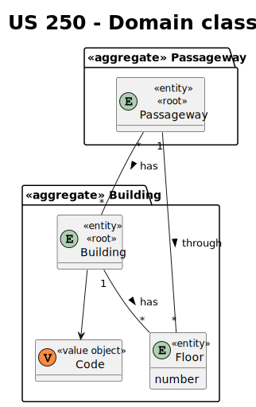
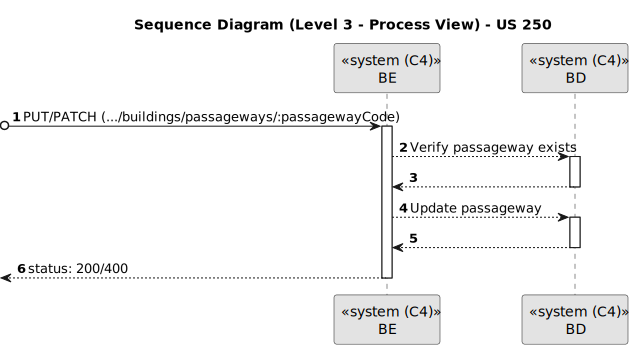

# US 250

Este documento contém a documentação relativa à *User Story (US)* 250.

## 1. Contexto

Esta *US* foi introduzida no *sprint* atual, e requer a funcionalidade de haver a possibilidade de alterar a informação de uma passagem entre edifícios. 
Esta *US* faz parte do módulo "1.2 Módulo Gestão de Campus".
Esta *US* pertence à unidade curricular de **ARQSI**.

## 2. Requisitos

***US 250*** - Como gestor de campus, quero editar passagem entre edifícios.
__Observações:__ Pedido PUT/PATCH.

A respeito deste requisito, entendemos que deverá ser possível um gestor de campus editar a informação referente a uma certa passagem entre dois edifícios, no sistema a desenvolver.

### 2.1. Dependências encontradas

- **US 240** - Como gestor de campus, quero criar passagem entre edifícios.

	**Explicação:** É necessário que seja possível criar uma passagem entre edifícios para que depois possamos editar essa informação.

### 2.2. Critérios de aceitação

**CA 1:** O código da passagem não pode ser editado.
**CA 2:** Podem ser alterada a informação de ambos os edifícios e ambos os pisos.
**CA 3:** Quando alterado um edifício, este deve existir no sistema e o número do piso correspondente no sistema deve existir neste mesmo edifício.
**CA 4:** Quando alterado um piso, este deve existir no edifício que está atualmente registado no sistema.

## 3. Análise

### 3.1. Respostas do cliente

>**Questão:** "O que é que pretende que seja possível editar com esta *US*?"
> 
>**Resposta:** "Deve ser possivel corrigir todos os dados da passagem."

### 3.2. Diagrama de Sequência do Sistema (Nível 1 - Vista de Processos)

### 3.3. Diagrama de Sequência do Sistema (Nível 2 - Vista de Processos)

### 3.4. Classes de Domínio

## 4. Design

### 4.1. Diagrama de Sequência (Nível 3 - Vista de Processos)

### 4.2. Testes

Para esta *US* foram realizados testes unitários (com isolamento por duplos), testes de integração (com isolamento por duplos) e testes de sistema/end-to-end (sem isolamento) através do *Postman*.

## 5. Implementação

## 5.1. Arquitetura Onion
### Camada de Domínio

Utilizou-se a entidade *Passageway* e os respetivos *value object* que já tinham sido criados por outra *US*.

### Camada de Aplicação

Utilizou-se o serviço *PassagewayService*.

### Camada de Adaptadores de *Interface*

Utilizou-se o controlador *PassagewayController* e o repositório *PassagewayRepo*.

### Camada de *Frameworks* e *Drivers*

Utilizou-se a persistência *IPassagewayPersistence* e o *router* *BuildingRoute*.

## 5.2. Commits Relevantes

[Listagem dos Commits realizados](https://github.com/sem5pi/sem5pi-23-24-50/issues/11)

## 6. Integração/Demonstração

Para editar uma passagem entre edifícios foi adicionada a rota **../buildings/:code** do tipo *PUT* ou *PATCH*.

Ao realizar o pedido *PUT* deve ser indicado obrigatoriamente os campos *building1*, *floor1*, *building2* e *floor2*.

Além disso deve ser indicado no *url* o código da passageway pretendido.

Ao realizar o pedido *PATCH* pode ser indicado apenas um dos campos que é pretendido editar.

## 7. Observações

Não existem observações relevantes a acrescentar.
