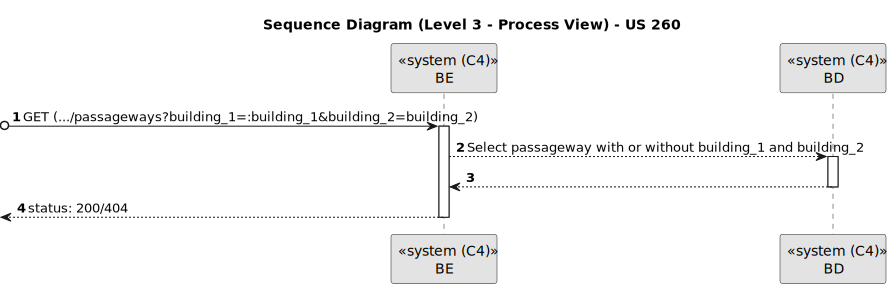

# US 260

Este documento contém a documentação relativa à *User Story (US)* 260.

## 1. Contexto

Esta *US* foi introduzida no *sprint* atual, e requer a funcionalidade de haver a possibilidade de listar as passagens existentes entre dois edifícios.
Esta *US* faz parte do módulo "1.2 Módulo Gestão de Campus".
Esta *US* pertence à unidade curricular de **ARQSI**.

## 2. Requisitos

***US 260*** - Como gestor de campus, quero listar passagens entre 2 edifícios.
__Observações:__ Pedido GET.

A respeito deste requisito, entendemos que deverá ser possível um gestor de campus listar as passagens que existem entre dois edifícios e em que pisos essas passagens ocorrem, no sistema a desenvolver.

### 2.1. Dependências encontradas

- **US 240** - Como gestor de campus, quero criar passagem entre edifícios.

  **Explicação:** É necessário que seja possível criar passagens entre edifícios para depois as poder listar.

- **US 190** - Como gestor de campus, quero criar piso de edifício.

  **Explicação:** Herdada da *US* 240. Sem pisos, não há passagens.

- **US 150** - Como gestor de campus, quero criar um edifício.

  **Explicação:** Herdada da *US* 190. Sem edifícios não há pisos e, consequentemente, não há passagens entre edifícios.

### 2.2. Critérios de aceitação

**CA 1:** O caminho da URL pode conter dois parâmetros, em que neste caso será mostradas as passagens entre esses dois edifícios. Existe também a opção onde não é passado nenhum parâmetro e são listadas todas as passagens entre todos os edifícios.

**CA 2:** A informação devolvida pelo sistema deve ter os seguintes dados: o código e nome dos dois edifícios pela qual a passagem pode ser feita e o respetivo número do piso de ambos os edifícios.

## 3. Análise

### 3.1. Respostas do cliente

>**Questão:** "A US 260 (listar passagens entre 2 edifícios) deixou-nos com uma dúvida: haverão múltiplas passagens entre 2 edifícios, isto é (por exemplo), haverá múltiplas passagens entre os edifícios A e B em pisos diferentes ou até no mesmo piso?

Caso a resposta seja "Sim", surgiram-me as seguintes opções para desenvolver esta US:

-esta listagem refere-se a uma lista de passagens entre (por exemplo) o edifício A e B;
-esta listagem refere-se a uma lista de passagens entre todos os edifícios;

-esta listagem necessita de uma questão ao utilizador para fazer uma das duas opções anteriormente referidas e, após, fazer a listagem.

Qual destas seria a esperada por si?"
> 
>**Resposta:** "Sim podem existir várias passagens entre edificios. Por exemplo, no edificio B do ISEP existe uma passagem no piso 2 para o edificio G, uma passagem no piso 3 para o edificio G e uma passagem no piso 3 para o edificio I.

O objetivo deste requisito é permitir consultar quais as passagens existentes entre dois edificios. se nada for indicado devem ser devolvidas todas as passagens entre todos os edificios. se for indicado um par de edificos devem apenas ser devolvidas as passagens entre esses dois edifcios.

Notem que uma vez que as passagens são bidirecionais, uma passagem entre o edificio B e o I, significa que se pode atravessar de B para I ou de I para B. o par de edificios utilizado para filtrar esta consulta não implica nenhum tipo de restrição no sentido da passagem."

### 3.2. Diagrama de Sequência do Sistema (Nível 1 - Vista de Processos)

### 3.3. Diagrama de Sequência do Sistema (Nível 2 - Vista de Processos)

### 3.4. Classes de Domínio

## 4. Design

### 4.1. Diagrama de Sequência (Nível 3 - Vista de Processos)

### 4.2. Testes

Para esta *US* foram realizados testes unitários (com isolamento por duplos), testes de integração (com isolamento por duplos) e testes de sistema/end-to-end (sem isolamento) através do *Postman*.

## 5. Implementação

## 5.1. Arquitetura Onion
### Camada de Domínio

Utilizou-se a entidade *Passageway*, *Building* e *Floor* e os respetivos *value object* que já tinham sido criados por outra *US*.

### Camada de Aplicação

Utilizou-se o serviço *PassagewayService*.

### Camada de Adaptadores de *Interface*

Utilizou-se o controlador *PassagewayController* e o repositório *PassagewayRepo*.

### Camada de *Frameworks* e *Drivers*

Utilizou-se a persistência *IPassagewayPersistence* e o *router* *PassagewayRoute*.

## 5.2. Commits Relevantes

[Listagem dos Commits realizados](https://github.com/sem5pi/sem5pi-23-24-50/issues/12)

## 6. Integração/Demonstração

Para listar a passagem entre dois edifícios foi adicionada a rota **(.../passageways?building_1=:building_1&building_2=building_2)** do tipo *GET*.

Ao realizar o pedido *GET* pode ou não ser indicado no *url* o código de dois edifícios. Se forem colocados, apenas serão listadas as passagens entre esses dois edifícios específicos, se não, serão listadas todas as passagens entre edifícios existentes.

Demonstração da listagem de todas as passagens entre edifícios.

Demonstração da listagem das passagens entre dois edifícios específicos.

## 7. Observações

Não existem observações relevantes a acrescentar.
