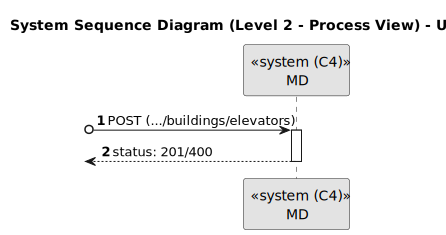
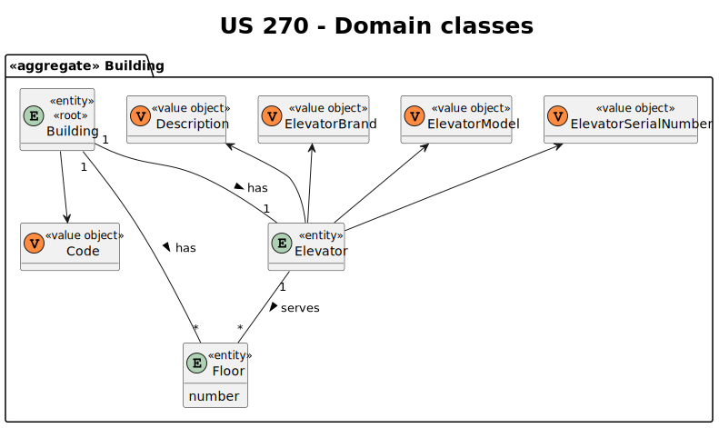
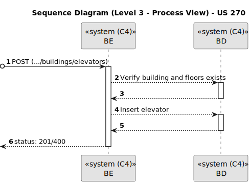
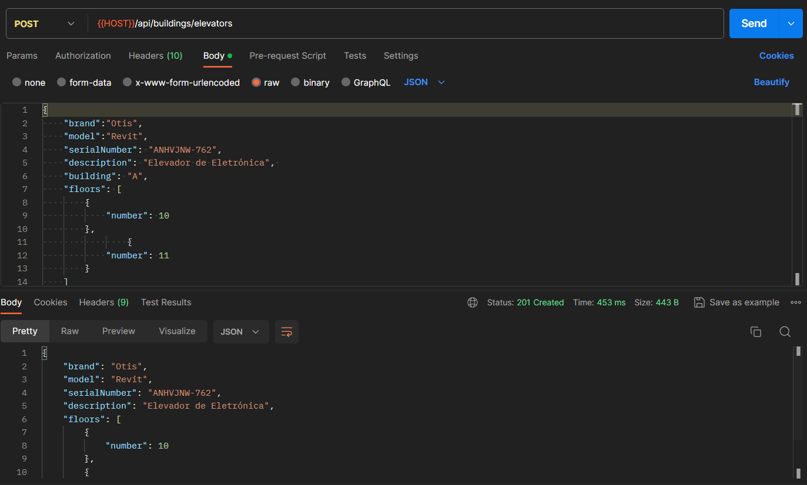

# US 270

Este documento contém a documentação relativa à *User Story (US)* 270.

## 1. Contexto

Esta *US* foi introduzida no *sprint* atual, e requer a funcionalidade de haver a possibilidade de criar elevador em edifícios. 
Esta *US* faz parte do módulo "1.2 Módulo Gestão de Campus".
Esta *US* pertence à unidade curricular de **ARQSI**.

## 2. Requisitos

***US 270*** - Criar elevador em edifício.
__Observações:__ Pedido POST.

A respeito deste requisito, entendemos que deverá ser possível criar um elevador num edifício no sistema a desenvolver 
definindo quais os pisos que este serve.

### 2.1. Dependências encontradas

- **US 190** - Criar piso de edifício.

  **Explicação:** Se não existir um piso de edifício, não é possível criar um elevador para servi-lo.

### 2.2. Critérios de aceitação

**CA 1:** Cada edifício apenas pode conter um elevador;

**CA 2:** Um elevador de um edifício deve servir pelo menos dois pisos;

**CA 3:** A marca do elevador é opcional e pode ter no máximo 50 caracteres alfanuméricos;

**CA 4:** O modelo do elevador é opcional, mas obrigatório se a marca for introduzida e pode ter no máximo 50 caracteres alfanuméricos;

**CA 5:** O número de série do fabricante é opcional e pode ter no máximo 50 caracteres alfanuméricos;

**CA 6:** A descrição do elevador é opcional e pode ter no máximo 250 caracteres alfanuméricos.

## 3. Análise

### 3.1. Respostas do cliente

>**Questão:** "Há alguma restrição para o ID do elevador?"
>
>**Resposta:** "Não sei a que se refere quando refere "ID" assumindo que a sua pergunta é sobre se há necessidade de identificar os elevadores, 
> cada elevador terá um número identificativo único no edificio. De momento assume-se que existe apenas um elevador em cada edificio."
 
>**Questão:** "...gostaria de saber que atributos deveria ter o elevador, para além de uma lista de pisos aos quais consegue aceder dentro do seu edifício?"
>
>**Resposta:** "edificio (obrigatório); número identificativo (obrigatório, único no edificio); lista de pisos do edificio servidos pelo elevador (obrigatório);
marca (opcional, alfanumerico, 50 caracteres); modelo (opcional, mas obrigatório se marca for introduzido, alfanumerico, 50 caracteres);
número de série do fabricante (opcional, alfanumerico, 50 caracteres); breve descrição (opcional, alfanumerico, 250 caracteres)"

### 3.2. Diagrama de Sequência do Sistema (Nível 1 - Vista de Processos)

### 3.3. Diagrama de Sequência do Sistema (Nível 2 - Vista de Processos)

### 3.4. Classes de Domínio

## 4. Design

### 4.1. Diagrama de Sequência (Nível 3 - Vista de Processos)

### 4.2. Testes

Para esta *US* foram realizados testes unitários (com isolamento por duplos), testes de integração (com isolamento por duplos)
e testes de sistema/end-to-end (sem isolamento) através do *Postman*.

## 5. Implementação

## 5.1. Arquitetura Onion

### Camada de Domínio

Criou-se a entidade *Elevator* e os respetivos *value objects* e utilizou-se a entidade *Building* e *Floor* que já tinham sido criadas por outras *US*.

### Camada de Aplicação

Utilizou-se o serviço *BuildingService*.

### Camada de Adaptadores de *Interface*

Utilizou-se o controlador *BuildingController* e o repositório *BuildingRepo*.

### Camada de *Frameworks* e *Drivers*

utilizou-se a persistência *IBuildingPersistence* e o *router* *BuildingRoute*.

## 5.2. Commits Relevantes

[Listagem dos Commits realizados](https://github.com/sem5pi/sem5pi-23-24-50/issues/13)

## 6. Integração/Demonstração

Para a criação de um elevador num edifício foi adicionada a rota **(../buildings/elevators)** do tipo *POST*.

Ao realizar o pedido deve ser indicado obrigatoriamente os campos *building* e *floors*, opcionalmente pode ser indicado 
os campos *brand*, *model*, *serialNumber* e *description*.

## 7. Observações

Não existem observações relevantes a acrescentar.