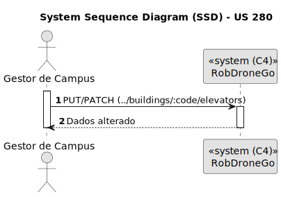
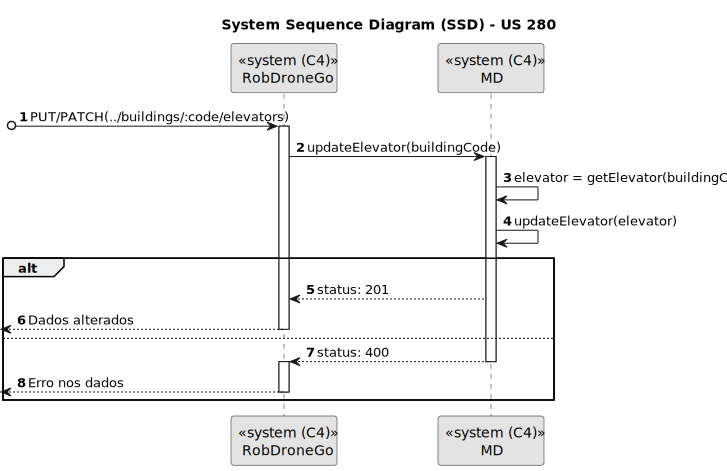
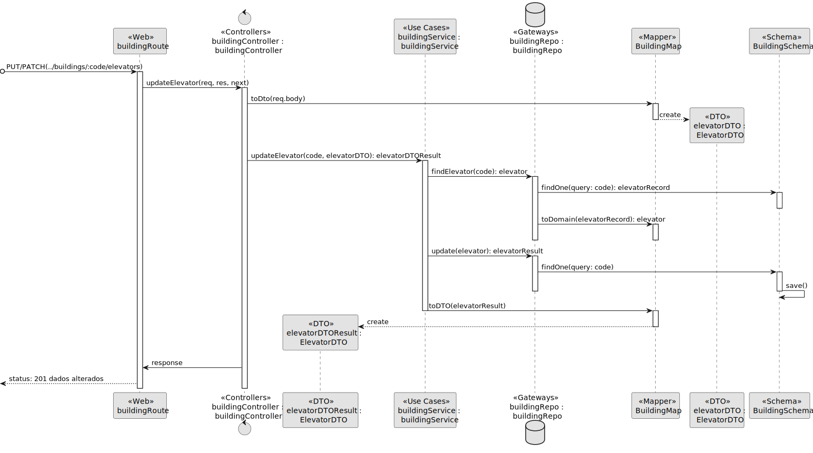

# US 280

Editar elevador em edifício

## 1. Contexto

Introduzida no sprint atual (A).

Faz parte do módulo "1.2 Módulo Gestão de Campus".

Pertence à unidade curricular de **ARQSI**.

## 2. Requisitos

Observações: PUT/PATCH

### 2.1. Dependências encontradas

Esta US depende da US 190, que permite criar elevadores.

### 2.2. Critérios de aceitação

podem ser alteradas todas as informações à exceção do edificio a que o piso se refere.

## 3. Análise

### 3.1. Respostas do cliente

>**Questão:** "
Caro cliente,
Em relação às User Stories de edição, temos já uma ideia das informações que são opcionais, mas queremos ter a certeza daquilo que é editável ou não. Posto isto, poderia indicar que informações pretende editar nas US160, US200, US250 e US280?
Obrigado pela atenção,
Grupo 77.
"
> 
>**Resposta:** "
bom dia
[...]
requisito 280 - editar elevador - todas as informações à exceção do edificio a que o piso se refere
"

### 3.2. Diagrama de Sequência do Sistema (Nível 1 - Vista de Processos)

### 3.3. Diagrama de Sequência do Sistema (Nível 2 - Vista de Processos)

### 3.4. Classes de Domínio

## 4. Design

### 4.1. Diagrama de Sequência (Nível 3 - Vista de Processos)

### 4.2. Testes

## 5. Implementação

## 5.1. Arquitetura Onion

### Camada de Domínio

Utilizou-se a entidade *elevator*.

### Camada de Aplicação
Utilizou-se o serviço *BuildingService*.

### Camada de Adaptadores de *Interface*
Utilizou-se o controlador *BuildingController*, o repositório *BuildingRepo*, o mapper *BuildingMap*, oschema *BuildingSchema* e o DTO *elevatorDTO*.

### Camada de *Frameworks* e *Drivers*
utilizou-se a persistência *IBuildingPersistence* e o *router* *BuildingRoute*.

## 5.2. Commits Relevantes

[Listagem dos Commits realizados](https://github.com/sem5pi/sem5pi-23-24-50/issues/14)

## 6. Integração/Demonstração

## 7. Observações

Não existem observações relevantes a acrescentar.