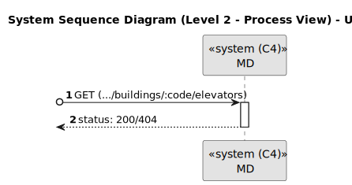

# US 290

Este documento contém a documentação relativa à *User Story (US)* 290.

## 1. Contexto

Esta *US* foi introduzida no *sprint* atual, e requer a funcionalidade de haver a possibilidade de listar elevedores em edifício.
Esta *US* faz parte do módulo "1.2 Módulo Gestão de Campus".
Esta *US* pertence à unidade curricular de **ARQSI**.

## 2. Requisitos

***US 290*** - Listar elevadores em edifício.
__Observações:__ Pedido GET.

A respeito deste requisito, entendemos que deverá ser possível listar o elevador existente num edifício 
no sistema a desenvolver.

### 2.1. Dependências encontradas

- **US 270** - Criar elevador em edifício.

  **Explicação:** Se não existir elevador no edifício, não é possível listá-lo.

### 2.2. Critérios de aceitação

**CA 1:** Cada edifício apenas pode conter um elevador;

**CA 2:** A listagem deve conter toda a informação do elevador (marca, modelo, número de série, descrição e os pisos que serve).

## 3. Análise

### 3.1. Respostas do cliente

>**Questão:** "Tendo em conta que só há um elevador por edificio, pretende-se saber qual é o elevador de cada edificio? Ou é suposto haver mais do que um elevador num edificio?"
>
>**Resposta:** "...de momento apenas necessitam suportar um elevador por edificio."

>**Questão:** "Que informacoes pretende, então, ver sobre esse elevador?"
>
>**Resposta:** "...pretende-se listar todas as informações do elevador."

### 3.2. Diagrama de Sequência do Sistema (Nível 1 - Vista de Processos)

### 3.3. Diagrama de Sequência do Sistema (Nível 2 - Vista de Processos)

### 3.4. Classes de Domínio

## 4. Design

### 4.1. Diagrama de Sequência (Nível 3 - Vista de Processos)

### 4.2. Testes

Para esta *US* foram realizados testes unitários (com isolamento por duplos), testes de integração (com isolamento por duplos)
e testes de sistema/end-to-end (sem isolamento) através do *Postman*.

## 5. Implementação

## 5.1. Arquitetura Onion

### Camada de Domínio

Utilizou-se a entidade *Building*, *Elevator* e *Floor* e os respetivos *value object* que já tinham sido criados por outra *US*.

### Camada de Aplicação

Utilizou-se o serviço *BuildingService*.

### Camada de Adaptadores de *Interface*

Utilizou-se o controlador *BuildingController* e o repositório *BuildingRepo*.

### Camada de *Frameworks* e *Drivers*

utilizou-se a persistência *IBuildingPersistence* e o *router* *BuildingRoute*.

## 5.2. Commits Relevantes

[Listagem dos Commits realizados](https://github.com/sem5pi/sem5pi-23-24-50/issues/15)

## 6. Integração/Demonstração

Para listar elevadores em edifício foi adicionada a rota **(../buildings/:code/elevators)** do tipo *GET*.

Ao realizar o pedido *GET* deve ser indicado no *url* o código do edifício pretendido.

## 7. Observações

Não existem observações relevantes a acrescentar.