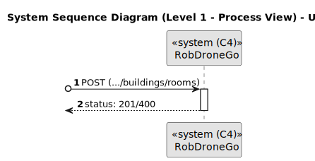
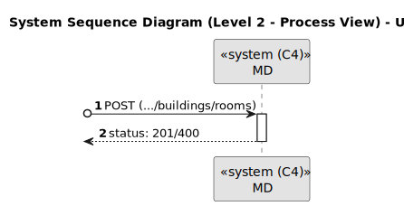
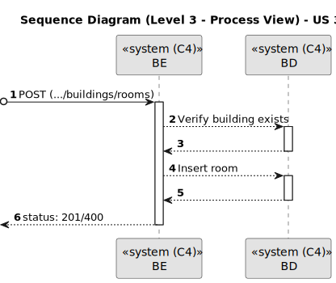

# US 310

Este documento contém a documentação relativa à *User Story (US)* 310.

## 1. Contexto

Esta *US* foi introduzida no *sprint* atual, e requer a funcionalidade de criar uma sala num piso de um dado edifício. Esta *US* faz parte do módulo "1.2 Módulo Gestão de Campus".
Esta *US* pertence à unidade curricular de **ARQSI**.

## 2. Requisitos

***US 310*** - Como gestor de campus, quero criar sala de piso de edifício.
__Observações:__ Pedido POST.

A respeito deste requisito, entendemos que deverá ser possível um gestor de campus criar uma sala que está associada a um determinado piso de um edifício em concreto.

### 2.1. Dependências encontradas

- **US 190** - Como gestor de campus, quero criar piso de edifício.

  **Explicação:** É necessário que exista pelo menos um piso no edifício para que seja possível a existência de uma sala.

- **US 150** - Como gestor de campus, quero criar um edifício.

  **Explicação:** Herdada da *US* 190, pois sem edifício, não há piso, e sem piso não pode haver sala.

### 2.2. Critérios de aceitação

**CA 1:** O nome da sala deve ser único e só pode ter no máximo 50 caracteres.
**CA 2:** As salas podem ser categorizadas em Gabinete, Anfiteatro, Laboratório ou Outro.
**CA 3:** A sala deve conter uma breve descrição.
**CA 4:** A sala deve ter um tamanho mínimo de 1 célula.

## 3. Análise

### 3.1. Respostas do cliente

>**Questão:** "Deveria o nome da sala ser único?"
> 
>**Resposta:** "Sim."

>**Questão:** "Gostaria de saber se quando uma sala é criada o mapa do piso deve ser alterado para adicionar esta sala e por sua vez quando é carregado um mapa no sistema se as salas do piso devem ser alteradas (por exemplo se o mapa carregado tiver apenas 3 salas e o piso anteriormente tinha 4)"
> 
>**Resposta:** "No futuro existirá um editor de pisos que garantirá toda a consistência de informação. de momento não necessitam fazer tratamento adicional e podem assumir que o utilizador (ou o futuro editor) introduz essa informação de forma coerente"

>**Questão:** "Será possível esclarecer como funcionará esta User Story?"
> 
>**Resposta:** "Esta US permite definir uma sala num dado piso de um edificio, exemplo sala 'B310' no 3º piso do edificio B, com uma categorização dessa sala (Gabinete, Anfiteatro, Laboratório, Outro) e uma breve descrição, ex., 'Laboratório de Engenharia de Qualidade'"
>
>**Questão:** "Para além do que foi dito, devem também ser especificadas as dimensões e posições das salas dentro do piso? Isso ajudaria a evitar a sobreposição de salas com elevadores e até mesmo com outras salas."
>
>**Resposta:** "Essa informação é necessária para o sistema como indicado no RFP. Pode ser recolhida ao criar a sala no requisito 310 ou pode fazer parte do ficheiro que é carregado no requisito 230"

>**Questão:** "Em relação aos atributos que definem uma sala, quais são os limites desejados para o seu nome e descrição.
Ainda, existem algum tamanho mínimo para criar uma sala?"
>
>**Resposta:** "Nome - max 50 caracteres; Descrição - max 250 caracteres; Tamanho mínimo da sala - 1 célula"

### 3.2. Diagrama de Sequência do Sistema (Nível 1 - Vista de Processos)

### 3.3. Diagrama de Sequência do Sistema (Nível 2 - Vista de Processos)

### 3.4. Classes de Domínio

## 4. Design

### 4.1. Diagrama de Sequência (Nível 3 - Vista de Processos)

### 4.2. Diagrama de Classes

### 4.3. Testes

Para esta *US* foram realizados testes unitários (com isolamento por duplos), testes de integração (com isolamento por duplos)
e testes de sistema/end-to-end (sem isolamento) através do *Postman*.

## 5. Implementação

## 5.1. Arquitetura Onion
### Camada de Domínio

Criou-se a entidade *Room* e os *value object* *RoomName*, *RoomCategory* e *CellPosition*. Também se utilizou a entidade *Building* e o *value object* *Description* que já tinham sido criados por outra *US*.

### Camada de Aplicação

Utilizou-se o serviço *BuildingService*.

### Camada de Adaptadores de *Interface*

Utilizou-se o controlador *BuildingController* e o repositório *BuildingRepo*.

### Camada de *Frameworks* e *Drivers*

Utilizou-se a persistência *IBuildingPersistence* e o *router* *BuildingRoute*.

## 5.2. Commits Relevantes

[Listagem dos Commits realizados](https://github.com/sem5pi/sem5pi-23-24-50/issues/17)

## 6. Integração/Demonstração

Para a criação de uma sala de um piso foi adicionada a rota **../buildings/rooms** do tipo *POST*.

Ao realizar o pedido deve ser indicado obrigatoriamente os campos *name*, *category*, *building* e *floor*, opcionalmente pode ser indicado o campo *description*.

## 7. Observações

Não existem observações relevantes a acrescentar.
