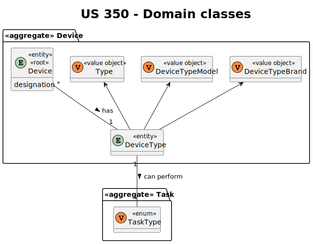
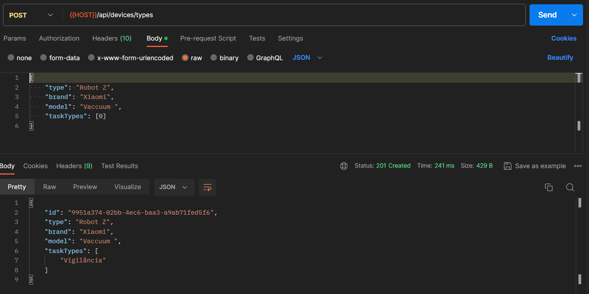

# US 350

Este documento contém a documentação relativa à *User Story (US)* 350.

## 1. Contexto

Esta *US* foi introduzida no *sprint* atual, e requer a funcionalidade de haver a possibilidade de adicionar um novo tipo de *robot*. 
Esta *US* faz parte do módulo "1.3 Módulo Gestão de Frota".
Esta *US* pertence à unidade curricular de **ARQSI**.

## 2. Requisitos

***US 350*** - Como gestor de frota pretendo adicionar um novo tipo de robot indicando a sua designação e que tipos de tarefas pode executar da lista prédefinida de tarefas
__Observações:__ Pedido POST.

A respeito deste requisito, entendemos que deverá ser possível um gestor de frota criar um novo tipo de robot no sistema a desenvolver.

### 2.1. Dependências encontradas

Esta *US* não possui nenhuma dependência.

### 2.2. Critérios de aceitação

**CA 1:** O tipo de *robot* é obrigatório e pode ter no máximo 25 caracteres alfanuméricos;
**CA 2:** A marca é obrigatória e pode ter no máximo 50 caracteres;
**CA 3:** O modelo é obrigatório e pode ter no máximo 50 caracteres.

## 3. Análise

### 3.1. Respostas do cliente

>**Questão:** "Existem diferentes tipos de tarefas, por isso, cada uma terá os seus atributos. No entanto, que atributos
> definem uma tarefa em geral? Apenas a sua designação?"
>
>**Resposta:** "...de momento todos os robots da frota apenas suportam estes dois tipos de tarefas. A existirem novos tipos
> de tarefas será necessáiro desenvolvimento especifico para tal. Em consequência não existem "tarefas em geral"".

>**Questão:** "Poderia explicar as diferenças entre estas duas user stories, US350 e US360?"
> 
>**Resposta:** "...o requisito 350 permite definir que tipos de robots existem. por exemplo "Tipo A: Robot marca X modelo Y 
> com capacidade de executar tarefas de vigilância" e "Tipo B: Robot marca W modelo Z com capacidade de executar tarefas de vigilância e pickeup&delivery"
o requisito 360 permite indicar que robots existem e de que tipo cada um é, por exemplo "Robot 'ABC32' do tipo A", "Robot 'Brian2' do tipo A" e "Robot 'Stew' do tipo B"

>**Questão:** "Pretende alguma regra de negócio para o limite de caracteres para o tipo, marca e modelo?"
>
>**Resposta:** "tipo de robot: obrigatório, alfanum+ericos, maximo 25 caracteres
marca: obrigatório, maximo 50 caracteres
modelo: obrigatório, máximo 100 caracteres"

> >**Questão:** "Em relação aos atributos do tipo de robot existe alguma condição no modelo do tipo de  robot, por exemplo: podemos ter  um robot da marca A e modelo A1 e outro marca B e modelo A1?"
>
>**Resposta:** "Marca e modelo são dois atributos de texto livre. O sistema não impoe restrições"

### 3.2. Diagrama de Sequência do Sistema (Nível 1 - Vista de Processos)

### 3.3. Diagrama de Sequência do Sistema (Nível 2 - Vista de Processos)

### 3.4. Classes de Domínio

## 4. Design

### 4.1. Diagrama de Sequência (Nível 3 - Vista de Processos)

### 4.2. Testes

Para esta *US* foram realizados testes unitários (com isolamento por duplos), testes de integração (com isolamento por duplos)
e testes de sistema/end-to-end (sem isolamento) através do *Postman*.

## 5. Implementação

## 5.1. Arquitetura Onion

### Camada de Domínio

Criou-se a entidade *DeviceType* e os respetivos *value objects*.

### Camada de Aplicação

Utilizou-se o serviço *DeviceTypeService*.

### Camada de Adaptadores de *Interface*

Utilizou-se o controlador *DeviceTypeController* e o repositório *DeviceTypeRepo*.

### Camada de *Frameworks* e *Drivers*

Utilizou-se o *router* *DeviceRoute* e a persistência *IDeviceTypePersistence*.

## 5.2. Commits Relevantes

[Listagem dos Commits realizados](https://github.com/sem5pi/sem5pi-23-24-50/issues/18)

## 6. Integração/Demonstração

Para a criação de novo tipo de *robot* foi adicionada a rota **.../devices/types** do tipo *POST*.

Ao realizar o pedido deve ser indicado obrigatoriamente os campos *type*, *brand*, *model* e *taskTypes* que corresponde 
às tarefas que este tipo de robot pode realizar.

## 7. Observações

Não existem observações relevantes a acrescentar.