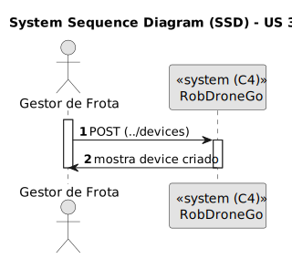
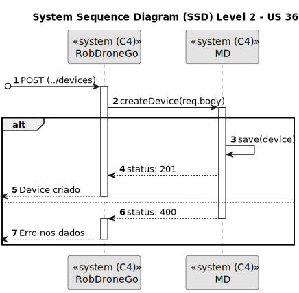
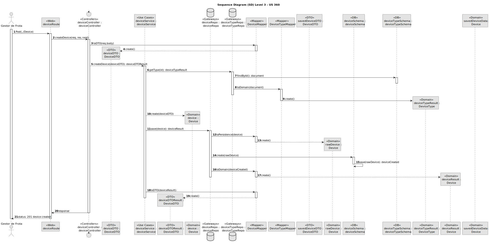

# US 360

Como gestor de frota pretendo adicionar um novo robot à frota indicando o seu tipo, designação, etc.

## 1. Contexto

Introduzida no sprint atual (A).

Faz parte do módulo "1.3 Módulo Gestão de Frota".

Pertence à unidade curricular de **ARQSI**.

## 2. Requisitos

Observações: POST

### 2.1. Dependências encontradas

Esta US depende da US 350, que permite criar tipos de robot

### 2.2. Critérios de aceitação

* Identificador: obrigatório, alfanumérico, máximo de 30 caracteres, único;
* Nickname: obrigatório, alfanumérico, máximo de 30 caracteres, único;
* Tipo (US 350): obrigatório;
* Número de série: obrigatório, alfanumérico, máximo de 50 caracteres, único para um dado tipo de robô;
* Descrição: opcional, alfanumérico, máximo de 250 caracteres.

## 3. Análise

### 3.1. Respostas do cliente

>**Questão:** "
Boa tarde, Professor, 
relativamente aos robots, qual o elemento que identifica um robot?
Podemos atribuir um ID ao mesmo? Se sim, alguma especificação para o mesmo?
Difere caso seja robIsep ou droneisep?
Obrigada
"
> 
>**Resposta:** "
bom dia
cada Robot possui um número de série do fabricante e que deve ser registado quando se cria o robot no sistema. cada robot é identificado por um código e um nickname atribuidos pelo administrador. Por exemplo, um robot da marca X com número de série 1234567 tem o código "picker-0001" e o nickname "Robert" enquanto um outro robot da marca Y com número de série 456789 tem o código "sec-A-001" e o nickname "Jason"
"

>**Questão:** "Boa tarde professor,
O número de série será único para cada robot ou será comum para o mesmo tipo de robots?
Cumprimentos."
>
>**Resposta:** "boa tarde,
o número de série é único para cada robot da mesma marca"

>**Questão:** "Caro cliente, 
Os atributos do robot têm algum tipo de formatação/restrição? 
Obrigado pela sua atenção,
Grupo 3"
>
>**Resposta:** "bom dia,
código identificativo, obrigatório, alfanumerico, max 30 caracteres, único no sistema
nickname, obrigatório, obrigatório, alfanumerico, max 30 caracteres, único no sistema 
tipo de robot, obrigatório
número de série, obrigatório, alfanumerico, max 50 caracteres, único para um dado tipo de robot
descrição, opcional, alfanumerico, max. 250 caracteres"

>**Questão 1:** "Boa tarde,
Poderia explicar as diferenças entre estas duas user stories, US350 e US360?"
>
>**Resposta 1:** "boa tarde,
o requisito 360 permite definir que tipos de robots existem. por exemplo "Tipo A: Robot marca X modelo Y com capacidade de executar tarefas de vigilância" e "Tipo B: Robot marca W modelo Z com capacidade de executar tarefas de vigilância e pickeup&delivery"
o requisito 370 permite indicar que robots existem e de que tipo cada um é, por exemplo "Robot 'ABC32' do tipo A", "Robot 'Brian2' do tipo A" e "Robot 'Stew' do tipo B""
>
>**Questão 2:** "Olá,
pode, por favor, explicar um pouco melhor?
A US 350 (Como gestor de frota pretendo adicionar um novo tipo de robot indicando a sua designação e que tipos de tarefas pode executar da lista prédefinida de tarefas) - adicionar um tipo é indicar qual é a marca, o modelo e as tarefas que pode desempenhar um robot?
A US 360 (Como gestor de frota pretendo adicionar um novo robot à frota indicando o seu tipo, designação, etc.) é associar as caracteristicas de um tipo a um robot?
Pode, por favor, clarificar as diferenças entre estas duas US? Obrigada"
>
>**Resposta 2:** "
bom dia,
no requisito 350 definimos tipos de robots e no requisito 360 definimos robots desses tipos.
se ajudar, fica aqui uma analogia.
definir tipos de viaturas:
    tipo 1: renault clio 5 portas gasolina
    tipo 2: renault megane 5 portas diesel
definir viaturas
    viatura com matricula AA-00-01 do tipo 1
    viatura com matricula BB-10-CC do tipo 2"


### 3.2. Diagrama de Sequência do Sistema (Nível 1 - Vista de Processos)



### 3.3. Diagrama de Sequência do Sistema (Nível 2 - Vista de Processos)




## 4. Design

### 4.1. Diagrama de Sequência




### 4.2. Diagrama de Classes


### 4.3. Testes

**Teste 1:** *Verifies that it is not possible to create an instance of the Example class with null values.*

```
@Test(expected = IllegalArgumentException.class)
public void ensureNullIsNotAllowed() {
	Example instance = new Example(null, null);
}
```

## 5. Implementação

*In this section the team should present, if necessary, some evidencies that the implementation is according to the design. It should also describe and explain other important artifacts necessary to fully understand the implementation like, for instance, configuration files.*

*It is also a best practice to include a listing (with a brief summary) of the major commits regarding this requirement.*

## 5.1. Arquitetura Onion
### Camada de Domínio

### Camada de Aplicação

### Camada de Adaptadores de *Interface*

### Camada de *Frameworks* e *Drivers*

## 5.2. Commits Relevantes

[Listagem dos Commits realizados](https://github.com/sem5pi/sem5pi-23-24-50/issues/NUMERO_DA_ISSUE)

*NUMERO_DA_ISSUE é o #número atribuido à issue pelo próprio GitHub*

## 6. Integração/Demonstração

*In this section the team should describe the efforts realized in order to integrate this functionality with the other parts/components of the system*

*It is also important to explain any scripts or instructions required to execute an demonstrate this functionality*

## 7. Observações

*This section should be used to include any content that does not fit any of the previous sections.*

*The team should present here, for instance, a critical prespective on the developed work including the analysis of alternative solutioons or related works*

*The team should include in this section statements/references regarding third party works that were used in the development this work.*