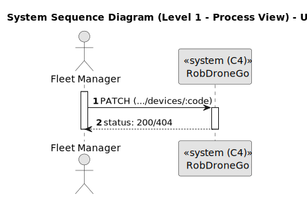
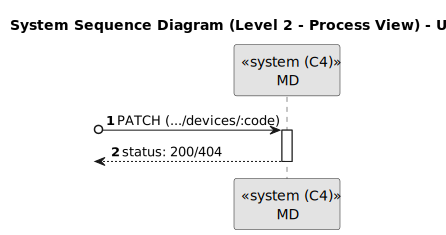

# US 370

Este documento contém a documentação relativa à *User Story (US)* 370.

## 1. Contexto

Esta *US* foi introduzida no *sprint* atual, e requer a funcionalidade de haver a possibilidade de inibir um *robot*.
Esta *US* faz parte do módulo "1.3 Módulo Gestão de Frota".
Esta *US* pertence à unidade curricular de **ARQSI**.

## 2. Requisitos

***US 370*** - Como gestor de frota pretendo inibir um robot.
__Observações:__ Pedido PATCH.

A respeito deste requisito, entendemos que deverá ser possível um gestor de frota inibir/desinibir um *robot* no sistema a desenvolver.

### 2.1. Dependências encontradas

- **US 360** - Como gestor de frota pretendo adicionar um novo robot à frota indicando o seu tipo, designação, etc.

	**Explicação:** Se não existir um *robot*, não é possível inibír-lo/desinibír-lo. Ao criar um novo *robot* este é colocado no estado 'Ativo'.

### 2.2. Critérios de aceitação

Esta *US* não possui nenhum critério de aceitação.

## 3. Análise

### 3.1. Respostas do cliente

>**Questão:** "Há a possibilidade de inibir um robot. No entanto, para além deste "estado" que outros estados pretende que existam? 
> em funcionamento, ocupado, livre, a executar tarefa? Ou basta apenas inibido - desinibido?"
> 
>**Resposta:** "...funcionalmente não existe esse conceito de "estado" que referes. poderá ser no entanto algo util em termos técnicos.
de um ponto de vista funcional pretende-se que seja possivel inibir ou desinibir um robot e que essa informação seja devidamente 
utilizada nos restantes casos de uso. por exemplo, um robot inibido não pode executar tarefas."

**Nota:** Dada a resposta do cliente, vamos considerar que um *robot* pode ter 2 estados (Ativo/Inativo), com a esta *US* 
é possível alternar entre estes 2 estados.

### 3.2. Diagrama de Sequência do Sistema (Nível 1 - Vista de Processos)

### 3.3. Diagrama de Sequência do Sistema (Nível 2 - Vista de Processos)

### 3.4. Classes de Domínio

## 4. Design

### 4.1. Diagrama de Sequência (Nível 3 - Vista de Processos)

### 4.2. Testes

Para esta *US* foram realizados testes unitários (com isolamento por duplos), testes de integração (com isolamento por duplos)
e testes de sistema/end-to-end (sem isolamento) através do *Postman*.

## 5. Implementação

## 5.1. Arquitetura Onion

### Camada de Domínio

Utilizou-se a entidade *Device* e os respetivos *value objects* criados noutra *US*.

### Camada de Aplicação

Utilizou-se o serviço *DeviceService*.

### Camada de Adaptadores de *Interface*

Utilizou-se o controlador *DeviceController* e o repositório *DeviceRepo*.

### Camada de *Frameworks* e *Drivers*

Utilizou-se o *router* *DeviceRoute* e a persistência *IDevicePersistence*.

## 5.2. Commits Relevantes

[Listagem dos Commits realizados](https://github.com/sem5pi/sem5pi-23-24-50/issues/20)

## 6. Integração/Demonstração

Para inibir/desinibir um *robot* foi adicionada a rota **.../devices/:code** do tipo *PATCH*.

Ao realizar o pedido deve ser indicado no *url* o código do *robot* pretendido.

## 7. Observações

Não existem observações relevantes a acrescentar.