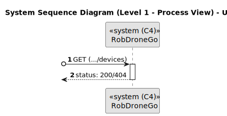
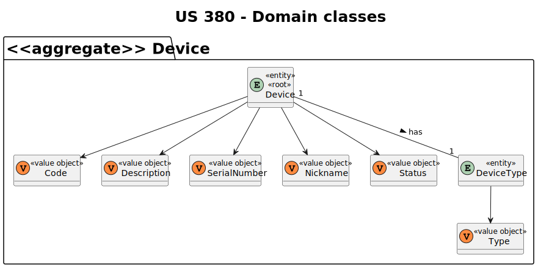
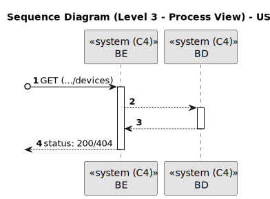

# US 380

Este documento contém a documentação relativa à *User Story (US)* 380.

## 1. Contexto

Esta *US* foi introduzida no *sprint* atual (A), e requer a funcionalidade de haver a possibilidade de listar todos os robots de frota.
Esta *US* faz parte do módulo "1.3 Módulo Gestão de Frota".
Esta *US* pertence à unidade curricular de **ARQSI**.

## 2. Requisitos

***US 380*** - Como gestor de frota, quero listar todos os pisos de um edificio.
__Observações:__ Pedido GET.

A respeito deste requisito, entendemos que deverá ser possível um gestor de campus listar todos os robots de frota, no sistema a desenvolver.

### 2.1. Dependências encontradas

- **US 360** - Como gestor de frota, pretendo adicionar um novo robot à frota indicando o seu tipo, designação, etc.

  **Explicação:** Se não existirem robots na frota, não é possível listá-los.

### 2.2. Critérios de aceitação

**CA 1:** Todos os robots devem ser listados;

## 3. Análise

### 3.1. Respostas do cliente

### 3.2. Diagrama de Sequência do Sistema (Nível 1 - Vista de Processos)

### 3.3. Diagrama de Sequência do Sistema (Nível 2 - Vista de Processos)

### 3.4. Classes de Domínio

## 4. Design

### 4.1. Diagrama de Sequência (Nível 3 - Vista de Processos)

### 4.2. Testes

Para esta *US* foram realizados testes unitários (com isolamento por duplos), testes de integração (com isolamento por duplos)
e testes de sistema/end-to-end (sem isolamento) através do *Postman*.

## 5. Implementação

## 5.1. Arquitetura Onion

### Camada de Domínio
Utilizou-se a entidade *Devices* e *DeviceType* e os respetivos *value object* que já tinham sido criados por outra *US*.

### Camada de Aplicação
Utilizou-se o serviço *DeviceService*.

### Camada de Adaptadores de *Interface*
Utilizou-se o controlador *DeviceController* e o repositório *DeviceRepo*.

### Camada de *Frameworks* e *Drivers*
utilizou-se a persistência *IDevicePersistence* e o *router* *DeviceRoute*.

## 5.2. Commits Relevantes

[Listagem dos Commits realizados](https://github.com/sem5pi/sem5pi-23-24-50/issues/21)

## 6. Integração/Demonstração

Para listar elevadores em edifício foi adicionada a rota **(../devices)** do tipo *GET*.

Ao realizar o pedido *GET* deve ser indicado no *url* o código do edifício pretendido.

## 7. Observações

Não existem observações relevantes a acrescentar.