# Modelo de Domínio

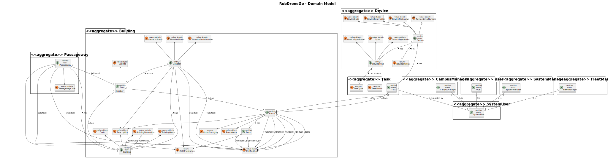

# Vistas

## Nível 1

### Vista Lógica

### Vista de Processos

#### SSD US 1000 - Como gestor de frota pretendo adicionar um novo tipo de *robot* indicando a sua designação e que tipos de tarefas pode executar da lista predefinida de tarefas.

#### SSD US 1010 - Como gestor de Frota pretendo adicionar um novo robot à frota indicando o seu tipo, designação, etc.

#### SSD US 1020 - Como gestor de frota pretendo inibir um *robot*.
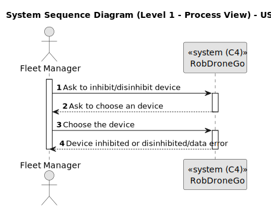

#### SSD US 1030 - Como gestor de Frota pretendo consultar todos os robots da frota.

#### SSD US 1050 - Como gestor de Campus pretendo criar um Edifício indicando [...].

#### SSD US 1060 - Como gestor de Campus pretendo listar Edifícios.

#### SSD US 1070 - Como gestor de campus pretendo editar a informação (total ou parcial) de edifício.

#### SSD US 1080 - Como gestor de Campus pretendo listar Edifícios com min e max de pisos.

#### SSD US 1090 - Como gestor de campus pretendo criar um piso indicando [...].
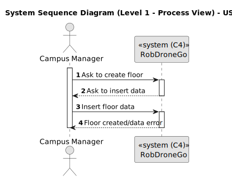

#### SSD US 1100 - Como gestor de Campus pretendo listar todos os Pisos de um Edifício.

#### SSD US 1110 - Como gestor de Campus pretendo editar a informação (total ou parcial) de Piso.

#### SSD US 1120 - Como gestor de Campus pretendo carregar mapa de Piso de Edifício.

#### SSD US 1130 - Como gestor de campus pretendo criar um elevador num edifício indicando os pisos que serve.

#### SSD US 1140 - Como gestor de campus pretendo listar elevadores em edifício.

#### SSD US 1150 - Como gestor de Campus pretendo editar Elevador em Edifício.

#### SSD US 1170 - Como gestor de Campus pretendo criar uma Passagem entre 2 Edifícios.

#### SSD US 1180 - Como gestor de Campus pretendo editar uma Passagem entre 2 Edifícios.

#### SSD US 1190 - Como gestor de Campus pretendo listar Passagens entre 2 Edifícios.
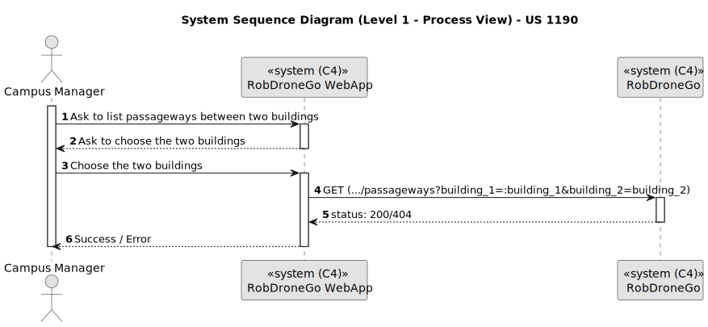

#### SSD US 1200 - Como gestor de Campus pretendo listar Pisos de Edifício com Passagem para outros Edifícios.

#### SSD US 1210 - Como gestor de Campus pretendo criar uma Sala num Piso de Edifício indicando [...].

### Vista de Cenários

## Nível 2

### Vista Lógica

### Vista de Processos

#### SSD US 1000 - Como gestor de frota pretendo adicionar um novo tipo de *robot* indicando a sua designação e que tipos de tarefas pode executar da lista predefinida de tarefas.
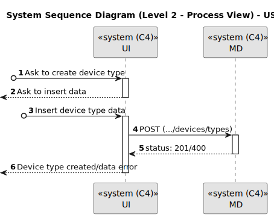

#### SSD US 1010 - Como gestor de Frota pretendo adicionar um novo robot à frota indicando o seu tipo, designação, etc.

#### SSD US 1020 - Como gestor de frota pretendo inibir um *robot*.

#### SSD US 1030 - Como gestor de Frota pretendo consultar todos os robots da frota.
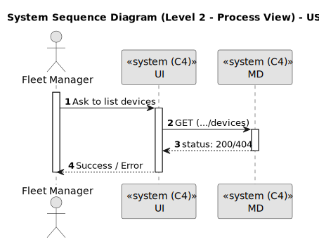

#### SSD US 1050 - Como gestor de Campus pretendo criar um Edifício indicando [...].

#### SSD US 1060 - Como gestor de Campus pretendo listar Edifícios.

#### SSD US 1070 - Como gestor de campus pretendo editar a informação (total ou parcial) de edifício.

#### SSD US 1080 - Como gestor de Campus pretendo listar Edifícios com min e max de pisos.
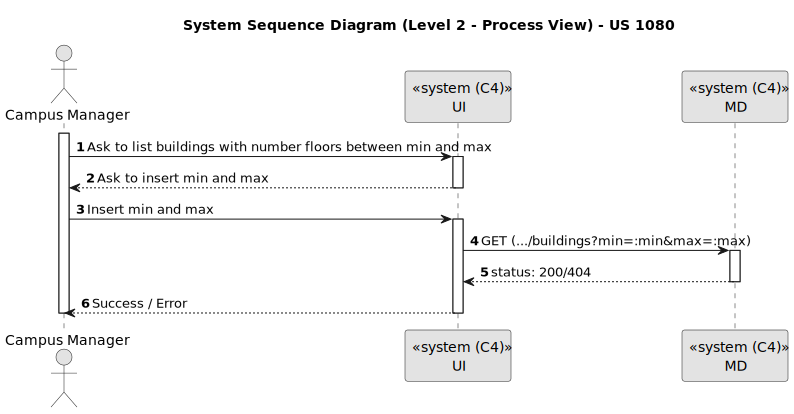

#### SSD US 1090 - Como gestor de campus pretendo criar um piso indicando [...].
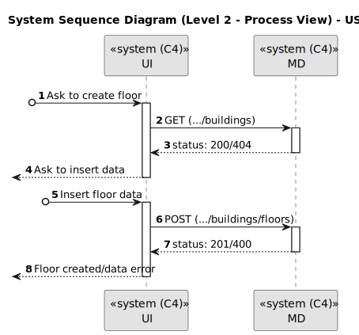

#### SSD US 1100 - Como gestor de Campus pretendo listar todos os Pisos de um Edifício.

#### SSD US 1110 - Como gestor de Campus pretendo editar a informação (total ou parcial) de Piso.

#### SSD US 1120 - Como gestor de Campus pretendo carregar mapa de Piso de Edifício.

#### SSD US 1130 - Como gestor de campus pretendo criar um elevador num edifício indicando os pisos que serve.

#### SSD US 1140 - Como gestor de campus pretendo listar elevadores em edifício.

#### SSD US 1150 - Como gestor de Campus pretendo editar Elevador em Edifício.

#### SSD US 1170 - Como gestor de Campus pretendo criar uma Passagem entre 2 Edifícios.

#### SSD US 1180 - Como gestor de Campus pretendo editar uma Passagem entre 2 Edifícios.
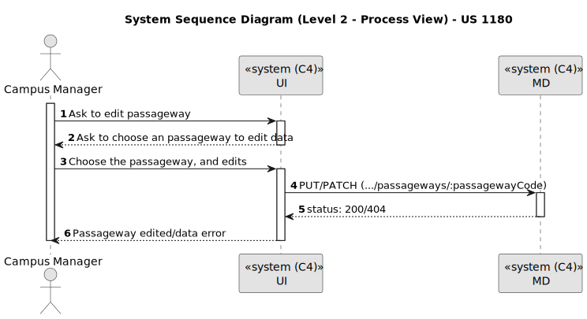

#### SSD US 1190 - Como gestor de Campus pretendo listar Passagens entre 2 Edifícios.
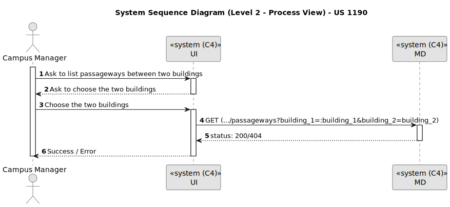

#### SSD US 1200 - Como gestor de Campus pretendo listar Pisos de Edifício com Passagem para outros Edifícios.

#### SSD US 1210 - Como gestor de Campus pretendo criar uma Sala num Piso de Edifício indicando [...].

### Vista de Implementação

### Vista Física

### Vista Lógica, Implementação e Física

## Nível 3 - MD

### Vista Lógica

### Vista de Implementação

## Nível 3 - UI

### Vista Lógica

### Vista de Processos

#### SD US 1000 - Como gestor de frota pretendo adicionar um novo tipo de *robot* indicando a sua designação e que tipos de tarefas pode executar da lista predefinida de tarefas.
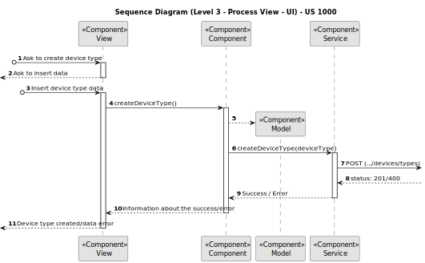

#### SD US 1010 - Como gestor de Frota pretendo adicionar um novo robot à frota indicando o seu tipo, designação, etc.

#### SD US 1020 - Como gestor de frota pretendo inibir um *robot*.

#### SD US 1030 - Como gestor de Frota pretendo consultar todos os robots da frota.

#### SD US 1050 - Como gestor de Campus pretendo criar um Edifício indicando [...].
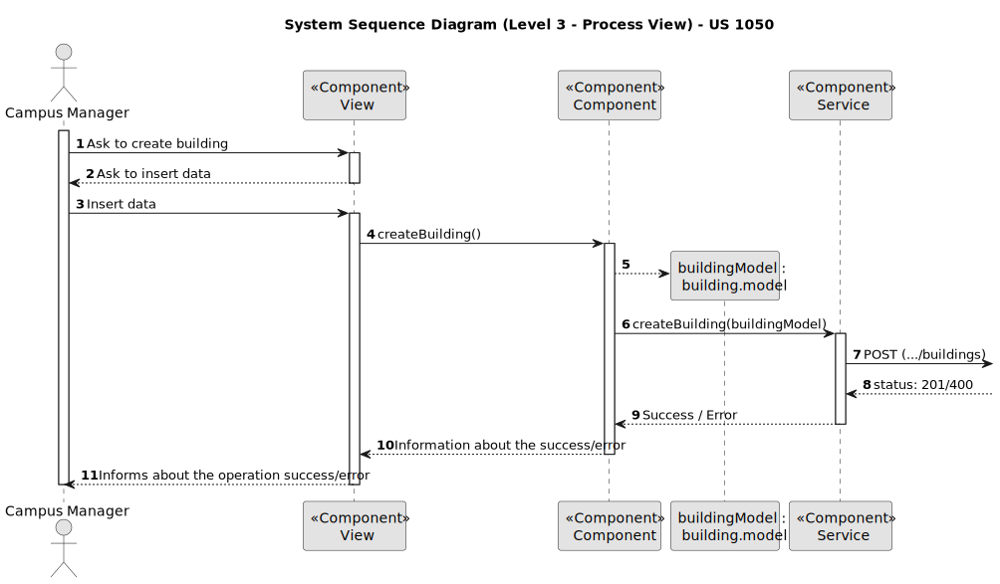

#### SD US 1060 - Como gestor de Campus pretendo listar Edifícios.

#### SD US 1070 - Como gestor de campus pretendo editar a informação (total ou parcial) de edifício.

#### SD US 1080 - Como gestor de Campus pretendo listar Edifícios com min e max de pisos.

#### SD US 1090 - Como gestor de campus pretendo criar um piso indicando [...].
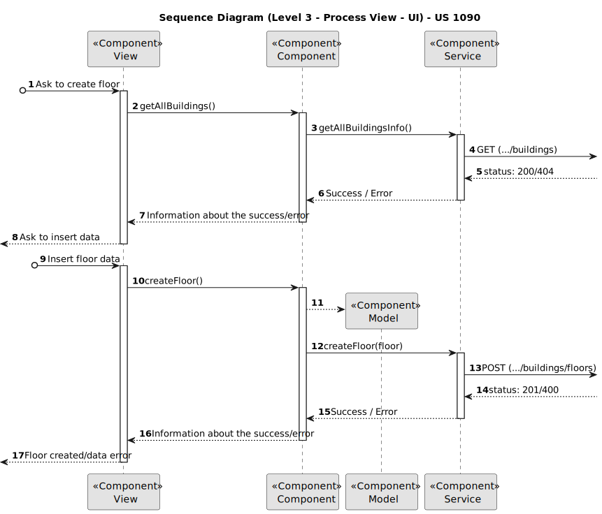

#### SD US 1100 - Como gestor de Campus pretendo listar todos os Pisos de um Edifício.

#### SD US 1110 - Como gestor de Campus pretendo editar a informação (total ou parcial) de Piso.
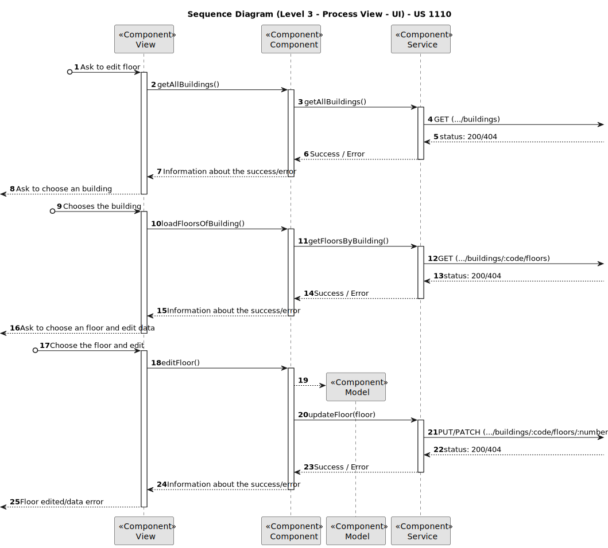

#### SD US 1120 - Como gestor de Campus pretendo carregar mapa de Piso de Edifício.

#### SD US 1130 - Como gestor de campus pretendo criar um elevador num edifício indicando os pisos que serve.

#### SD US 1140 - Como gestor de campus pretendo listar elevadores em edifício.

#### SD US 1150 - Como gestor de Campus pretendo editar Elevador em Edifício.

#### SD US 1170 - Como gestor de Campus pretendo criar uma Passagem entre 2 Edifícios.

#### SD US 1180 - Como gestor de Campus pretendo editar uma Passagem entre 2 Edifícios.
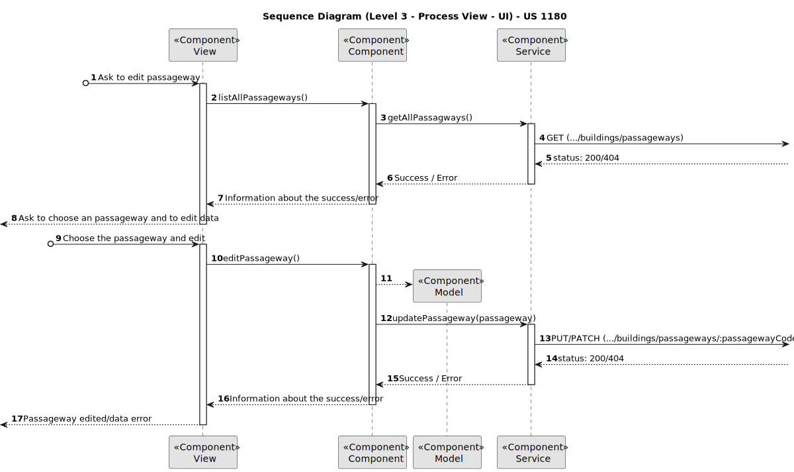

#### SD US 1190 - Como gestor de Campus pretendo listar Passagens entre 2 Edifícios.

#### SD US 1200 - Como gestor de Campus pretendo listar Pisos de Edifício com Passagem para outros Edifícios.

### Vista de Implementação

### Vista Lógica e de Implementação

