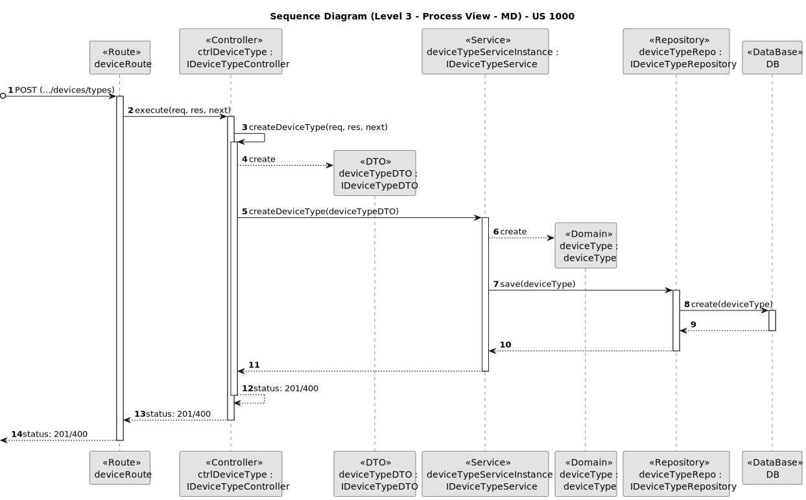

# US 1000

Este documento contém a documentação relativa à *User Story (US)* 1000.

## 1. Contexto

Esta *US* foi introduzida no *sprint* atual, e requer a implementação da UI para permitir ao gestor de frota criar um
novo tipo de *robot* através de um ambiente mais bonito e agradável.
Esta *US* faz parte do módulo "Gestão de Frota" e pertence à unidade curricular de **ARQSI**.

## 2. Requisitos

***US 1000*** - Como gestor de frota pretendo adicionar um novo tipo de *robot* indicando a sua designação e que tipos
de tarefas pode executar da lista predefinida de tarefas.

A respeito deste requisito, entendemos que o gestor de frota deve ter ao seu dispor uma UI para criar um tipo de *robot*, 
em que esta UI irá ser a "ponte" entre o gestor e a API criada no *sprint* passado.

### 2.1. Dependências encontradas

- **US 350** - Como gestor de frota pretendo adicionar um novo tipo de *robot* indicando a sua designação e que tipos de 
tarefas pode executar da lista predefinida de tarefas

	**Explicação:** A API já deve suportar o pedido *POST* para a criação de um tipo de *robot*.

### 2.2. Critérios de aceitação

**CA 1:** Deve ser feito o uso da API desenvolvida no *sprint* anterior, para que os dados sejam persistidos. Mais específicamente, a funcionalidade desenvolvida na *US* 350.

**CA 2:** O utilizador deve ser informado sobre o sucesso da operação.

**CA 3:** Se a operação falhar, deve ser dito ao utilizador o que está mal na informação inserida.

## 3. Análise

### 3.1. Respostas do cliente

Não foi necessário contactar com o cliente aquando da realização desta *US*.

### 3.2. Diagrama de Sequência do Sistema (Nível 1 - Vista de Processos)

### 3.3. Diagrama de Sequência do Sistema (Nível 2 - Vista de Processos)

## 4. Design

### 4.1. Diagrama de Sequência (Nível 3 - Vista de Processos - UI)

### 4.2. Diagrama de Sequência (Nível 3 - Vista de Processos - MD)

### 4.2. Testes

Para esta *US* foram realizados testes automáticos unitários (com isolamento via duplos) e testes automáticos E2E (sem
isolamento e com isolamento com o *backend*).

## 5. Implementação

Na realização desta *US* foi criada a UI (e respetivos estilos) que interage com o utilizador, o componente *DeviceTypeCreateComponent* 
e o serviço *DeviceTypeService*.

**Commits Relevantes**

[Listagem dos Commits realizados](https://1191296gg.atlassian.net/browse/S50-15)

## 6. Integração/Demonstração

Para aceder a esta funcionalidade na *WebApp*, deve-se selecionar o tipo de utilizador "Fleet Manager" e através do menu
temos que aceder a Fleet -> Type of robot -> Create.

Após aceder a este local, o gestor de frota tem à sua disposição um formulário onde pode introduzir os dados para criar 
um novo tipo de *robot* no sistema.

Quando o gestor de frota insere algum valor inválido nos campos, ele ao tentar criar o tipo de robot irá ser avisado de que 
algo está errado e a operação é cancelada. De seguida temos um exemplo em que o campo *type* está inválido e o gestor 
de frota tenta criar o tipo de *robot*.

Por fim, quando todos os dados introduzidos estão válidos, o tipo de *robot* é criado com sucesso, e uma mensagem aparece 
a informar o gestor de frota dessa mesma ocorrência.

## 7. Observações

Não existem observações relevantes a acrescentar.
