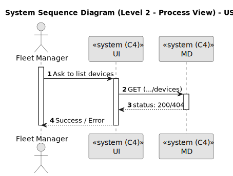
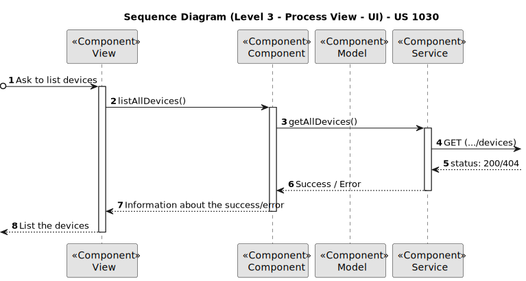
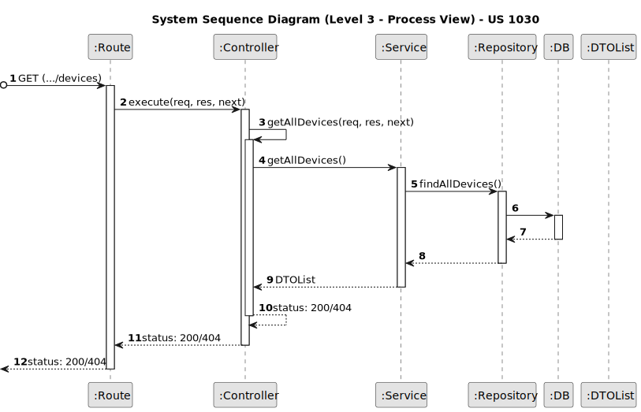
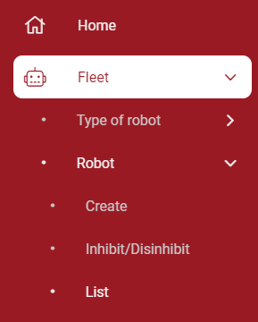
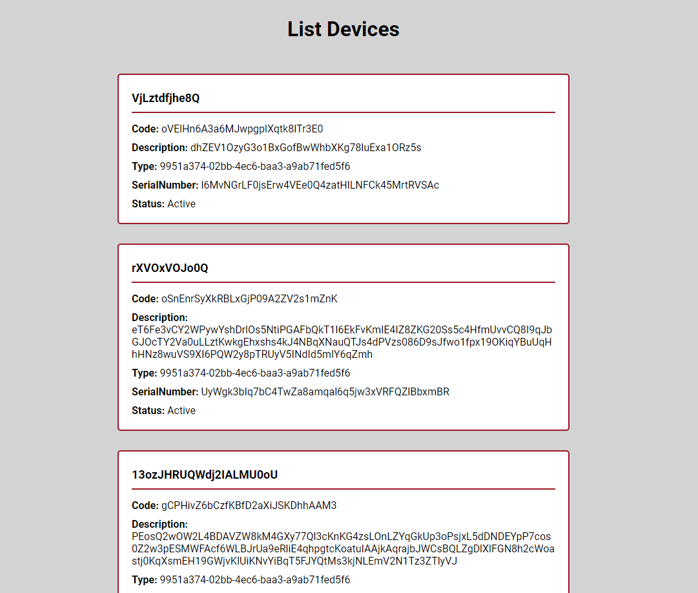

# US 1030

Este documento contém a documentação relativa à *User Story (US)* 1030.

## 1. Contexto

Esta *US* foi introduzida no *sprint* atual, e requer a implementação da UI para permitir ao gestor de frota listar todos os robot de um edifício através de um ambiente mais bonito e agradável.
Esta *US* faz parte do módulo "Gestão de Campus" e pertence à unidade curricular de **ARQSI**.

## 2. Requisitos

***US 1030*** - Como gestor de frota pretendo listar todos os robos.

A respeito deste requisito, entendemos que o gestor de campus deve ter ao seu dispor uma UI para listar robot,
em que esta UI irá ser a "ponte" entre o gestor e a API criada no *sprint* passado.

### 2.1. Dependências encontradas

- **US 360** - Criar robot.

  **Explicação:** A API já deve suportar o pedido *POST* para a criação de um robot, pois se não existir um robot não é possível listá-los.

- **US 380** - Listar robots.

	**Explicação:** A API já deve suportar o pedido *GET* para listar um robot.

### 2.2. Critérios de aceitação

**CA 1:** Deve ser feito o uso da API desenvolvida no *sprint* anterior. Mais específicamente, a funcionalidade desenvolvida na *US* 380.

## 3. Análise

### 3.1. Respostas do cliente

Não foi necessário contactar com o cliente aquando da realização desta *US*.

### 3.2. Diagrama de Sequência do Sistema (Nível 1 - Vista de Processos)

### 3.3. Diagrama de Sequência do Sistema (Nível 2 - Vista de Processos)

## 4. Design

### 4.1. Diagrama de Sequência (Nível 3 - Vista de Processos - UI)

### 4.2. Diagrama de Sequência (Nível 3 - Vista de Processos - MD)

### 4.3. Testes

Para esta *US* foram realizados testes ao componente e aos serviços utilizados.

## 5. Implementação

Na realização desta *US* foi criada a UI (e respetivos estilos) que interage com o utilizador, o componente *DeviceListComponent* e o serviço *DeviceService*.

**Commits Relevantes**

[Listagem dos Commits realizados](https://1191296gg.atlassian.net/browse/S50-5)

## 6. Integração/Demonstração

Para aceder a esta funcionalidade na *WebApp*, deve-se selecionar o tipo de utilizador "Fleet Manager" e através do menu
temos que aceder a Fleet -> Device -> List.

Ao selecionar a aba correta aparecerá imediatamente todo a lista de devices.

## 7. Observações

Não existem observações relevantes a acrescentar.
