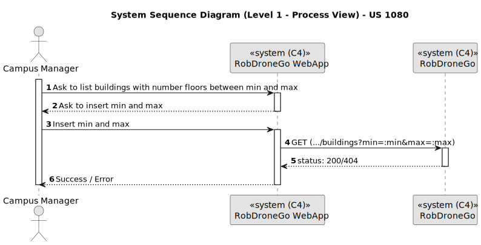

# US 1080

Este documento contém a documentação relativa à *User Story (US)* 1080.

## 1. Contexto

Esta *US* foi introduzida no *sprint* atual, e requer a implementação da UI para permitir ao gestor de campus listar edifícios que tenham um total de pisos determinado entre um mínimo e um máximo, através de um ambiente mais bonito e agradável.
Esta *US* faz parte do módulo "Gestão de Campus" e pertence à unidade curricular de **ARQSI**.

## 2. Requisitos

***US 1080*** - Como gestor de Campus pretendo listar Edifícios com min e max de pisos

A respeito deste requisito, entendemos que o gestor de campus deve ter ao seu dispor uma UI para listar edifícios que tenham um total de pisos determinado entre um mínimo e um máximo. Esta UI irá ser a "ponte" entre o gestor e a API criada no *sprint* passado.

### 2.1. Dependências encontradas

- **US 180** - Listar edifícios com min e max de pisos.

	**Explicação:** A API a utilizar já deve suportar o pedido *GET* com os parâmetros necessários (min e max) para que seja possível realizar esta listagem.

### 2.2. Critérios de aceitação

**CA 1:** Deve ser feito o uso da API desenvolvida no *sprint* anterior, para que os dados sejam requisitados. Mais específicamente, a funcionalidade desenvolvida na *US* 180.

**CA 2:** Se a operação falhar por alguma razão, deve ser dito ao utilizador que algo falhou.

## 3. Análise

### 3.1. Respostas do cliente

Não foi necessário contactar com o cliente aquando da realização desta *US*.

### 3.2. Diagrama de Sequência do Sistema (Nível 1 - Vista de Processos)

### 3.3. Diagrama de Sequência do Sistema (Nível 2 - Vista de Processos)

## 4. Design

### 4.1. Diagrama de Sequência (Nível 3 - Vista de Processos)

### 4.2. Testes

Para esta US foram realizados testes ao componente e aos serviços utilizados.

## 5. Implementação

Na realização desta *US* foi criada a UI (e respetivos estilos) que interage com o utilizador e o componente *BuildingListComponent*. Para além disso, foi utilizado o serviço *BuildingService*.

**Commits Relevantes**

[Listagem dos Commits realizados](https://1191296gg.atlassian.net/browse/S50-28)

## 6. Integração/Demonstração

Para aceder a esta funcionalidade na WebApp, deve-se selecionar o tipo de utilizador "Campus Manager" e através do menu temos que aceder a Campus -> Building -> List.

Após aceder a este local, o gestor de campus tem à sua disposição duas opções: a de listar todos os edifícios, e a de listar apenas aqueles que têm uma quantidade de pisos compreendidos entre um mínimo e um máximo. Para utilizarmos a funcionalidade desenvolvida nesta *US*, temos que selecionar a opção correspondente.

Caso nenhuma opção das que existem para listar for selecionada, é apresentado um aviso de que o gestor de campus deve selecionar uma para a pesquisa ser feita.

Se o gestor não colocar os valores corretos para o mínimo e máximo, ou seja, se o máximo for menor do que o valor mínimo, o seguinte erro é apresentado.

Outra situação é quando não é encontrado nenhum edifício com um número de pisos compreendido entre os valores inseridos. Nesse caso, obtemos o seguinte erro.

Por último, se existirem edifícios que tenham uma quantidade de pisos compreendida entre os valores mínimo e máximo inseridos, obtemos essa mesma listagem, como é possível visualizar na seguinte imagem.

## 7. Observações

Esta *US* encontra-se integrada na mesma opção de menu que a *US* 1060. Lá é possível selecionar qual é a forma que desejamos listar os edifícios, ou seja, pela forma que foi implementada nesta *US*, ou pela forma implementada na *US* 1060.
