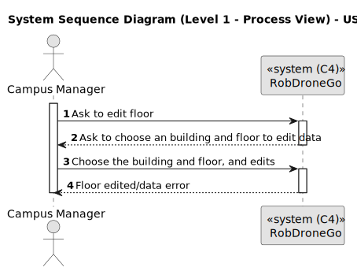
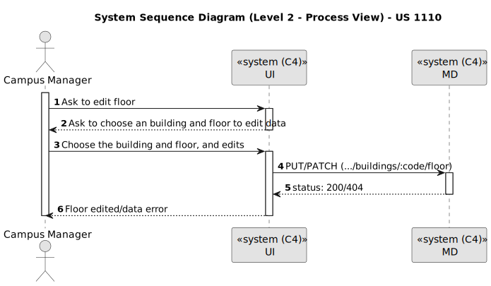
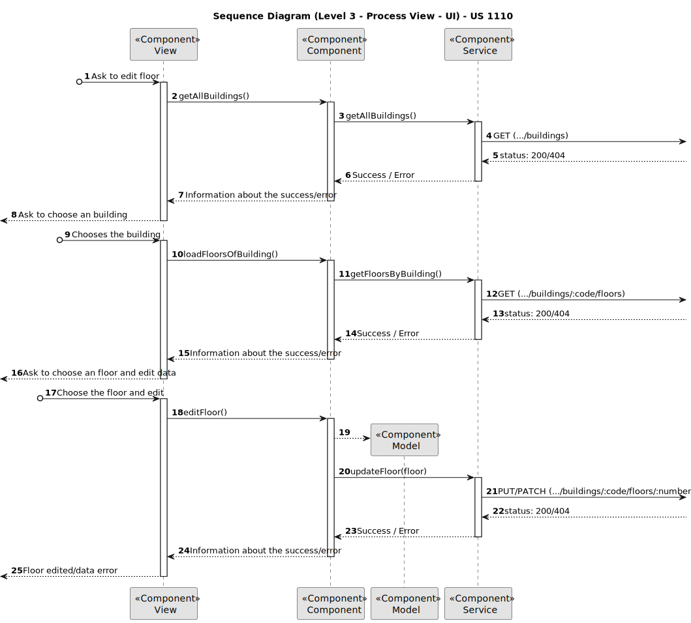
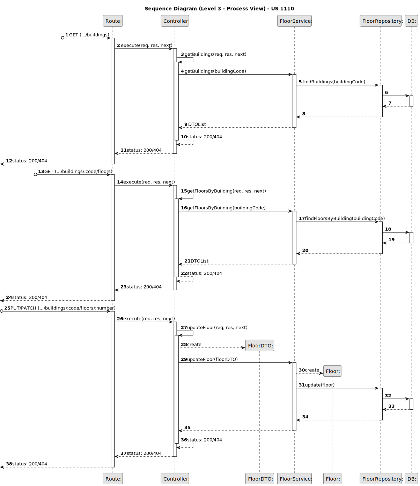
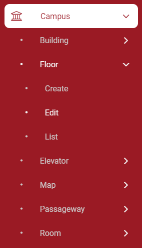
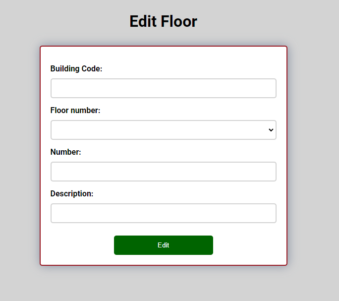
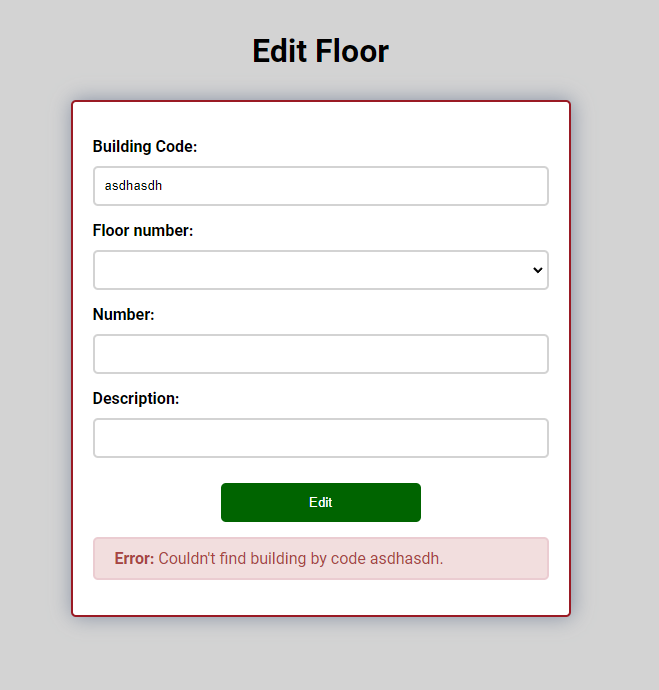
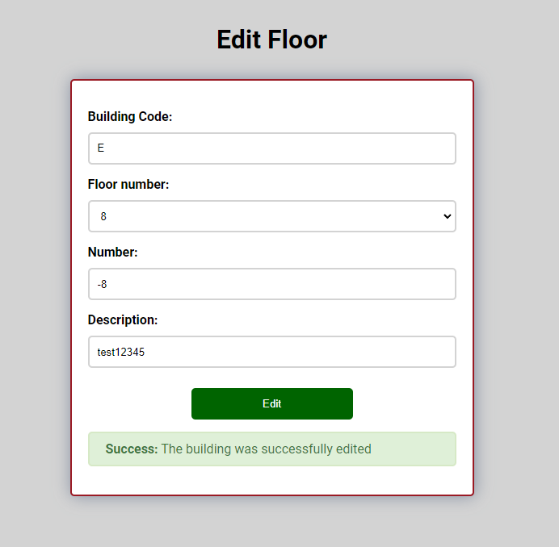

# US 1110

Este documento contém a documentação relativa à *User Story (US)* 1110.

## 1. Contexto

Esta *US* foi introduzida no *sprint* atual, e requer a implementação da UI para permitir ao gestor de campus editar um piso de num edifício através de um ambiente mais bonito e agradável.
Esta *US* faz parte do módulo "Gestão de Campus" e pertence à unidade curricular de **ARQSI**.

## 2. Requisitos

***US 1110*** - Como gestor de Campus pretendo editar a informação (total ou parcial) de Piso.

A respeito deste requisito, entendemos que o gestor de campus deve ter ao seu dispor uma UI para editar um piso de num edifício, em que esta UI irá ser a "ponte" entre o gestor e a API criada no *sprint* passado.

### 2.1. Dependências encontradas

- **US 190** - Criar piso de edifício.

  **Explicação:** A API já deve suportar o pedido *POST* para a criação de um piso.

- **US 200** - Editar informação de piso de edifício.

  **Explicação:** A API já deve suportar o pedido *GET* para a edição de um piso.

### 2.2. Critérios de aceitação

**CA 1:** Deve ser feito o uso da API desenvolvida no *sprint* anterior, para que os dados sejam persistidos. Mais específicamente, a funcionalidade desenvolvida na *US* 200.

**CA 2:** O utilizador deve ser informado sobre o sucesso da operação.

**CA 3:** Se a operação falhar, deve ser dito ao utilizador o que está mal na informação inserida.

## 3. Análise

### 3.1. Respostas do cliente

Não foi necessário contactar com o cliente aquando da realização desta *US*.

### 3.2. Diagrama de Sequência do Sistema (Nível 1 - Vista de Processos)

### 3.3. Diagrama de Sequência do Sistema (Nível 2 - Vista de Processos)

## 4. Design

### 4.1. Diagrama de Sequência (Nível 3 - Vista de Processos - UI)

### 4.2. Diagrama de Sequência (Nível 3 - Vista de Processos - MD)

### 4.3. Testes

Para esta *US* foram realizados testes ao componente e aos serviços utilizados.

## 5. Implementação

Na realização desta *US* foi criada a UI (e respetivos estilos) que interage com o utilizador, o componente *ElevatorCreateComponent*
e o serviço *ElevatorService*, além disso utilizou-se o servico *BuildingService* criado por outra *US*.

**Commits Relevantes**

[Listagem dos Commits realizados](https://1191296gg.atlassian.net/browse/S50-10)

## 6. Integração/Demonstração

Para aceder a esta funcionalidade na *WebApp*, deve-se selecionar o tipo de utilizador "Campus Manager" e através do menu
temos que aceder a Campus -> Floor -> Edit.

Após aceder a este local, o gestor de campus tem à sua disposição um formulário onde pode escolher um dos edificios já criados e para cada um desses edificios tem todos os anadares criados, depois de selecionar o edificio e o andar os campos "number" e "description" serão preenchidos com o valor atual e poderão ser substituidos pelos valores pretendidos.

Quando o gestor de campus insere um edificio não existente a edição não será possivel, aparecendo a mensagem de erro: "Couldn't find building by code ...".

Por fim, quando todos os dados introduzidos estão válidos, o andar será atualizado na base de dados, aparecendo a seguinte mensagem: "The building was successfully edited".

## 7. Observações

Não existem observações relevantes a acrescentar.