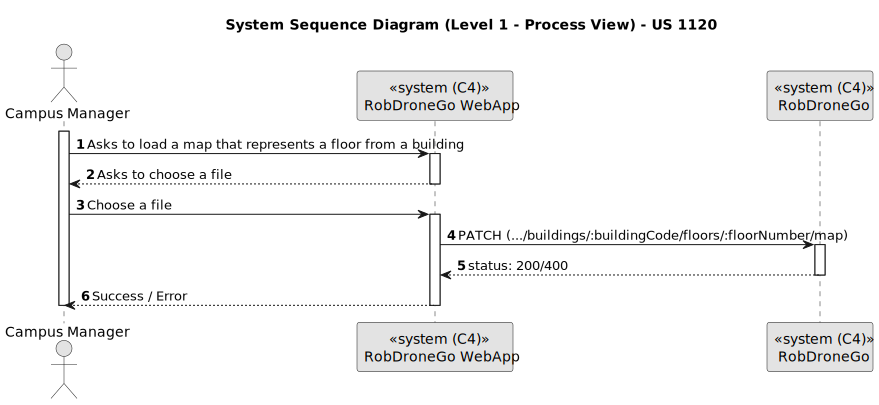

# US 1120

Este documento contém a documentação relativa à *User Story (US)* 1120.

## 1. Contexto

Esta *US* foi introduzida no *sprint* atual, e requer a implementação da UI para permitir ao gestor de campus carregar o mapa de um piso de um dado edifício, fazendo-o através de um ambiente mais bonito e agradável.
Esta *US* faz parte do módulo "Gestão de Campus" e pertence à unidade curricular de **ARQSI**.

## 2. Requisitos

***US 1120*** - Como gestor de Campus pretendo carregar mapa de Piso de Edifício

A respeito deste requisito, entendemos que o gestor de campus deve ter ao seu dispor uma UI para conseguir carregar o mapa de um piso de um dado edifício. Esta UI irá ser a "ponte" entre o gestor e a API criada no *sprint* passado.

### 2.1. Dependências encontradas

- **US 230** - Carregar mapa de piso.

	**Explicação:** A API já deve suportar o pedido *PATCH* para realizar o carregamento do mapa de um piso de um dado edifício.

### 2.2. Critérios de aceitação

**CA 1:** Deve ser feito o uso da API desenvolvida no *sprint* anterior, para que os dados sejam persistidos. Mais específicamente, a funcionalidade desenvolvida na *US* 230.

**CA 2:** O utilizador deve ter ao seu dispor um *input* que lhe permite selecionar o ficheiro que deseja submeter com a informação necessária.

**CA 3:** O utilizador deve ser informado sobre o sucesso da operação.

**CA 4:** Se a operação falhar, deve ser dito ao utilizador o que está mal na informação inserida.

**CA 5:** Deve ser possível o utilizador selecionar o edifício através de um *dropdown*, em que este deve suportar a filtragem através da introdução de texto.

**CA 6:** Deve ser possível o utilizador selecionar o número do piso através de um *dropdown*. Este *dropdown* deve ser atualizado em função dos pisos existentes no edifício selecionado.

## 3. Análise

### 3.1. Respostas do cliente

Não foi necessário contactar com o cliente aquando da realização desta *US*.

### 3.2. Diagrama de Sequência do Sistema (Nível 1 - Vista de Processos)

### 3.3. Diagrama de Sequência do Sistema (Nível 2 - Vista de Processos)

## 4. Design

### 4.1. Diagrama de Sequência (Nível 3 - Vista de Processos)

### 4.2. Testes

Para esta US foram realizados testes ao componente e aos serviços utilizados.

## 5. Implementação

Na realização desta *US* foi criada a UI (e respetivos estilos) que interage com o utilizador, o componente *MapLoadComponent* e o serviço *MapService*. Também foram utilizados os serviços *BuildingService* e *FloorService*. Foram também utilizados os *models* *Building* e *Floor*.

**Commits Relevantes**

[Listagem dos Commits realizados](https://1191296gg.atlassian.net/browse/S50-29)

## 6. Integração/Demonstração

Para aceder a esta funcionalidade na WebApp, deve-se selecionar o tipo de utilizador "Campus Manager" e através do menu temos que aceder a Campus -> Map -> Load Map.

Após aceder a este local, o gestor de campus tem à sua disposição um formulário onde pode introduzir os dados para carregar o mapa de um piso de um dado edifício.

Quando o gestor de campus insere algum valor inválido nos campos, é alertado do que está errado. De seguida temos um exemplo em que o edifício selecionado não tem pisos.

Também são reportados ao utilizador erros como a necessidade de selecionar um edifício, selecionar um piso e escolher um ficheiro que tenha a informação necessária.

Também são apresentados outros erros quando o ficheiro escolhido não se encontra válido, ou seja, não tem a estrutura/informação correta/obrigatória.

Quando toda a informação fornecida pelo gestor de campus se encontra correta, ao submeter o que foi introduzido, obtemos uma mensagem de sucesso pois o mapa do piso é carregado corretamente.

## 7. Observações

Não existem observações relevantes a acrescentar.
