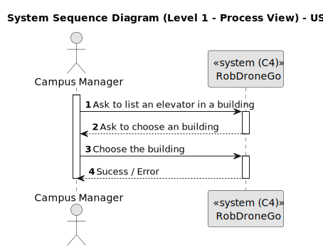
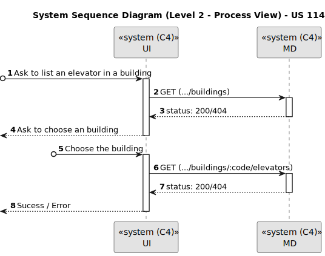
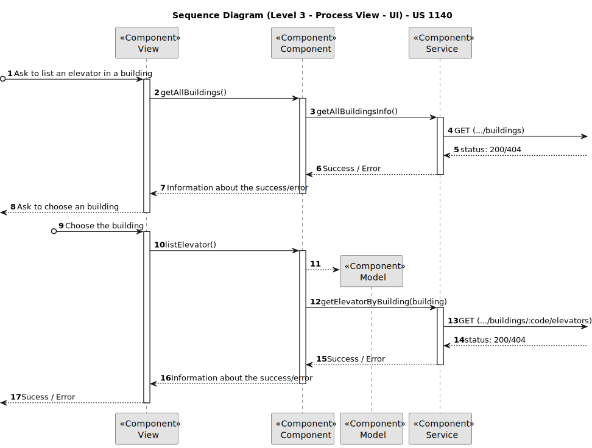
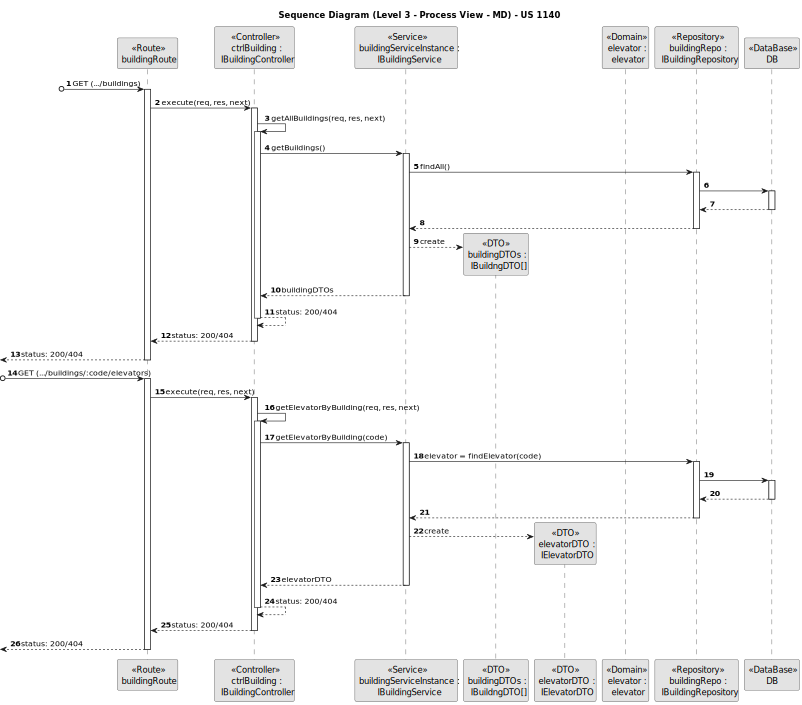
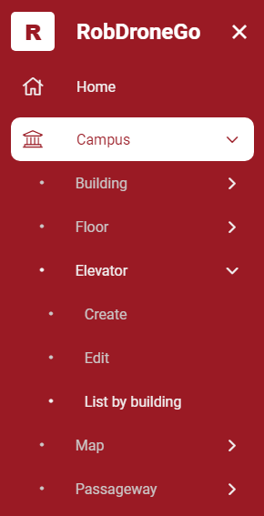
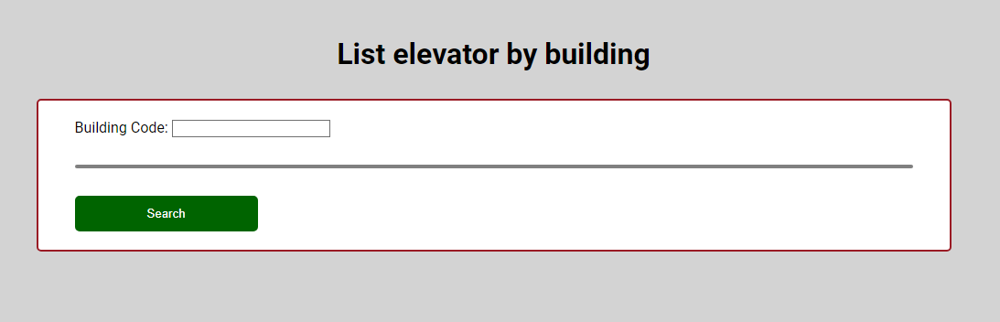
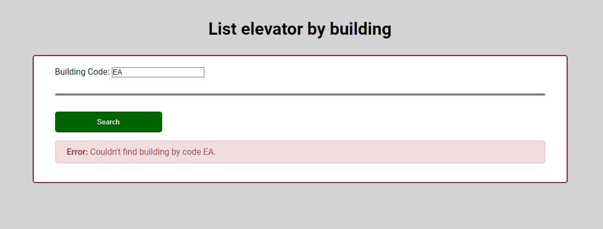
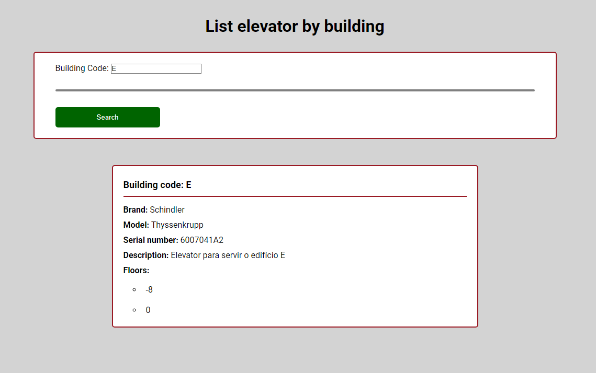

# US 1140

Este documento contém a documentação relativa à *User Story (US)* 1140.

## 1. Contexto

Esta *US* foi introduzida no *sprint* atual, e requer a implementação da UI para permitir ao gestor de campus listar o 
elevador de um edifício através de um ambiente mais bonito e agradável.
Esta *US* faz parte do módulo "Gestão de Campus" e pertence à unidade curricular de **ARQSI**.

## 2. Requisitos

***US 1140*** - Como gestor de campus pretendo listar elevadores em edifício.

A respeito deste requisito, entendemos que o gestor de campus deve ter ao seu dispor uma UI para listar o elevador de um 
edifício, em que esta UI irá ser a "ponte" entre o gestor e a API criada no *sprint* passado.

### 2.1. Dependências encontradas

- **US 290** - Listar elevadores em edifício.

	**Explicação:** A API já deve suportar o pedido *GET* para realizar a listagem do elevador de um edifício.

### 2.2. Critérios de aceitação

**CA 1:** Deve ser feito o uso da API desenvolvida no sprint anterior, para que os dados sejam requisitados. Mais específicamente, a funcionalidade desenvolvida na US 290.

**CA 2:** Se a operação falhar por alguma razão, deve ser apresentado ao utilizador uma mensagem a caracterizar a falha.

**CA 3:** A informação deve ser apresentada corretamente e de forma percetível ao utilizador.

## 3. Análise

### 3.1. Respostas do cliente

Não foi necessário contactar com o cliente aquando da realização desta *US*.

### 3.2. Diagrama de Sequência do Sistema (Nível 1 - Vista de Processos)

### 3.3. Diagrama de Sequência do Sistema (Nível 2 - Vista de Processos)

## 4. Design

### 4.1. Diagrama de Sequência (Nível 3 - Vista de Processos - UI)

### 4.2. Diagrama de Sequência (Nível 3 - Vista de Processos - MD)

### 4.2. Testes

Para esta *US* foram realizados testes automáticos unitários (com isolamento via duplos) e testes automáticos E2E (sem
isolamento e com isolamento com o *backend*).

## 5. Implementação

Na realização desta *US* foi criada a UI (e respetivos estilos) que interage com o utilizador, o componente *ElevatorListComponent*,
além disso utilizou-se o serviço *BuildingService* e *ElevatorService* criados por outras *USs*.

**Commits Relevantes**

[Listagem dos Commits realizados](https://1191296gg.atlassian.net/browse/S50-14)

## 6. Integração/Demonstração

Para aceder a esta funcionalidade na *WebApp*, deve-se selecionar o tipo de utilizador "Campus Manager" e através do menu
temos que aceder a Campus -> Elevator -> List by building.

Após aceder a este local, o gestor de campus tem à sua disposição um formulário onde pode introduzir o código do edifício
que pretende listar o seu elevador.

Se o gestor colocar um código de edifício que não exista, o seguinte erro é apresentado.

Por fim, se o edifício escolhido conter elevador, obtemos a listagem do mesmo.

## 7. Observações

Não existem observações relevantes a acrescentar.
