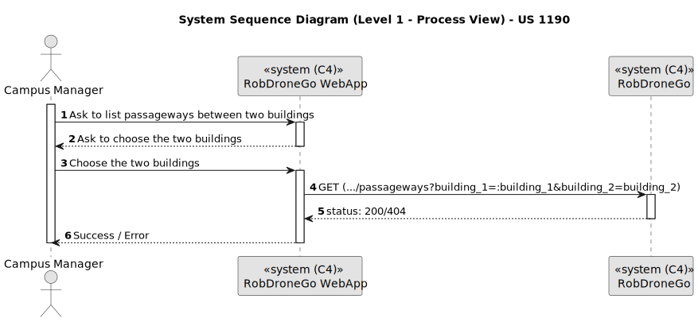
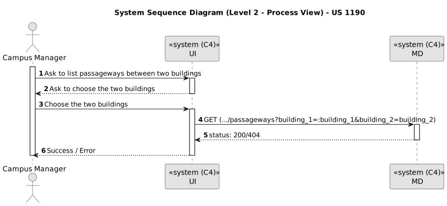
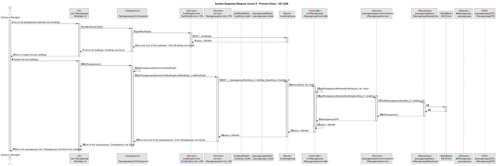
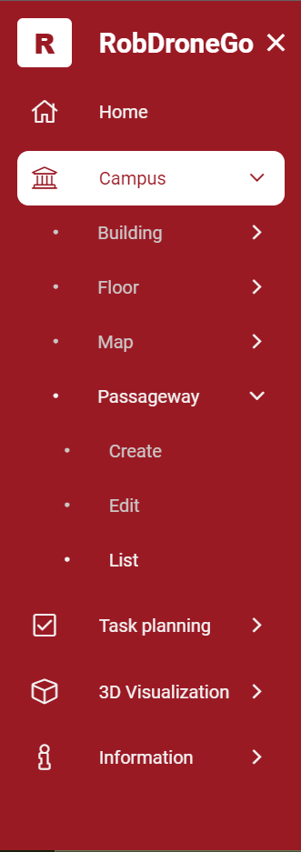
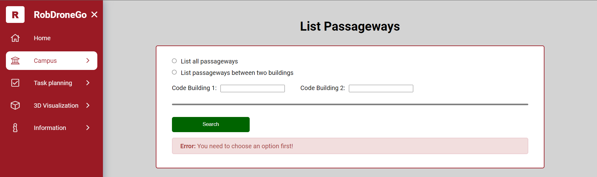
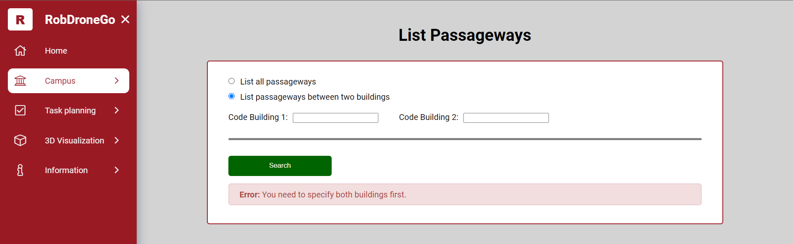
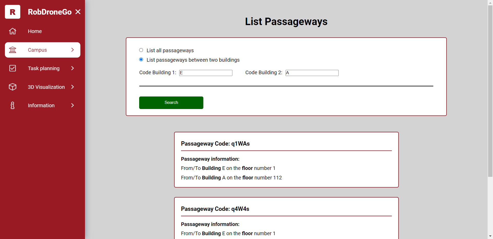
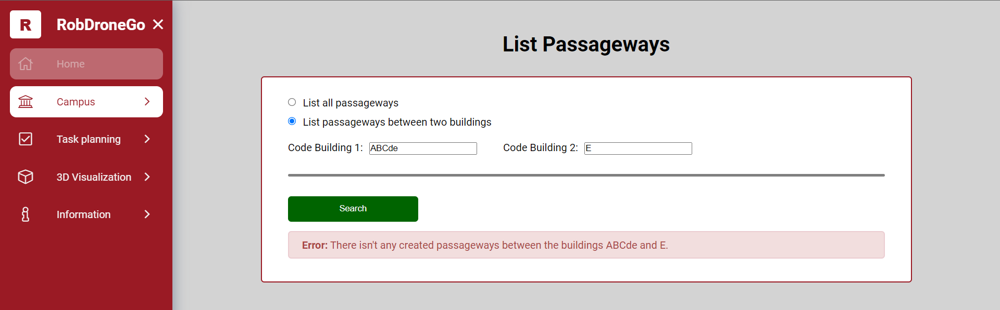

# US 1190

Este documento contém a documentação relativa à *User Story (US)* 1190.

## 1. Contexto

Esta *US* foi introduzida no *sprint* atual, e requer a implementação da UI para permitir ao gestor de campus listar a passagem entre dois edifícios, através de um ambiente mais bonito e agradável.
Esta *US* faz parte do módulo "Gestão de Campus" e pertence à unidade curricular de **ARQSI**.

## 2. Requisitos

***US 1190*** - Como gestor de Campus pretendo listar Passagens entre 2 Edifícios

A respeito deste requisito, entendemos que o gestor de campus deve ter ao seu dispor uma UI para listar a passagem entre dois edifícios escolhidos por ele. Esta UI irá ser a "ponte" entre o gestor e a API criada no *sprint* passado.

### 2.1. Dependências encontradas

- **US 260** - Como gestor de campus, quero listar passagens entre 2 edifícios.

	**Explicação:** A API já deve suportar o pedido *GET* para realizar a listagem de passagens entre dois edifícios.

### 2.2. Critérios de aceitação

**CA 1:** Deve ser feito o uso da API desenvolvida no sprint anterior, para que os dados sejam requisitados. Mais específicamente, a funcionalidade desenvolvida na US 260.

**CA 2:** Se a operação falhar por alguma razão, deve ser apresentado ao utilizador uma mensagem a caracterizar a falha.

**CA 3:** A informação deve ser apresentada corretamente e de forma percetível ao utilizador.

## 3. Análise

### 3.1. Respostas do cliente

Não foi necessário contactar com o cliente aquando da realização desta *US*.

### 3.2. Diagrama de Sequência do Sistema (Nível 1 - Vista de Processos)

### 3.3. Diagrama de Sequência do Sistema (Nível 2 - Vista de Processos)

## 4. Design

### 4.1. Diagrama de Sequência (Nível 3 - Vista de Processos)

### 4.2. Testes

Para esta US foram realizados testes ao componente e aos serviços utilizados.

## 5. Implementação

Na realização desta US foi criada a UI (e respetivos estilos) que interage com o utilizador, o *model* representativo de uma *passageway*, o componente *PassagewayListComponent* e o serviço *PassagewayService*. Também foi utilizado o *model* representativo de um *building* e o serviço *BuildingService*, anteriormente criados por outra *US*.

**Commits Relevantes**

[Listagem dos Commits realizados](https://1191296gg.atlassian.net/browse/S50-30)

## 6. Integração/Demonstração

Para aceder a esta funcionalidade na WebApp, deve-se selecionar o tipo de utilizador "Campus Manager" e através do menu temos que aceder a Campus -> Passageway -> List.

Após aceder a este local, o gestor de campus deve selecionar a opção que irá realizar a listagem das passagens através da especificação de dois edifícios.

Se não for selecionada nenhuma opção, ocorrerá o seguinte erro.

Caso apenas a opção seja selecionada e o botão de procura premido sem que sejam especificados dois edifícios, o sistema irá apresentar um erro a avisar que os dois edifícios devem ser especificados. O mesmo ocorre se apenas um edifício for especificado e não ambos.

Ao especificar os dois edifícios, se existirem passagens entre eles, elas serão listada, como é possível visualizar a seguir.

Já se não existirem passagens entre os edifícios especificados, será apresentada uma mensagem de erro ao gestor de campus a informar dessa mesma situação.

## 7. Observações

O layout da página ficou formatado de forma a que se no futuro existam mais listagens a fazer às *passageways*, seja mais fácil de adaptar a nova funcionalidade dando assim menos trabalho de a implementar.
