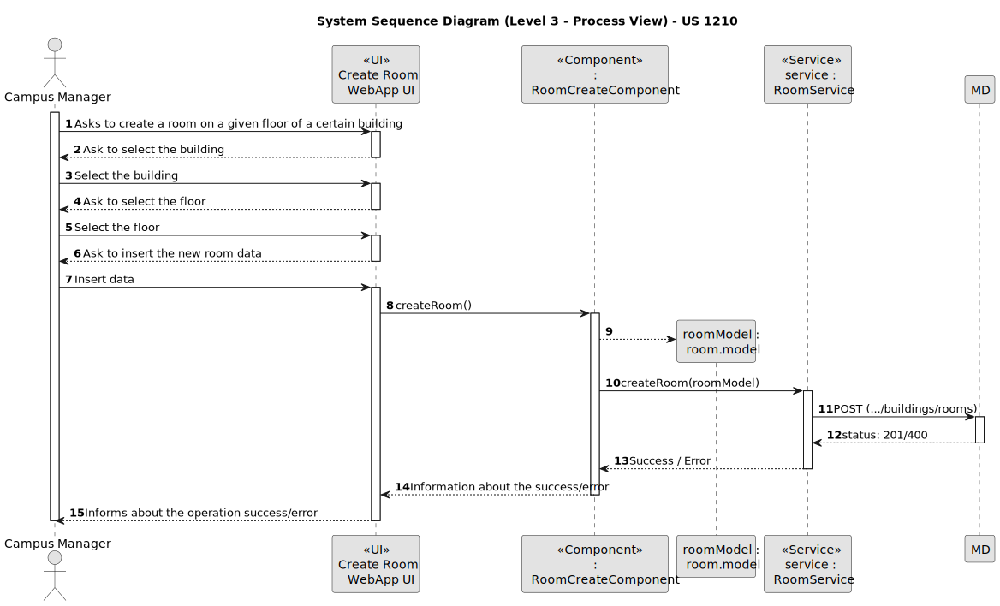
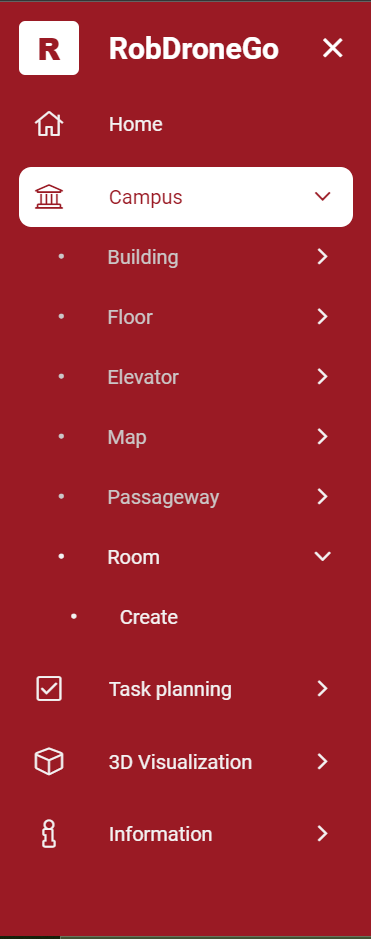
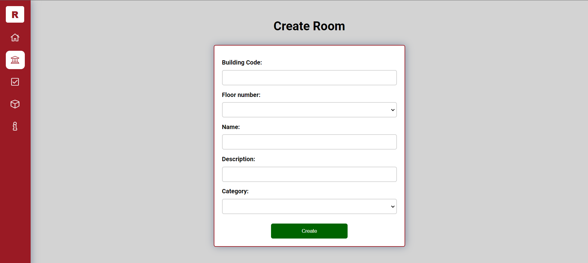
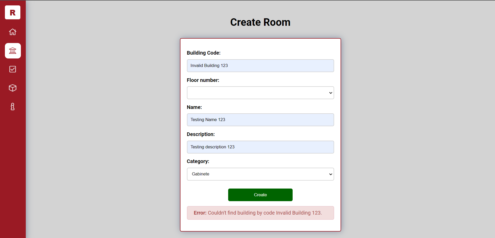
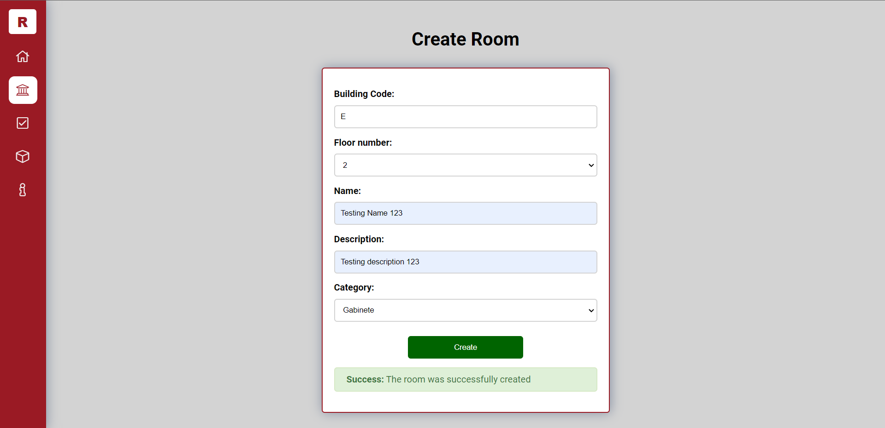

# US 1210

Este documento contém a documentação relativa à *User Story (US)* 1210.

## 1. Contexto

Esta *US* foi introduzida no *sprint* atual, e requer a implementação da UI para permitir ao gestor de campus criar uma sala num piso de um dado edifício, através de um ambiente mais bonito e agradável.
Esta *US* faz parte do módulo "Gestão de Campus" e pertence à unidade curricular de **ARQSI**.

## 2. Requisitos

***US 1210*** - Como gestor de Campus pretendo criar uma Sala num Piso de Edifício.

A respeito deste requisito, entendemos que o gestor de campus deve ter ao seu dispor uma UI para criar uma sala num dado piso de um edifício. Esta UI irá ser a "ponte" entre o gestor e a API criada no *sprint* passado.

### 2.1. Dependências encontradas

- **US 310** - Como gestor de campus, quero criar sala de piso de edifício.

	**Explicação:** A API já deve suportar o pedido *POST* para a criação de uma sala num dado piso de um certo edifício.

### 2.2. Critérios de aceitação

**CA 1:** Deve ser feito o uso da API desenvolvida no *sprint* anterior, para que os dados sejam persistidos. Mais específicamente, a funcionalidade desenvolvida na *US* 310.

**CA 2:** O utilizador deve ser informado sobre o sucesso da operação.

**CA 3:** Se a operação falhar, deve ser dito ao utilizador o que está mal na informação inserida.

**CA 4:** Deve ser possível o utilizador selecionar o edifício através de um *dropdown*, em que este deve suportar a filtragem através da introdução de texto.

**CA 5:** Deve ser possível o utilizador selecionar o número do piso onde deseja criar a sala através de um *dropdown*. Este *dropdown* deve ser atualizado em função dos pisos existentes no edifício selecionado.

**CA 6:** Deve ser possível o utilizador selecionar através de um *dropdown* a categoria da sala a criar.

## 3. Análise

### 3.1. Respostas do cliente

Não foi necessário contactar com o cliente aquando da realização desta *US*.

### 3.2. Diagrama de Sequência do Sistema (Nível 1 - Vista de Processos)

### 3.3. Diagrama de Sequência do Sistema (Nível 2 - Vista de Processos)

## 4. Design

### 4.1. Diagrama de Sequência (Nível 3 - Vista de Processos)

### 4.2. Testes

Para esta US foram realizados testes ao componente e aos serviços utilizados.

## 5. Implementação

Na realização desta *US* foi criada a UI (e respetivos estilos) que interage com o gestor de campus, o componente *RoomCreateComponent*, o *model Room* e o serviço *RoomService*. Também foram utilizados os serviços *BuildingService* e *FloorService*.

**Commits Relevantes**

[Listagem dos Commits realizados](https://1191296gg.atlassian.net/browse/S50-33)

## 6. Integração/Demonstração

Para aceder a esta funcionalidade na WebApp, deve-se selecionar o tipo de utilizador "Campus Manager" e através do menu temos que aceder a Campus -> Room -> Create.

Após aceder a este local, o gestor de campus tem à sua disposição um formulário onde pode introduzir os dados para criar uma nova sala num piso de um dado edifício.

Quando o gestor de campus insere algum valor inválido nos campos, ele ao tentar criar a sala irá ser avisado de que algo está errado e a operação é cancelada. De seguida, temos um exemplo em que o campo *building code* que representa o edifício que terá esta nova sala, não está válido quando o gestor de campus tenta fazer a criação da sala.

Por fim, quando todos os dados introduzidos estão válidos, a sala é criada com sucesso, e uma mensagem aparece a informar o gestor de campus dessa mesma ocorrência.

## 7. Observações

Os campos *building code*, *floor number* e *category* são de seleção para facilitar a vida ao gestor de campus. Contudo, o campo *building code* suporta filtragem para facilitar a seleção do edifício desejado.
