# Modelo de Domínio

# Vistas

## Nível 1

### Vista Lógica

### Vista de Processos

#### SSD US 10 - Como administrador pretendo criar um utilizador de sistema indicando as suas permissões.

#### SSD US 80 - Como administrador do sistema pretendo aprovar ou recusar o registo de um utente.

#### SSD US 460 - Como utente do sistema pretendo requisitar uma tarefa indicando os parâmetros necessários à sua execução, nomeadamente o ponto inicial e o término e qual a tarefa pretendida.
##### Tarefa de vigilância
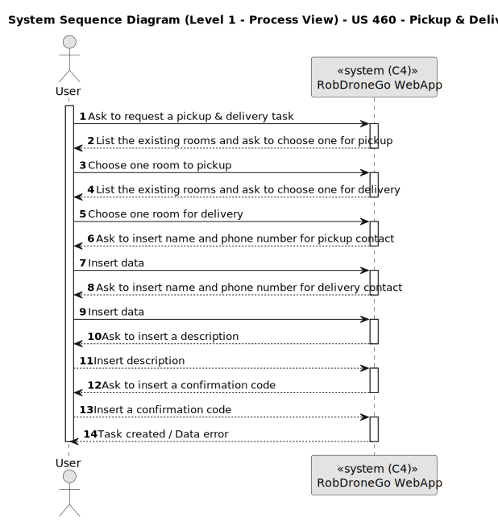

##### Tarefa de Pickup & Delivery
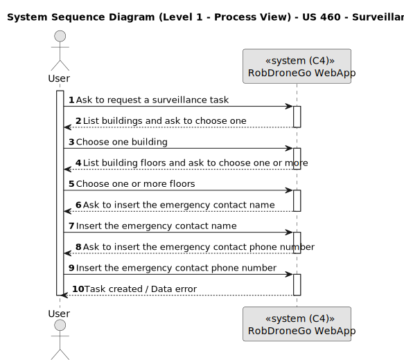

#### SSD US 470 - Como gestor de tarefas pretendo aprovar ou recusar uma requisição.
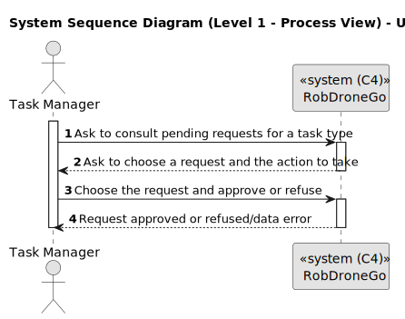

#### SSD US 480 - Como gestor de tarefas pretendo consultar as requisições de tarefas ainda não aprovadas.

#### SSD US 490 - Como gestor de tarefas pretendo pesquisar as requisições de tarefas por estado, por tipo de dispositivo, ou utente.

#### SSD US 500 - Como gestor de tarefas pretendo obter a sequência de execução das tarefas aprovadas.

### Vista de Cenários

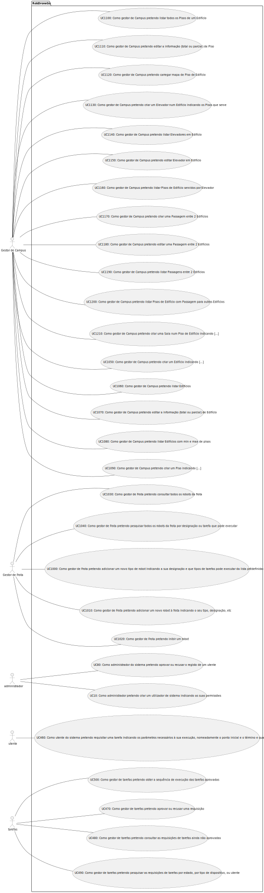

## Nível 2

### Vista Lógica

### Vista de Processos

#### SSD US 10 - Como administrador pretendo criar um utilizador de sistema indicando as suas permissões.
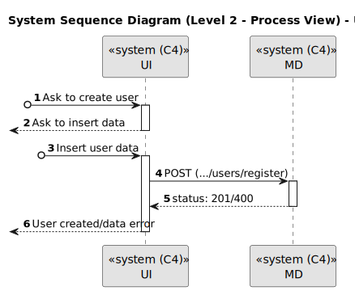

#### SSD US 80 - Como administrador do sistema pretendo aprovar ou recusar o registo de um utente.

#### SSD US 460 - Como utente do sistema pretendo requisitar uma tarefa indicando os parâmetros necessários à sua execução, nomeadamente o ponto inicial e o término e qual a tarefa pretendida.
##### Tarefa de vigilância
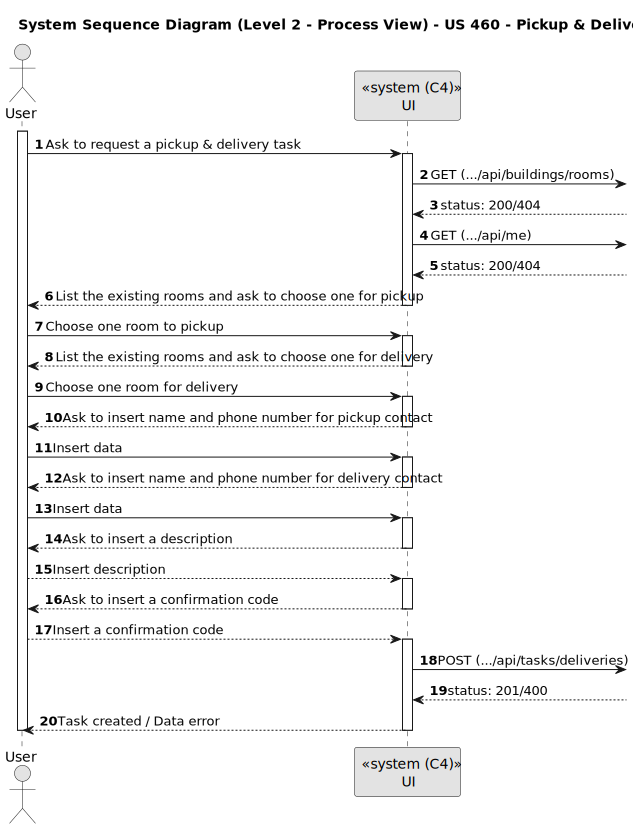

##### Tarefa de Pickup & Delivery

#### SSD US 470 - Como gestor de tarefas pretendo aprovar ou recusar uma requisição.
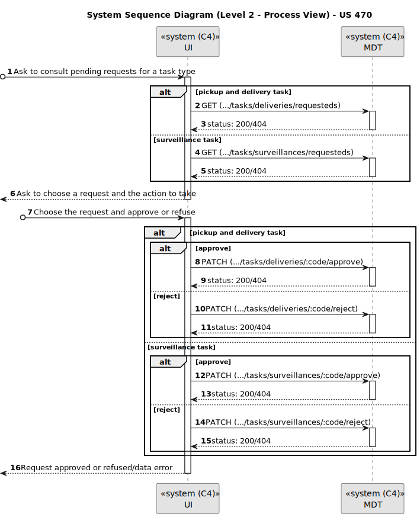

#### SSD US 480 - Como gestor de tarefas pretendo consultar as requisições de tarefas ainda não aprovadas.

#### SSD US 490 - Como gestor de tarefas pretendo pesquisar as requisições de tarefas por estado, por tipo de dispositivo, ou utente.
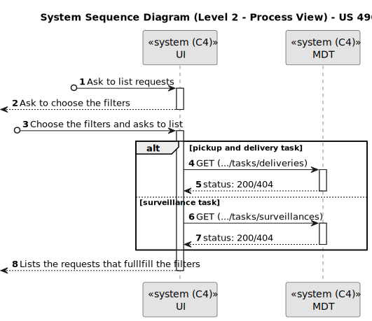

#### SSD US 500 - Como gestor de tarefas pretendo obter a sequência de execução das tarefas aprovadas.

### Vista de Implementação

### Vista Física

### Vista Lógica, Implementação e Física

## Nível 3 - MD

### Vista Lógica

### Vista de Processos

#### SSD US 10 - Como administrador pretendo criar um utilizador de sistema indicando as suas permissões.

#### SSD US 80 - Como administrador do sistema pretendo aprovar ou recusar o registo de um utente.

### Vista de Implementação

## Nível 3 - MDT

### Vista Lógica

### Vista de Processos

#### SSD US 460 - Como utente do sistema pretendo requisitar uma tarefa indicando os parâmetros necessários à sua execução, nomeadamente o ponto inicial e o término e qual a tarefa pretendida.
##### Tarefa de vigilância

##### Tarefa de Pickup & Delivery

#### SSD US 470 - Como gestor de tarefas pretendo aprovar ou recusar uma requisição.

#### SSD US 480 - Como gestor de tarefas pretendo consultar as requisições de tarefas ainda não aprovadas.

#### SSD US 490 - Como gestor de tarefas pretendo pesquisar as requisições de tarefas por estado, por tipo de dispositivo, ou utente.

#### SSD US 500 - Como gestor de tarefas pretendo obter a sequência de execução das tarefas aprovadas.

### Vista de Implementação

### Vista Lógica e de Implementação

## Nível 3 - UI

### Vista Lógica

### Vista de Processos

#### SSD US 10 - Como administrador pretendo criar um utilizador de sistema indicando as suas permissões.
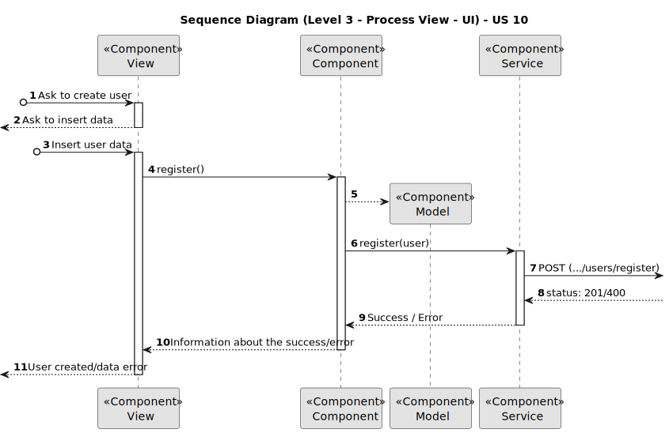

#### SSD US 80 - Como administrador do sistema pretendo aprovar ou recusar o registo de um utente.

#### SSD US 460 - Como utente do sistema pretendo requisitar uma tarefa indicando os parâmetros necessários à sua execução, nomeadamente o ponto inicial e o término e qual a tarefa pretendida.
##### Tarefa de vigilância

##### Tarefa de Pickup & Delivery

#### SSD US 470 - Como gestor de tarefas pretendo aprovar ou recusar uma requisição.
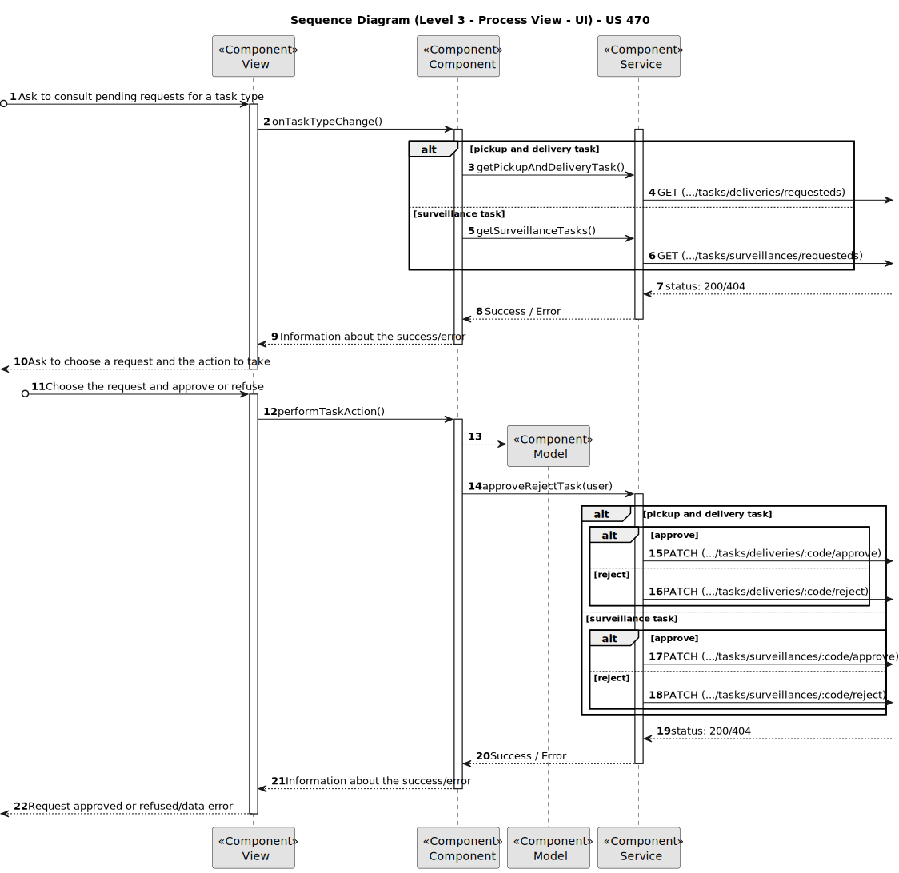

#### SSD US 480 - Como gestor de tarefas pretendo consultar as requisições de tarefas ainda não aprovadas.

#### SSD US 490 - Como gestor de tarefas pretendo pesquisar as requisições de tarefas por estado, por tipo de dispositivo, ou utente.
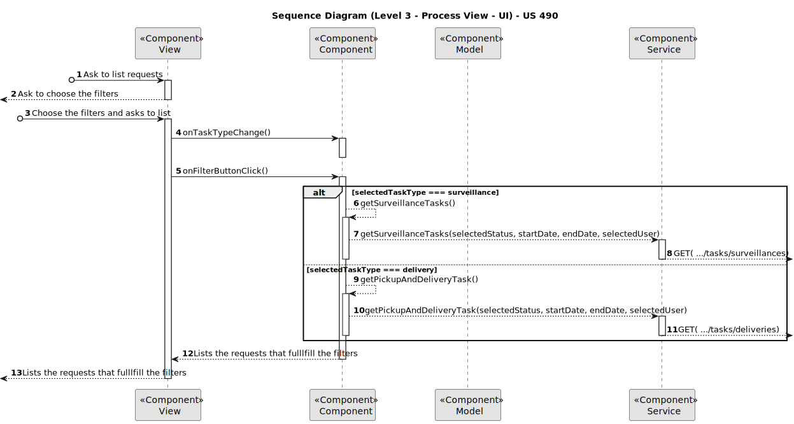

#### SSD US 500 - Como gestor de tarefas pretendo obter a sequência de execução das tarefas aprovadas.

### Vista de Implementação

### Vista Lógica e de Implementação

