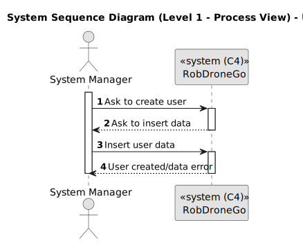
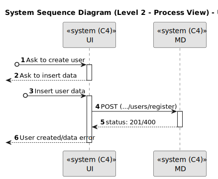
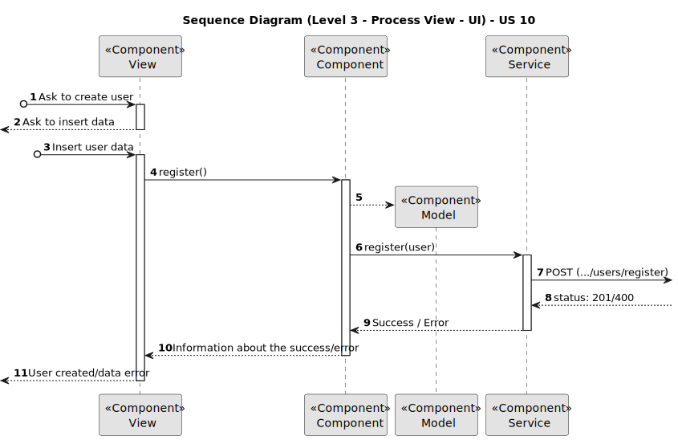
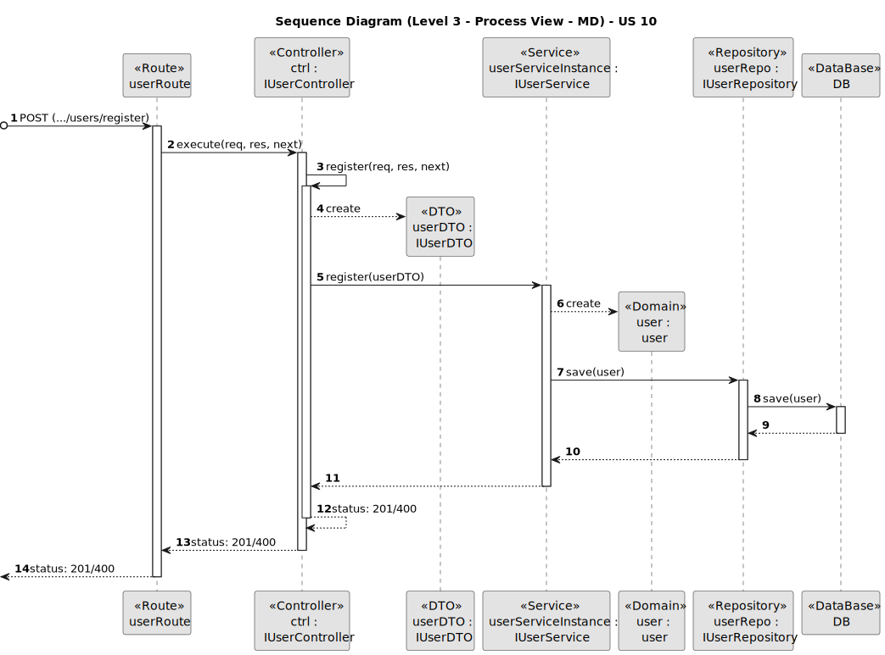
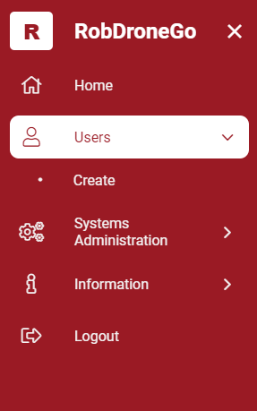
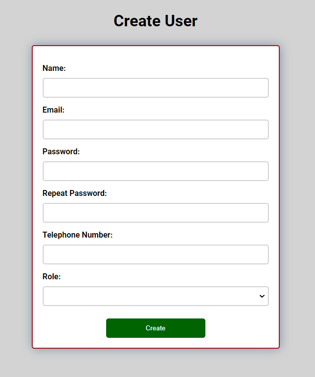
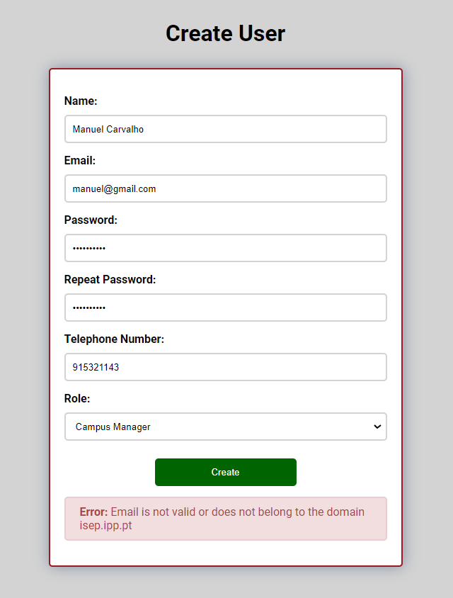
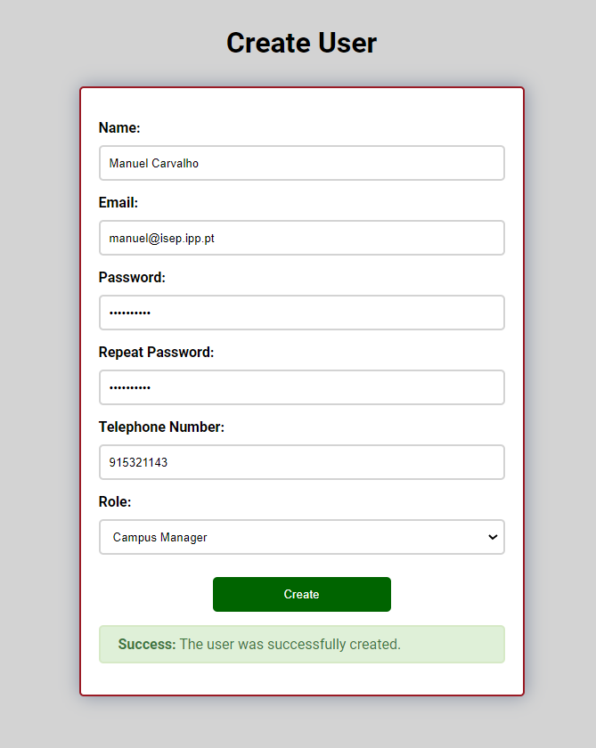

# US 10

Este documento contém a documentação relativa à *User Story (US)* 10.

## 1. Contexto

Esta *US* foi introduzida no *sprint* atual, e requer a implementação da funcionalidade que permite ao adminstrador do 
sistema, criar utilizadores. Para complementar esta funcionalidade, deve ser criada a respetiva *UI*.
Esta *US* faz parte do módulo "Gestão de Utilizadores" e pertence à unidade curricular de **ARQSI**.

## 2. Requisitos

***US 10*** - Como administrador pretendo criar um utilizador de sistema indicando as suas permissões.

A respeito deste requisito, entendemos que o administrador pode criar um utilizador do *backoffice* do sistema em que para 
isso deve ter ao seu dispor uma UI, que o permita utilizar esta funcionalidade.

### 2.1. Dependências encontradas

Esta *US* não possui nenhuma dependência.

### 2.2. Critérios de aceitação

**CA 1:** O papel do utilizador deve pertencer a um dos vários utilizadores do *backoffice* do sistema.

**CA 2:** Além da *role*, deve ser indicado o nome, email, palavra-passe e telefone.

**CA 3:** O email é o identificador de cada utilizador.

**CA 4:** Apenas deve ser aceite emails da organização, por exemplo *isep.ipp.pt*. A parametrização do dominio de email 
aceite deve ser mantida num ficheiro de propriedades ou numa variável de ambiente.

**CA 3:** A palavra-passe deve seguir os seguinte critérios: minimo 10 caracteres, pelo menos 1 letra maiúscula, pelo menos 
1 letra minúscula, pelo menos 1 dígito e pelo menos 1 símbolo.

## 3. Análise

### 3.1. Respostas do cliente

>**Questão:** "Como pretende que a atribuição de um Role seja feito?"
>
>**Resposta:** "O administrador atribui o papel na criação de utilizadores."
 
>**Questão:** "Que dados são necessários para a criação/registo de um utilizador, para além do seu Role?"
>
>**Resposta:** "A criação de utilizadores serve para os administradores de sistema criarem os diversos utilizadores de 
> backoffice do sistema num dos papeis designados, ex., gestor de campus, gestor de frota, gestor de tarefas. Será necessário 
> obter nome, email e telefone. Apenas serão aceites emails da organização, ex., isep.ipp.pt. A parametrização do dominio 
> de email aceite deve ser mantida fora do código fonte do projeto, ex., ficheiro de propriedades ou variavel de ambiente"

>**Questão:** "No contexto da criação de utilizadores, desejo entender como posso identificar e distinguir um utilizador dos demais utilizadores."
>
>**Resposta:** "O email será o username que identifica cada utilizador."
 
>**Questão:** "No desenvolvimento da US10 surgiu uma questão em relação à password do utilizador criado. Esta password deve ser gerada automaticamente? 
> Se sim, que requisitos considera para uma password segura e como deve ser a password gerada?"
>
>**Resposta:** "De momento a password inicial deve ser introduzida pelo administrador quando cria a conta. a politica de 
> passwords é a seguinte: minimo 10 caracteres, pelo menos 1 letra maiuscula, pelo menos 1 letra minuscula, pelo menos 1 
> digito e pelo menos 1 simbolo"

>**Questão:** "...gostávamos de saber se um utilizador pode ter múltiplas roles."
>
>**Resposta:** "Em relação a multiplos roles, nesta fase do projeto não é necessário suportar (será uma adição interessante 
> para futuros sprints)."

### 3.2. Diagrama de Sequência do Sistema (Nível 1 - Vista de Processos)

### 3.3. Diagrama de Sequência do Sistema (Nível 2 - Vista de Processos)

## 4. Design

### 4.1. Diagrama de Sequência (Nível 3 - Vista de Processos - UI)

### 4.2. Diagrama de Sequência (Nível 3 - Vista de Processos - MD)

### 4.2. Testes

Para o *MD* foram realizados testes unitários (com isolamento por duplos), testes de integração (com isolamento por duplos)
e testes de sistema/end-to-end (sem isolamento) através do *Postman*.

Para a *UI* foram realizados testes automáticos unitários (com isolamento via duplos) e testes automáticos E2E (sem isolamento 
e com isolamento com o *backend*).

## 5. Implementação

Na realização desta *US* foi criada a UI (e respetivos estilos) que interage com o utilizador e o componente *UserCreateComponent*,
além disso utilizou-se o servico *UserService* criado por outra *US*.

**Commits Relevantes**

[Listagem dos Commits realizados](https://1191296gg.atlassian.net/browse/S50-81)

## 6. Integração/Demonstração

Para aceder a esta funcionalidade na *WebApp*, deve-se estar autenticado com um utilizador do tipo "System Manager" e através 
do menu temos que aceder a Users -> Create.

Após aceder a este local, o administrador tem à sua disposição um formulário onde pode introduzir os dados para criar
um novo utilizador no sistema.

Quando o administrador insere algum valor inválido nos campos, ele ao tentar criar o utilizador irá ser avisado de que
algo está errado e a operação é cancelada. De seguida temos um exemplo em que o campo *email* está inválido e o administrador
tenta criar o utilizador.

Por fim, quando todos os dados introduzidos estão válidos, o utilizador é criado com sucesso, e uma mensagem aparece
a informar o administrador dessa mesma ocorrência.

## 7. Observações

A conceção desta *US* foi planeada de forma a facilitar e permitir uma implementação mais suave e reutilizável da *US* 20.