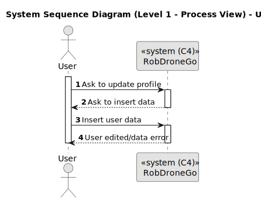
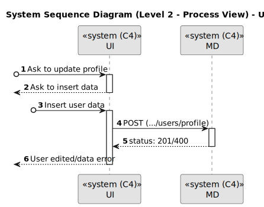
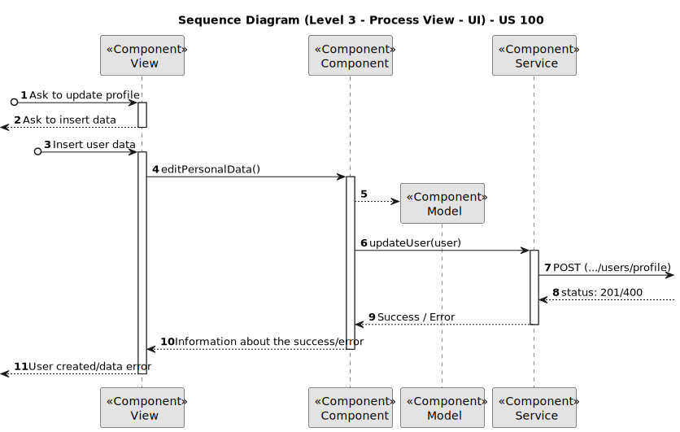
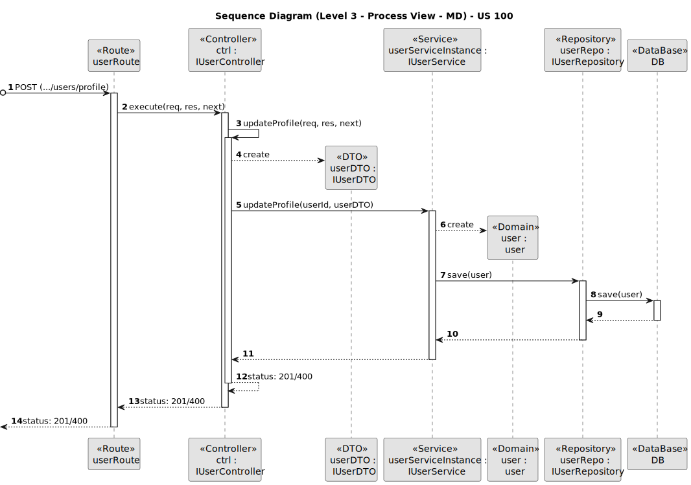
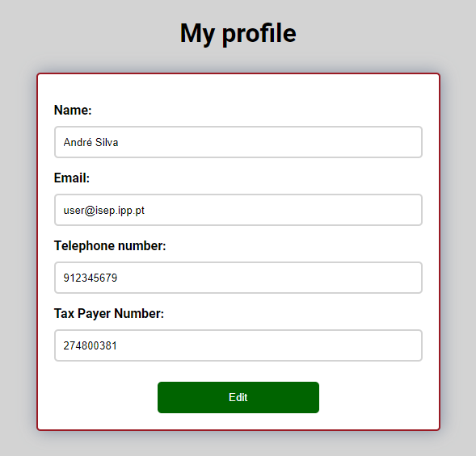
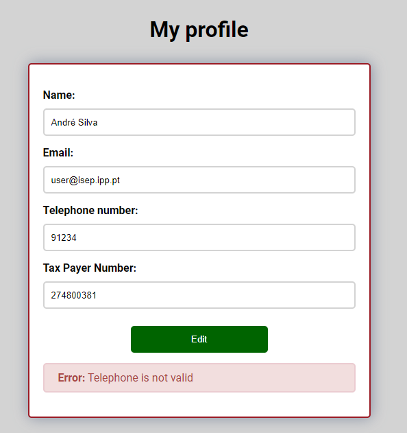
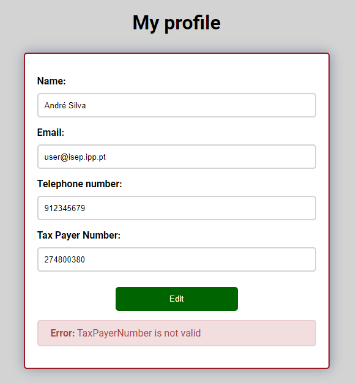
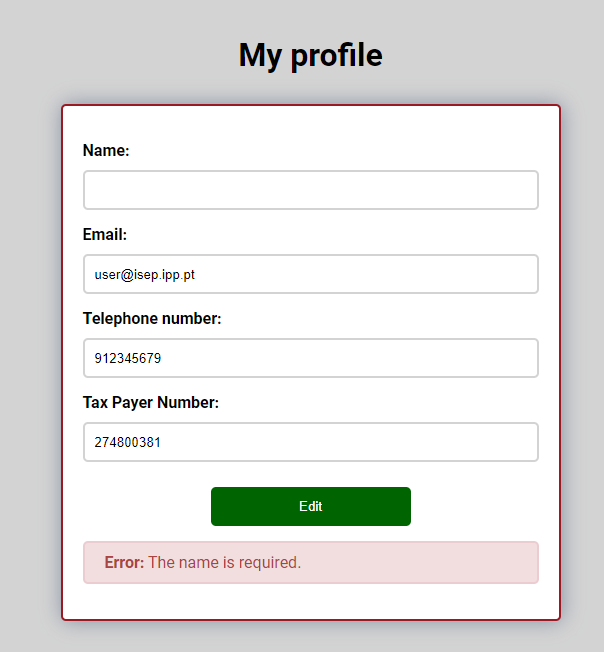
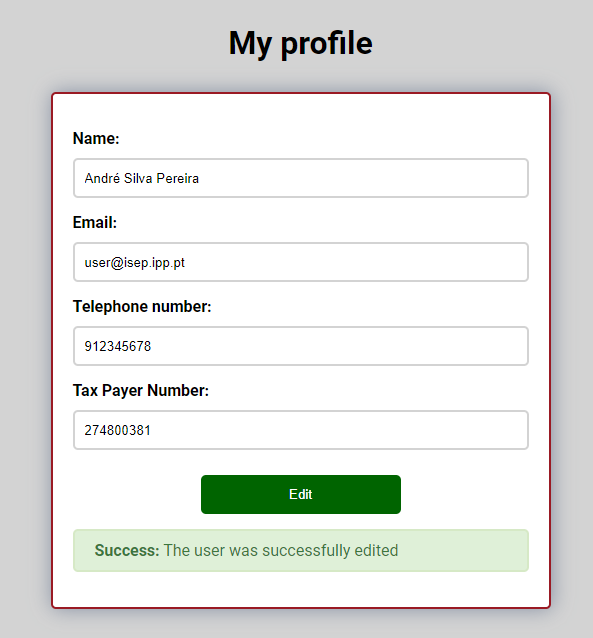

# US 100

Este documento contém a documentação relativa à *User Story (US)* 100.

## 1. Contexto

Esta *US* foi introduzida no *sprint* atual, e requer a implementação da funcionalidade que permite a um utente, retificar as suas informações.
Para complementar esta funcionalidade, deve ser criada a respetiva *UI*.
Esta *US* faz parte do módulo "Gestão de Utilizadores" e pertence à unidade curricular de **ARQSI**.

## 2. Requisitos

***US 100*** - Como utente do sistema pretendo retificar/alterar os meus dados

A respeito deste requisito, entendemos que um utilizador, pode retificar uma conta do *backoffice* do sistema em que para isso deve ter ao seu dispor uma UI,
que o permita utilizar esta funcionalidade.

### 2.1. Dependências encontradas

Esta *US* depende da us_20, pois é necessário existir um utilizador para o editar.

### 2.2. Critérios de aceitação

**CA 1:** O email não pode ser alterado.

**CA 2:** O numero de telefone e o NIF não podem ser alterados para numeros já registados no sistema.

## 3. Análise

### 3.1. Respostas do cliente

>**Questão:** "Que dados pessoais é que o utente pode alterar?"
>
>**Resposta:** "Todos à exceção do email que serve para identificar o cliente."
 
>**Questão:** "O cliente em uma outra resposta relativamente às US 10 e 20 disse que para o registo de utentes, seriam necessarios o nome, email, telefone e numero de contribuinte. Então nós estamos na duvida como 
> seria integrada a US 750 com a US 20 e 100. Nós pensamos em um registo por passos, basicamente o utente primeiramente se registaria com a sua conta google, por exemplo, e depois apareceria um form para completar o 
> registo, onde então iria pedir os restantes dados mencionados."
>
>**Resposta:** "No caso de usarem um fornecedor de IAM, ex., google, no registo de utentes, podem faze-lo por passos inciando pela autenticação no IAM e posteriormente pela recolha dos dados mencionados"

### 3.2. Diagrama de Sequência do Sistema (Nível 1 - Vista de Processos)

### 3.3. Diagrama de Sequência do Sistema (Nível 2 - Vista de Processos)

## 4. Design

### 4.1. Diagrama de Sequência (Nível 3 - Vista de Processos - UI)

### 4.2. Diagrama de Sequência (Nível 3 - Vista de Processos - MD)

### 4.2. Testes

Para o *MD* foram realizados testes unitários (com isolamento por duplos), testes de integração (com isolamento por duplos) e testes de sistema/end-to-end (sem isolamento) através do *Postman*.

Para a *UI* foram realizados testes automáticos unitários (com isolamento via duplos) e testes automáticos E2E (sem isolamento e com isolamento com o *backend*).

## 5. Implementação

Na realização desta *US* foi criado o MD e a UI (e respetivos estilos) que interage com o utilizador e o componente *UserCreateComponent*, além disso utilizou-se o servico *UserService* criado por outra *US*.

**Commits Relevantes**

[Listagem dos Commits realizados](https://1191296gg.atlassian.net/browse/S50-83)

## 6. Integração/Demonstração

Para aceder a esta funcionalidade na *WebApp*, deve estar autenticado e através do menu de user deve selecionar a opção "MyProfile".

Após aceder a este local, o administrador tem à sua disposição um formulário onde pode editar os seus dados.

Quando o administrador insere algum valor inválido nos campos, ao tentar editar o utilizador irá ser avisado de que algo está errado e a operação é cancelada.

De seguida temos um exemplo em que o campo *Telephone number* está inválido e o utente tenta editar o utilizador.

De seguida temos um exemplo em que o campo *Tax Payer Number* está inválido e o utente tenta editar o utilizador.

De seguida temos um exemplo em que o campo *Name* está inválido e o utente tenta editar o utilizador.

Por fim, quando todos os dados introduzidos estão válidos, o utilizador é editado com sucesso,
e uma mensagem aparece a informar o utilizador dessa mesma ocorrência.

## 7. Observações

Sem observações.