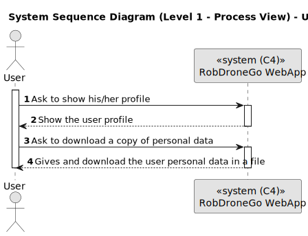

# US 110

Este documento contém a documentação relativa à *User Story (US)* 110.

## 1. Contexto

Esta *US* foi introduzida no *sprint* atual, e requer a implementação da funcionalidade para permitir ao utilizador obter uma cópia dos seus dados pessoais. Isto requer a implementação de uma UI que permita a utilização desta funcionalidade.
Esta *US* faz parte do módulo "Gestão de Utilizadores" e pertence à unidade curricular de **LAPR5**.

## 2. Requisitos

***US 110*** - Como utente do sistema pretendo uma cópia dos meus dados pessoais.

A respeito deste requisito, entendemos que o utilizador deve ter ao seu dispor uma UI para conseguir obter uma cópia dos seus dados pessoais.

### 2.1. Dependências encontradas

- **US 10** - Como administrador pretendo criar um utilizador de sistema indicando as suas permissões.

	**Explicação:** É necessário que existam utilizadores no sistema para que estes possam aceder à sua conta, e posteriormente aos seus dados pessoais.

- **US 1300** - Como utilizador pretendo que o menu da aplicação se ajuste consoante o meu tipo de utilizador.

	**Explicação:** É necessário que os utilizadores do tipo "utente" possam ter acesso à opção do menu que lhes permite aceder ao seu perfil, e posteriormente à opção para requisitar a cópia dos seus dados pessoais.

### 2.2. Critérios de aceitação

**CA 1:** Deve existir um botão no perfil do utilizador que permita requisitar a cópia dos dados pessoais.

**CA 2:** Deve ser feito o *download* automático de um ficheiro com os dados pessoais disponíveis do utilizador.

**CA 3:** Os dados pessoais que devem existir na cópia são: o nome, o e-mail, o número de telefone e o número de contribuinte.

## 3. Análise

### 3.1. Respostas do cliente

>**Questão:** "Gostaríamos de saber como a cópia dos dados pessoais deve ser feita."
> 
>**Resposta:** "Deve ser gerado um ficheiro json com a informação que o sistema guardou sobre a pessoa."

### 3.2. Diagrama de Sequência do Sistema (Nível 1 - Vista de Processos)

### 3.3. Diagrama de Sequência do Sistema (Nível 2 - Vista de Processos)

## 4. Design

### 4.1. Diagrama de Sequência (Nível 3 - Vista de Processos)

### 4.2. Testes

Para esta US foram realizados testes ao componente e aos serviços utilizados.

## 5. Implementação

Na realização desta *US* foi criada a UI (e respetivos estilos) que interage com o utilizador, o componente *ProfileComponent*, o *view model User* e o serviço *ProfileService*.

**Commits Relevantes**

[Listagem dos Commits realizados](https://1191296gg.atlassian.net/browse/S50-84)

## 6. Integração/Demonstração

Para aceder a esta funcionalidade na WebApp, deve-se estar autenticado com um utilizador do tipo 'utente' e através do menu temos que aceder a My Profile.

Para receber uma cópia dos dados pessoais, o utilizador apenas tem de clicar no botão aqui presente. Desta forma, será transferido um ficheiro no formato JSON que contém a informação pessoal existente no sistema relativamente ao próprio utilizador.

No ficheiro, é possível visualizar os dados pessoais do utilizador.

## 7. Observações

Não existem observações relevantes a acrescentar.
