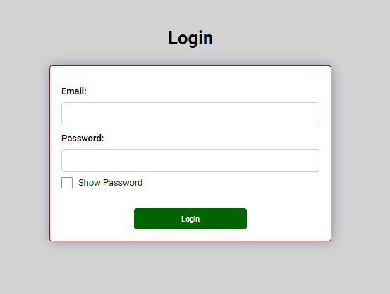
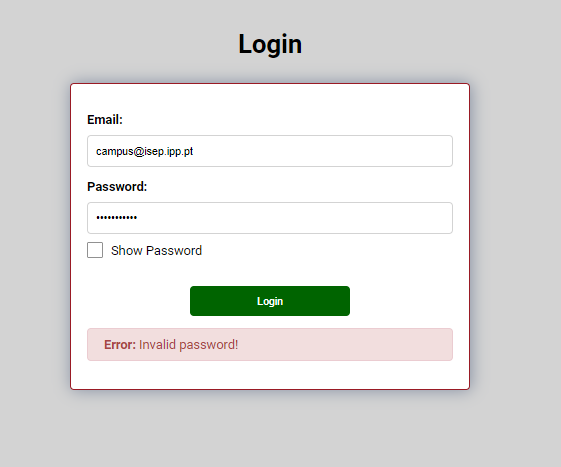
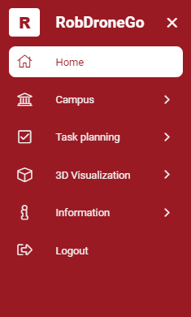

# US 1300

Este documento contém a documentação relativa à *User Story (US)* 1300.

## 1. Contexto

Esta *US* foi introduzida no *sprint* atual, e requer que o menu da aplicação se ajuste consoante o tipo de utilizador.
Esta *US* faz parte do módulo "Gestão de Utilizadores" e pertence à unidade curricular de **LAPR5**.

## 2. Requisitos

***US 1310*** - Como utilizador pretendo que o menu da aplicação se ajuste consoante o meu tipo de utilizador.

Relativamente a este requisito, entendemos que após a autenticação do utilizador, o menu da aplicação deve se ajustar consoante 
o tipo de utilizador.

### 2.1. Dependências encontradas

- **US 10** - Como administrador pretendo criar um utilizador de sistema indicando as suas permissões.

  **Explicação:** Se não existir utilizadores no sistema, não é possível verificar o papel do utilizador para enquadrar 
o menu da aplicação.

### 2.2. Critérios de aceitação

**CA 1:** O menu da aplicação deve corresponder ao papel do utilizador.

## 3. Análise

### 3.1. Respostas do cliente

Não foi necessário contactar com o cliente aquando da realização desta *US*.

## 4. Implementação

Na realização desta *US* foi criada a UI (e respetivos estilos) que interage com o utilizador, o componente *UserLoginComponent*
e o serviço *UserService*.

**Commits Relevantes**

[Listagem dos Commits realizados](https://1191296gg.atlassian.net/browse/S50-86)

## 5. Integração/Demonstração

Para aceder a esta funcionalidade é apenas necessário entrar na WebApp. De seguida, o utilizador tem à sua disposição um 
formulário onde pode autenticar-se no sistema.

Quando o utilizador insere algum dado inválido nos campos, ele ao tentar autenticar-se irá ser avisado de que
algo está errado e a operação é cancelada. De seguida temos um exemplo em que o campo *password* está inválido e o utilizador
tenta autenticar-se.

Por fim, quando todos os dados introduzidos estão válidos, o utilizador é autenticado com sucesso e é direcionado para o
menu que lhe corresponde.

## 6. Observações

Não existem observações relevantes a acrescentar.
