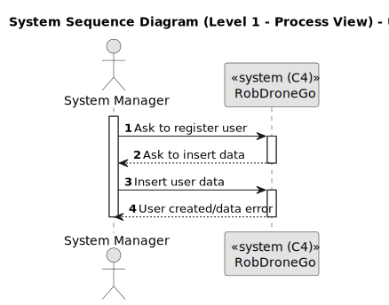
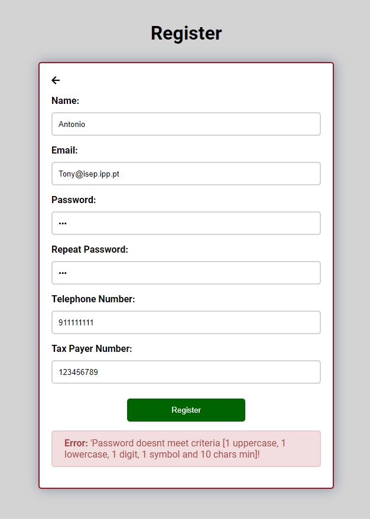

# US 20

Este documento contém a documentação relativa à *User Story (US)* 20.

## 1. Contexto

Esta *US* foi introduzida no *sprint* atual, e requer a implementação da funcionalidade que permite a um utente, pedir para criar uma conta na aplicação. Para complementar esta funcionalidade, deve ser criada a respetiva *UI*.
Esta *US* faz parte do módulo "Gestão de Utilizadores" e pertence à unidade curricular de **ARQSI**.

## 2. Requisitos

***US 20*** - Como potencial utente do sistema (ex., aluno, docente) pretendo registar-me como utente do sistema

A respeito deste requisito, entendemos que um utilizador, préviamente não registado na aplicação, pode criar uma conta do *backoffice* do sistema em que para isso deve ter ao seu dispor uma UI, que o permita utilizar esta funcionalidade.

### 2.1. Dependências encontradas

Esta *US* não possui nenhuma dependência.

### 2.2. Critérios de aceitação

**CA 1:** Deve ser indicado o nome, email, palavra-passe, telefone e numero de contribuinte.

**CA 2:** O email é o identificador de cada utilizador.

**CA 3:** Apenas deve ser aceite emails da organização, por exemplo *isep.ipp.pt*. A parametrização do dominio de email 
aceite deve ser mantida num ficheiro de propriedades ou numa variável de ambiente.

**CA 4:** A palavra-passe deve seguir os seguinte critérios: minimo 10 caracteres, pelo menos 1 letra maiúscula, pelo menos 
1 letra minúscula, pelo menos 1 dígito e pelo menos 1 símbolo.

## 3. Análise

### 3.1. Respostas do cliente

>**Questão:** "No âmbito desta US o objetivo é realizar o registo de um utente no sistema. Este registo irá criar um pedido de registo que, mais tarde será, ou não, aceite por um administrador de sistema. Em relação 
> a este pedido de registo, para além da informação do utilizador em questão, que outra informação será relevante guardar? (ex: timestamp)"
>
>**Resposta:** "No caso do pedido de registo apenas a data do pedido. se de um ponto de vista tecnico entenderem necessário guardar outra informação não haverá problema.
> no caso das aprovações/recusas dos pedidos de registo deve obviamente ser guardada informação sobre que utilizador e quando (data e hora) tomou a decisão"
 
>**Questão:** "O cliente em uma outra resposta relativamente às US 10 e 20 disse que para o registo de utentes, seriam necessarios o nome, email, telefone e numero de contribuinte. Então nós estamos na duvida como 
> seria integrada a US 750 com a US 20 e 100. Nós pensamos em um registo por passos, basicamente o utente primeiramente se registaria com a sua conta google, por exemplo, e depois apareceria um form para completar o 
> registo, onde então iria pedir os restantes dados mencionados."
>
>**Resposta:** "No caso de usarem um fornecedor de IAM, ex., google, no registo de utentes, podem faze-lo por passos inciando pela autenticação no IAM e posteriormente pela recolha dos dados mencionados"

>**Questão:** "Como pretende que a atribuição de um Role seja feito durante o registo do utente pelo Administrator (US10)?"
>
>**Resposta:** "Os utilizadores que utilizem a funcionalidade de registo serão sempre do tipo "utente"."

### 3.2. Diagrama de Sequência do Sistema (Nível 1 - Vista de Processos)

### 3.3. Diagrama de Sequência do Sistema (Nível 2 - Vista de Processos)

## 4. Design

### 4.1. Diagrama de Sequência (Nível 3 - Vista de Processos - UI)

### 4.2. Diagrama de Sequência (Nível 3 - Vista de Processos - MD)

### 4.2. Testes

Para o *MD* foram realizados testes unitários (com isolamento por duplos), testes de integração (com isolamento por duplos) e testes de sistema/end-to-end (sem isolamento) através do *Postman*.

Para a *UI* foram realizados testes automáticos unitários (com isolamento via duplos) e testes automáticos E2E (sem isolamento e com isolamento com o *backend*).

## 5. Implementação

Na realização desta *US* foi criada a UI (e respetivos estilos) que interage com o utilizador e o componente *UserCreateComponent*, além disso utilizou-se o servico *UserService* criado por outra *US*.

**Commits Relevantes**

[Listagem dos Commits realizados](https://1191296gg.atlassian.net/browse/S50-96)

## 6. Integração/Demonstração

Para aceder a esta funcionalidade na *WebApp*, não deve estar autenticado e através do menu de login inicial deve selecionar a opção "Do not have an account yet?".

Após aceder a este local, o administrador tem à sua disposição um formulário onde pode introduzir os dados para criar um novo utilizador no sistema.

Quando o administrador insere algum valor inválido nos campos, ao tentar criar o utilizador irá ser avisado de que algo está errado e a operação é cancelada.

De seguida temos um exemplo em que o campo *Email* está inválido e o utente tenta criar o utilizador.

De seguida temos um exemplo em que o campo *Email* está válido, mas o dominio do mesmo não é valido e o utente tenta criar o utilizador.

De seguida temos um exemplo em que o campo *Password* e *Repeat Password* está inválido e o utente tenta criar o utilizador.

De seguida temos um exemplo em que o campo *Password* e *Repeat Password* não estão iguais e o utente tenta criar o utilizador.

De seguida temos um exemplo em que o campo *Telephone Number* está inválido e o utente tenta criar o utilizador.

De seguida temos um exemplo em que o campo *Tax Payer Number* está inválido e o utente tenta criar o utilizador.

Por fim, quando todos os dados introduzidos estão válidos, o utilizador é criado com sucesso, e uma mensagem aparece
a informar o administrador dessa mesma ocorrência.

## 7. Observações

Sem observações.