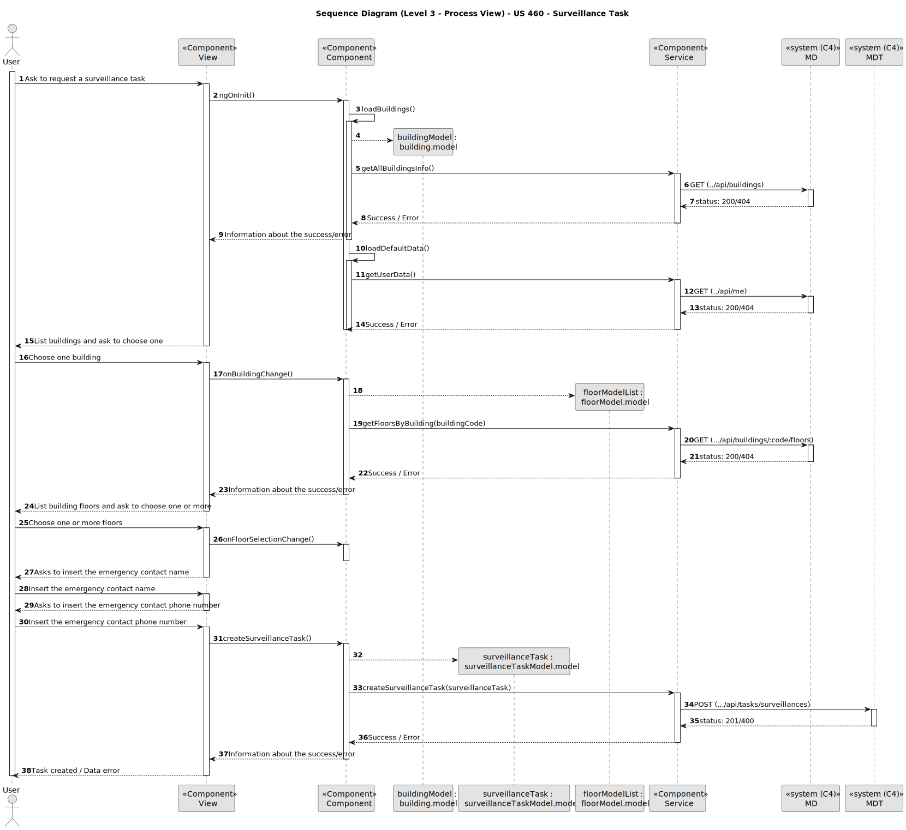

# US 460

Este documento contém a documentação relativa à *User Story (US)* 460.

## 1. Contexto

Esta *US* foi introduzida no *sprint* atual (*sprint* C), e requer a implementação da funcionalidade que permite ao utente do sistema, requisitar uma tarefa. Para complementar e completar esta funcionalidade, deve ser criada a respetiva *UI*.
Esta *US* faz parte do módulo "Gestão de tarefas" e pertence à unidade curricular de **ARQSI**.

## 2. Requisitos

***US 460*** - Como utente do sistema pretendo requisitar uma tarefa indicando os parâmetros necessários à sua execução, nomeadamente o ponto inicial e o término e qual a tarefa pretendida

A respeito deste requisito, entendemos que o utente pode requisitar uma tarefa em que para isso deve ter ao seu dispor uma *UI*, que o permita utilizar esta funcionalidade.

### 2.1. Dependências encontradas

Não foram encontradas dependências.

### 2.2. Critérios de aceitação

**CA 1:** Deve ficar registado qual foi o utente que realizou o pedido da tarefa.

**CA 2:** Para a tarefa de vigilância deve ser possível indicar um edifício, vários pisos e o número de contacto, que será usado em caso de incidente.

**CA 3:** Para a tarefa de vigilância, o utilizador na *UI* para escolher o edifício deve ter um *dropdown* que funcione também como *input* que filtra resultados.

**CA 4:** Para a tarefa de vigilância, o utilizador na *UI*, deve ter um *dropdown* para escolher o(s) piso(s) do edifício selecionado previamente, sendo que o edifício deve ter o piso que for selecionado.

**CA 5:** Quando o utente começa a requisitar uma tarefa, o contacto de requisição deve ser previamente preenchido com o contacto do requisitante.

**CA 6:** Para a tarefa de "Pickup & Delivery" devem ser indicada a sala de *pickup* e qual a sala de *delivery*, bem como um nome e um contacto para *pickup* e outro para *delivery*. Deve também ser indicado um código de confirmação que a pessoa que receberá deverá introduzir no painel do robot. Adicionalmente deve ser indicada uma descrição da entrega, ex., 'Marcadores de cor vermelha (1x) e azul (2x)'.

**CA 7:** Para a tarefa de "Pickup & Delivery", o utilizador na *UI*, deve ter um *dropdown* para escolher uma sala para *pickup* e outra para *delivery*.

**CA 8:** O sistema deve verificar se a sala selecionada existe.

**CA 9:** O código de confirmação é introduzido pelo requisitante e deve ser um número entre 4 e 6 digitos.

**CA 10:** A descrição da tarefa de *Pickup & Delivery* deve ter um limite de 1000 caracteres.

**CA 11:** A tarefa é criada com o estado "requisitada".

**CA 12:** Deve ser guardada a data da requisição.

## 3. Análise

### 3.1. Respostas do cliente

>**Questão:** "Gostaríamos de saber se pretende que fique registado qual foi o utente que requisitou a tarefa."
> 
>**Resposta:** "Sim. o requerente é uma informação importante a manter."

>**Questão:** "Na tarefa de Supervision deve ser indicado um contacto para o qual deve ser enviada uma mensagem em caso de necessidade. Este contacto pode/deve ser o do utente que faz a requisição da tarefa? Por exemplo, se um segurança pedir esta tarefa, e em caso de necessidade de contacto, o robot contacta o mesmo segurança que foi quem fez o pedido e é quem deve obter informações acerca da tarefa.

A mesma questão aplica-se à tarefa de Pickup & Delivery onde o contacto de pickup pode/deve ser o do utilizador que faz a requisição da tarefa, passando apenas o contacto de delivery."
> 
>**Resposta:** "o utilizador pode introduzir um contacto que não o dele. exemplo, o docente ABC requista a recolha de uma caneta na secretaria do departamento indicando o contacto de XYZ para entrega na sala de aula XXX ao docente ASD.

de um ponto de vista de usabilidade, será interessante se permitirem ter esses campos pré-preenchidos com os dados do utilizador requisitante."
>
>
>**Questão:** "O contacto indicado pelo utilizador deve ser o e-mail ou número de telemóvel?"
>
>**Resposta:** "Na requisição de uma tarefa será necessário indicar um contacto de "pickup" e um contacto de "delivery" (nome e número de telefone)"

>**Questão:** "Que atributos a tarefa tem para além dos já indicados?"
> 
>**Resposta:** "As tarefas de vigilância caracterizam-se por indicar qual o edificio e piso(s) que se pretende vigiar bem como o número de contacto em caso de incidente. tipicamente o segurança irá requisitar que um robot 'dê uma volta pelos pisos X, Y e Z do edificio N'. Caso o robot detete alguma situação anómala, o robot irá enviar um SMS para o contacto indicado (*)

As tarefas de 'piclup & delivery' caracterizam-se por indicar qual a sala que se pretende de pickup e qual a sala de delivery, bem como um nome e um contacto para pickup e outro para delivery. deve também ser indicado um código de confirmação que a pessoa que receberá deverá introduzir no painel do robot. adicionalmente deve ser indicada uma descrição da entrega, ex., 'Marcadores de cor vermelha (1x) e azul (2x)'

(*) fora do âmbito do protótipo"

>**Questão:** "Relativamente ao 'Código de Confirmação', mencionado em https://moodle.isep.ipp.pt/mod/forum/discuss.php?d=25045#p31683, gostava de perceber se este código segue algum formato específico. Além disso, o código será introduzido pelo utilizador que está a requisitar a tarefa, ou deverá ser gerado automaticamente pelo sistema?"
> 
>**Resposta:** "O código de confirmação é introduzido pelo requisitante. é um número entre 4 e 6 digitos"
>
>
>**Questão:** "Gostávamos de saber se a descrição de entrega deve ter algum limite de caracteres?"
>
>**Resposta:** "Para a descrição devem limitar a 1000 caracteres alfanumericos."

### 3.2. Diagramas de Sequência do Sistema (Nível 1 - Vista de Processos)

**Tarefa de vigilância**

Diagrama de Sequência do Sistema para o MDT

Diagrama de Sequência do Sistema para a UI

**Tarefa de *Pickup & Delivery***

Diagrama de Sequência do Sistema para o MDT

Diagrama de Sequência do Sistema para a UI

### 3.3. Diagramas de Sequência do Sistema (Nível 2 - Vista de Processos)

**Tarefa de vigilância**

Diagrama de Sequência do Sistema para o MDT

Diagrama de Sequência do Sistema para a UI

**Tarefa de *Pickup & Delivery***

Diagrama de Sequência do Sistema para o MDT

Diagrama de Sequência do Sistema para a UI

## 4. Design

### 4.1. Diagramas de Sequência (Nível 3 - Vista de Processos)

**Tarefa de vigilância**

Diagrama de Sequência para o MDT

Diagrama de Sequência para a UI

**Tarefa de *Pickup & Delivery***

Diagrama de Sequência para o MDT

Diagrama de Sequência para a UI

### 4.2. Testes

Para o módulo MDT foram realizados testes automáticos unitários, testes automáticos de integração de unidades (com algum isolamento) e testes automáticos de integração de contentores (sem isolamento).

Para a UI foram realizados testes automáticos unitários (com isolamento via duplos) e testes automáticos E2E (com isolamento com o backend).

## 5. Implementação

Na realização do módulo de *backend* MDT desta *US* foram criados os controladores *SurveillanceTaskController* e *PickupAndDeliveryTaskController*, além disso criou-se os serviços *PickupAndDeliveryTasksService* e *SurveillanceTasksService* criados. Também foi criado os *models* *SurveillanceTask* e *PickupAndDeliveryTask*, e ainda os esquemas de base de dados *SurveillanceTaskSchema* e *PickupAndDeliveryTaskSchema*. Também foi feita a ligação à base de dados.

Na realização do módulo de *frontend* desta *US* foi criada a *UI* (e respetivos estilos) que interagem com o utilizador (aluno, docente, funcionário). Foram também criados os componentes *TaskCreateSurveillanceComponent* e *TaskCreatePickupAndDeliveryComponent*, os *models* *SurveillanceTask* e *PickupAndDeliveryTask*, e o serviço *TaskService*. Também se utilizou os serviços *BuildingService*, *FloorService* e *RoomService*, que foram criados noutras *US's*.

**Commits Relevantes**

[Listagem dos Commits realizados](https://1191296gg.atlassian.net/browse/S50-76)

## 6. Integração/Demonstração

**Surveillance Tasks**

Para aceder a esta funcionalidade na WebApp, deve-se estar autenticado com um utilizador do tipo "User" e através do menu temos que aceder a Create Task -> Create Surveillance Task.

Após aceder a este local, o utilizador tem à sua disposição um formulário onde pode inserir os dados necessários para a criação de uma tarefa de vigilâcia. Os dados do nome e contacto de emergência já vêm preenchidos por defeito com os dados do utilizador que está a criar a tarefa.

Existe uma lista de filtragem para a escolha do edifício onde se quer realizar esta tarefa. Após selecionar o edifício pretendido, aparecem os pisos que existem nesse edifício. Desta forma, o utilizador pode selecionar os pisos em que pretende que o *robot* faça a tarefa de vigia.

Depois de selecionar os pisos em que se pretende realizar a tarefa de vigia, e submetido o formulário, é dada uma mensagem de sucesso caso os dados inseridos estejam válidos no negócio. Caso contrário, o erro ocorrido é reportado ao utilizador.

**Pickup & Delivery Tasks**

Para aceder a esta funcionalidade na WebApp, deve-se estar autenticado com um utilizador do tipo "User" e através do menu temos que aceder a Create Task -> Create Pickup & Delivery Task.

Após aceder a este local, o utilizador tem à sua disposição um formulário onde pode inserir os dados necessários para a criação de uma tarefa de *Pickup & Delivery*. Os dados dos nomes e contactos de *pickup* e o de *delivery* já vêm preenchidos por defeito com os dados do utilizador que está a criar a tarefa.

Existe uma lista de filtragem para a escolha da sala de *pickup* e outra para a sala de *delivery*. Desta forma, o utilizador pode selecionar a sala que pretende que o *robot* vá buscar algum material, e a sala onde quer que ele entregue esse material.

Depois de preencher todos os dados e submetido o formulário, caso esteja tudo de forma correta, ou seja, se os dados estiverem válidos no negócio, é dada uma mensagem de sucesso. Caso contrário, o erro ocorrido é reportado ao utilizador.

## 7. Observações

Não existem observações relevantes a acrescentar.
