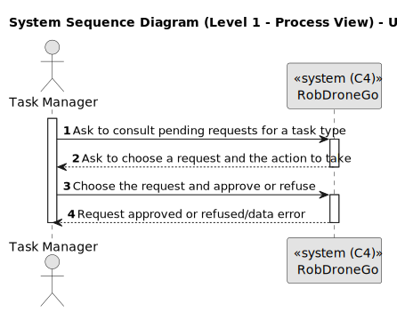
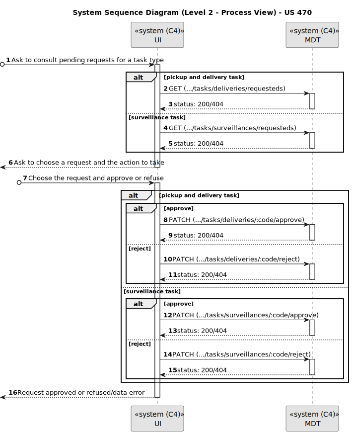
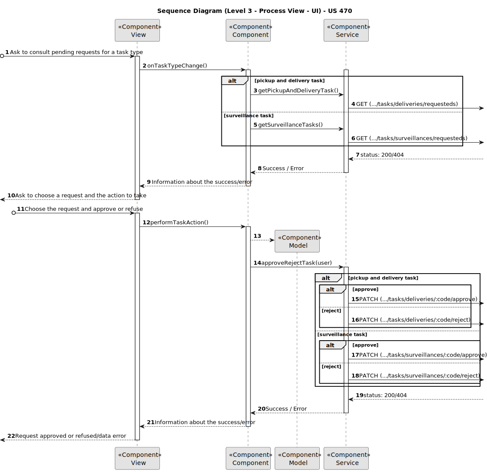
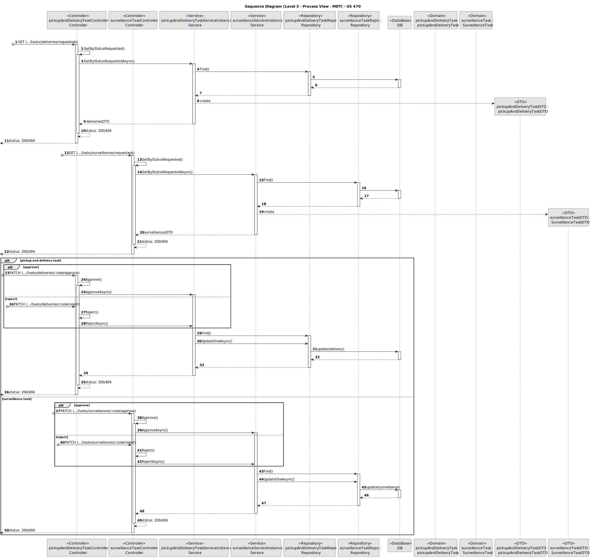
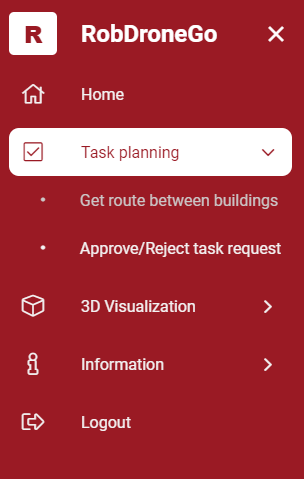
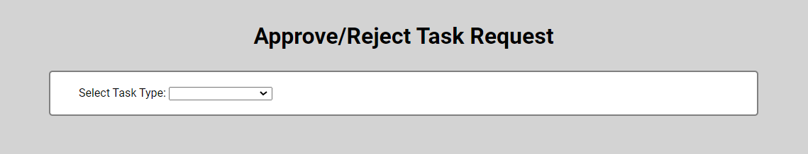
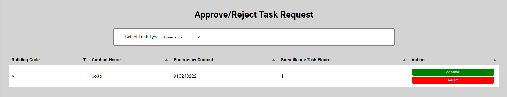
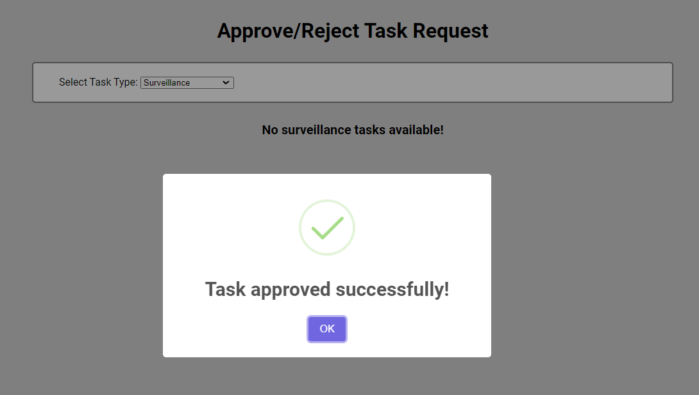

# US 470

Este documento contém a documentação relativa à *User Story (US)* 470.

## 1. Contexto

Esta *US* foi introduzida no *sprint* atual (*sprint* C), e requer a implementação da funcionalidade que permite ao gestor 
de tarefas aprovar ou recusar uma requisição. Para complementar esta funcionalidade, deve ser criada a respetiva *UI*.
Esta *US* faz parte do módulo "Gestão de tarefas" e pertence à unidade curricular de **ARQSI**.

## 2. Requisitos

***US 470*** - Como gestor de tarefas pretendo aprovar ou recusar uma requisição.

A respeito deste requisito, entendemos que o gestor de tarefas pode aprovar ou recusar uma requisição em que para isso 
deve ter ao seu dispor uma *UI*, que o permita utilizar esta funcionalidade.

### 2.1. Dependências encontradas

- **US 460** - Como utente do sistema pretendo requisitar uma tarefa indicando os parâmetros necessários à sua execução, 
nomeadamente o ponto inicial e o término e qual a tarefa pretendida.

  **Explicação:** Se uma requisição de tarefa não existir, não é possível aprová-la ou recusá-la.

- **US 480** - Como gestor de tarefas pretendo consultar as requisições de tarefas ainda não aprovadas.

  **Explicação:** A aprovação ou recusa de uma requisição deve ser realizada na listagem das requisições de tarefa pendentes 
de decisão.
    
### 2.2. Critérios de aceitação

**CA 1:** A decisão de aprovar ou recusar uma requisição deve ser feita diretamente na lista das requisições de tarefa pendentes.

## 3. Análise

### 3.1. Respostas do cliente

>**Questão:** "Queria esclarecer nesta US se o pretendido é consultar as requisições de tarefas que ainda não foram aprovadas, 
> nem recusadas (ou seja, apresentar só as "pendentes"). Ou se seria pretendido consultar as tarefas "pendentes" + as tarefas recusadas."
>
>**Resposta:** "Pretende-se a listagem das requisições pendentes de decisão. Nessa mesma listagem deve existir um botão 
> que permita aprovar ou recusar cada requisição."

### 3.2. Diagrama de Sequência do Sistema (Nível 1 - Vista de Processos)

### 3.3. Diagrama de Sequência do Sistema (Nível 2 - Vista de Processos)

## 4. Design

### 4.1. Diagrama de Sequência (Nível 3 - Vista de Processos - UI)

### 4.2. Diagrama de Sequência (Nível 3 - Vista de Processos - MDT)

### 4.2. Testes

Para o *MDT* foram realizados testes automáticos unitários, testes automáticos de integração de unidades (com algum isolamento) e
testes automáticos de integração de contentores (sem isolamento).

Para a *UI* foram realizados testes automáticos unitários (com isolamento via duplos) e testes automáticos E2E (com isolamento 
com o *backend*).

## 5. Implementação

Na realização do *backend* desta *US* foi utilizado o controlador *PickupAndDeliveryTaskController* e *SurveillanceTaskController*, 
além disso utilizou-se os serviços *PickupAndDeliveryTasksService* e *SurveillanceTasksService* criados por outra *US*.

Na realização do *frontend* desta *US* foi criada a UI (e respetivos estilos) que interage com o gestor de tarefas e o componente *TaskApproveComponent*,
além disso utilizou-se o servico *TaskService* criado por outra *US*.

**Commits Relevantes**

[Listagem dos Commits realizados](https://1191296gg.atlassian.net/browse/S50-77)

## 6. Integração/Demonstração

Para aceder a esta funcionalidade na *WebApp*, deve-se estar autenticado com um utilizador do tipo "Task Manager" e através
do menu temos que aceder a Task planning -> Approve/Reject task request.

Após aceder a este local, o gestor de tarefas tem à sua disposição um formulário onde pode selecionar o tipo de tarefa 
que pretende visualizar.

Quando o tipo de tarefa é selecionado é apresentada a listagem das requisições pendentes.

Para aprovar ou rejeitar uma requisição, basta apenas clicar no respetivo botão, e uma mensagem aparece a informar o gestor 
de tarefas do sucesso da operação.

## 7. Observações

Não existem observações relevantes a acrescentar.