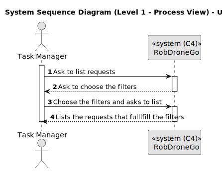
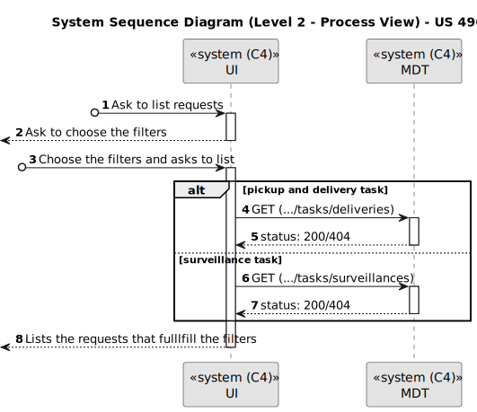
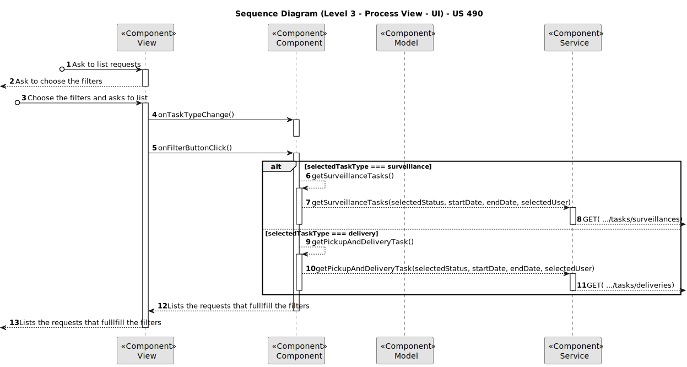
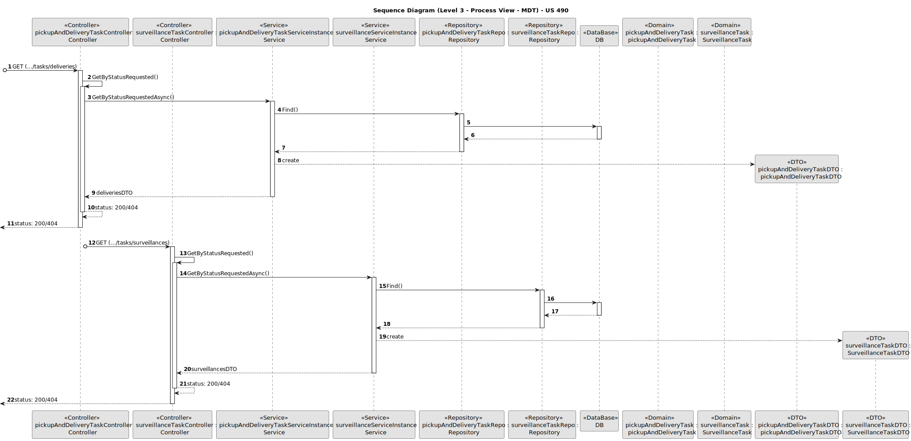
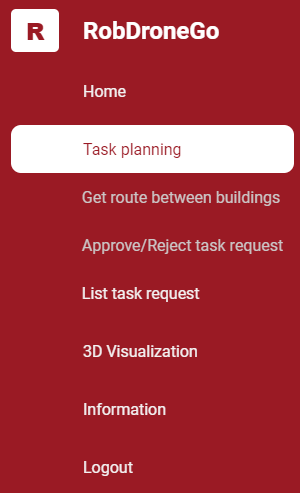
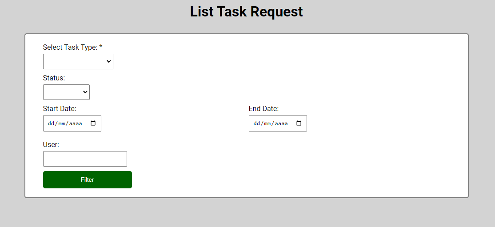
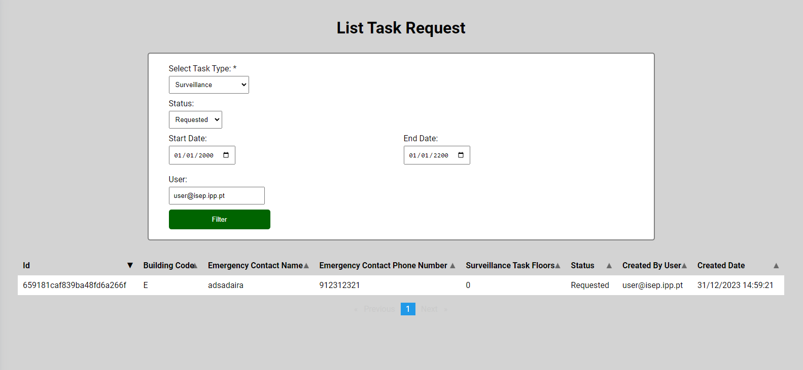

# US 490

Este documento contém a documentação relativa à *User Story (US)* 490.

## 1. Contexto

Esta *US* foi introduzida no *sprint* atual (*sprint* C), e requer a implementação da funcionalidade que permite ao gestor de tarefas pesquisar as requisições de tarefas por estado,
por tipo de dispositivo, ou utente.
Para complementar esta funcionalidade, deve ser criada a respetiva *UI*.
Esta *US* faz parte do módulo "Gestão de tarefas" e pertence à unidade curricular de **ARQSI**.

## 2. Requisitos

***US 490*** - Como gestor de tarefas pretendo pesquisar as requisições de tarefas por estado, por tipo de dispositivo, ou utente.

A respeito deste requisito, entendemos que o gestor de tarefas pode pesquisar as requisições de tarefas por estado,
por tipo de dispositivo, ou utente.

### 2.1. Dependências encontradas

- **US 460** - Como utente do sistema pretendo requisitar uma tarefa indicando os parâmetros necessários à sua execução, 
nomeadamente o ponto inicial e o término e qual a tarefa pretendida.

  **Explicação:** Se uma requisição de tarefa não existir, não é possível lista-la.
    
### 2.2. Critérios de aceitação

**CA 1:** Na listagem resultante deve ser possivel filtrar os dados pelos atributos indicados.

**CA 2:** Deve ser possivel ordenar as colunas da tabela de forma ascendente ou descendente.

## 3. Análise

### 3.1. Respostas do cliente

>**Questão:** "Neste requisito é suposto o utilizador filtrar uma lista de requisições de tarefas ou apenas escolher o tipo de listagem (estado,tipo de dispositivo ou utente) que quer ver e mostrar lhe apenas isso."
>
>**Resposta:** "Na listagem resultante deve ser possivel filtrar os dados pelos atributos indicados. Esta opção mostra todas as requisições do sistema, incluindo de datas passadas pelo que deverá também ser possivel 
> filtrar por data de requisição.
> notem que o volume de dados pode ser muito grande pelo que devem avaliar tecnicamente como equilibrar este requisito funcional com a sua implementação tecnica. Por exemplo, ao fim de algum tempo o sistema poderá 
> ter milhares (ou dezenas de milhares) de requisições. Embora seja aceitavel para efeitos de prototipo que existam limitações na vossa implementação, tais limitações devem ser devidamente e explcitamente 
> documentadas bem como propostas de alternativas para contornar essas limitações."

>**Questão:**"Uma das interpretações possíveis é que a listagem da US490 engloba a listagem que precisa de ser desenvolvida na US480, já que na tabela da US490 é possível filtrar os requisitos de tarefas por tarefas 
> ainda não aprovadas. Essa filtragem daria a tabela que é pedida na US480."
>
>**Resposta:**"Sao duas opções distintas. Uma apenas para aprovar ou recusar as tarefas pendentes de decisão. A outra opção é para consulta de todas as tarefas do sistema, inclusive histórico."

>**Questão:**"Como gestor de tarefas, o que pretende ver relativamente à lista de requisições de tarefas?
> Era-lhe conveniente ver algum tipo de código para cada tarefa?
> Em relação ao utente, o e-mail?"
>
>**Resposta:**"Cada requisição/tarefa possui um código identificativo que deverá ser gerado pelo sistema e que deverá ser visualizado nas consultas e listagens de tarefas/requisições. em relação aos dados do 
> requerente deve ser mostrado pelo menos a sua identidade (email), mas será interessante mostrarem também o nome do utente."

>**Questão:**"O código identificativo terá algum tipo de restrição em termos de comprimento? Além disso, será alfanumérico ou segue outro formato?"
>
>**Resposta:**"Trata-se de um código abstrato, sem significado. deve ser legivel por humanos pelo que se aconselha seja numérico ou alfanumérico."

### 3.2. Diagrama de Sequência do Sistema (Nível 1 - Vista de Processos)

### 3.3. Diagrama de Sequência do Sistema (Nível 2 - Vista de Processos)

## 4. Design

### 4.1. Diagrama de Sequência (Nível 3 - Vista de Processos - UI)

### 4.2. Diagrama de Sequência (Nível 3 - Vista de Processos - MDT)

### 4.2. Testes

Para o *MDT* foram realizados testes automáticos unitários, testes automáticos de integração de unidades (com algum isolamento) e
testes automáticos de integração de contentores (sem isolamento).

Para a *UI* foram realizados testes automáticos unitários (com isolamento via duplos) e testes automáticos E2E (com isolamento 
com o *backend*).

## 5. Implementação

Na realização do *backend* desta *US* foi utilizado o controlador *PickupAndDeliveryTaskController* e *SurveillanceTaskController*, 
além disso utilizou-se os serviços *PickupAndDeliveryTasksService* e *SurveillanceTasksService* criados por outra *US*.

Na realização do *frontend* desta *US* foi criada a UI (e respetivos estilos) que interage com o gestor de tarefas e o componente *TaskApproveComponent*,
além disso utilizou-se o servico *TaskService* criado por outra *US*.

**Commits Relevantes**

[Listagem dos Commits realizados](https://1191296gg.atlassian.net/browse/S50-79)

## 6. Integração/Demonstração

Para aceder a esta funcionalidade na *WebApp*, deve-se estar autenticado com um utilizador do tipo "Task Manager" e através
do menu temos que aceder a Task planning -> List task request.

Após aceder a este local, o gestor de tarefas tem à sua disposição um formulário onde pode selecionar o tipo de tarefa, intervalo de data, utilizador ou estado da tarefa
que pretende visualizar.

Para listar uma requisição, basta apenas clicar no respetivo botão, e aparece uma tabela que contém todas as tarefas correspondentes aos filtros.

## 7. Observações

Não existem observações relevantes a acrescentar.