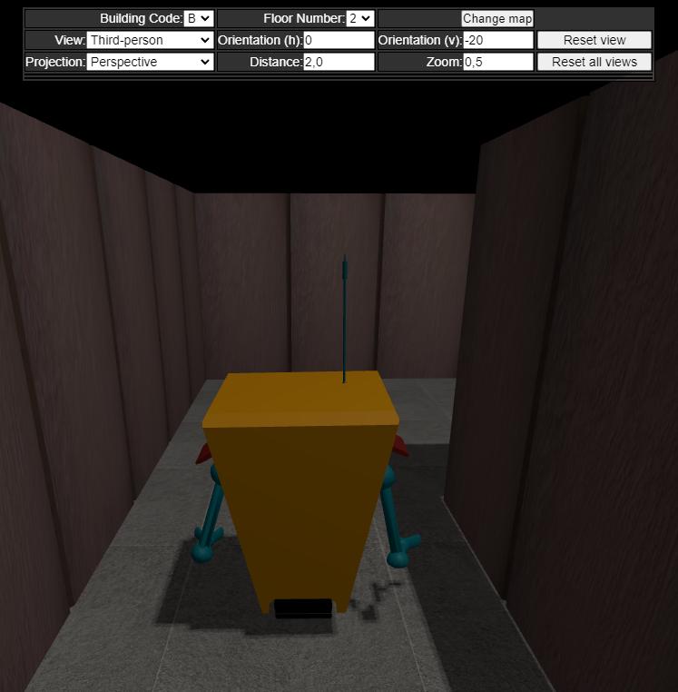
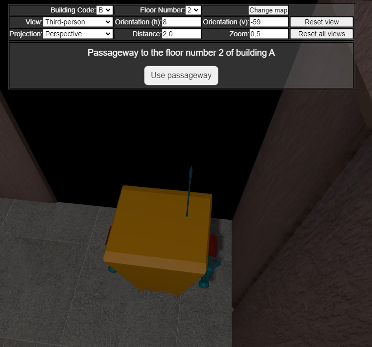
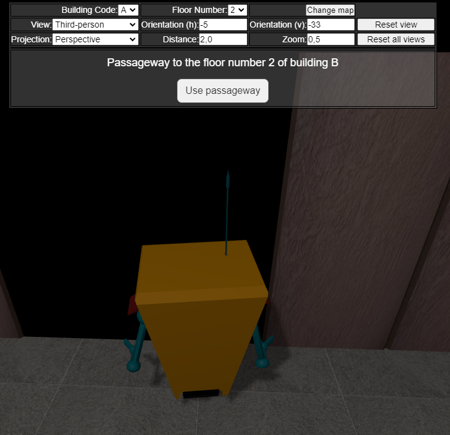

# US 607

Este documento contém a documentação relativa à *User Story (US)* 607.

## 1. Contexto

Esta *US* foi introduzida no *sprint* atual, e requer a possibilidade de atravassar uma passagem e transitar para o piso correspondente.
Esta *US* faz parte do módulo "Visualização 3D" e pertence à unidade curricular de **SGRAI**.

## 2. Requisitos

***US 607*** - Ao navegar interactivamente e ao chegar a uma passagem entre edifícios, deve transitar automaticamente para o piso adjacente.

Relativamente a este requisito, entendemos que, ao se aproximar de uma passageam, o utilizador deve deparar-se com uma opção que ao ser selecionada carregará o andar adequado do edificio adequado.
Após selecionar um dos pisos disponíveis, o robot deve aparecer adjacente á passagem em questão.

### 2.1. Dependências encontradas

- **US 606** - Permitir a navegação interactiva (com o recurso ao teclado) do robot pelos diversos pisos dos diversos edifícios do campus.

  **Explicação:** Se não for possível realizar uma navegação interactiva com o *robot*, não é possível entrar no elevador.

### 2.2. Critérios de aceitação

## 3. Análise

### 3.1. Respostas do cliente

Não foi necessário contactar com o cliente aquando da realização desta *US*.

## 4. Implementação

Na realização desta *US* foi utilizada a UI (e respetivos estilos) da visualização 3D que interage com o utilizador, o componente *FloorVisualizationComponent* e o serviço *PassagewayService*.

**Commits Relevantes**

[Listagem dos Commits realizados](https://1191296gg.atlassian.net/browse/S50-63)

## 5. Integração/Demonstração

Para aceder a esta funcionalidade na WebApp, deve-se através do menu aceder a 3D Visualization -> Interactive visualization.

Ao movimentar o *robot* pelo mapa, não é apresentada a opção de atravessar uma passageway.

Quando o *robot* entra em contacto com uma passageway, um botão é apresentado, permitindo a travessia para o edifício e piso correspondente.

Após selecionar a opção, ocorre uma transição para o edifício e andar correspondente, e o robot será posicionado adjacente á passageway adequado.

## 6. Observações

Não existem observações relevantes a acrescentar.
