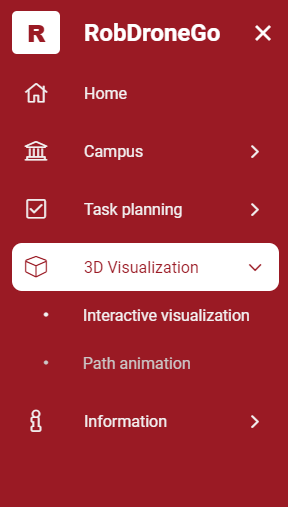
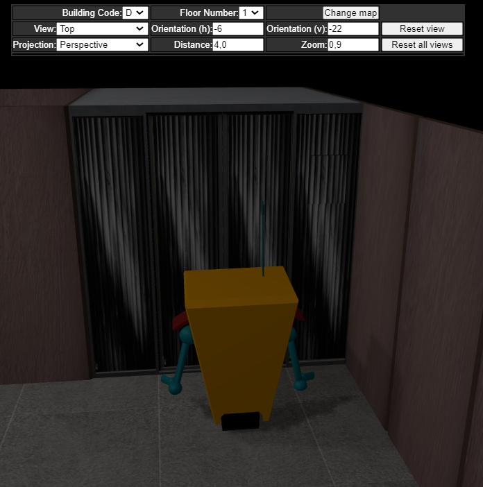
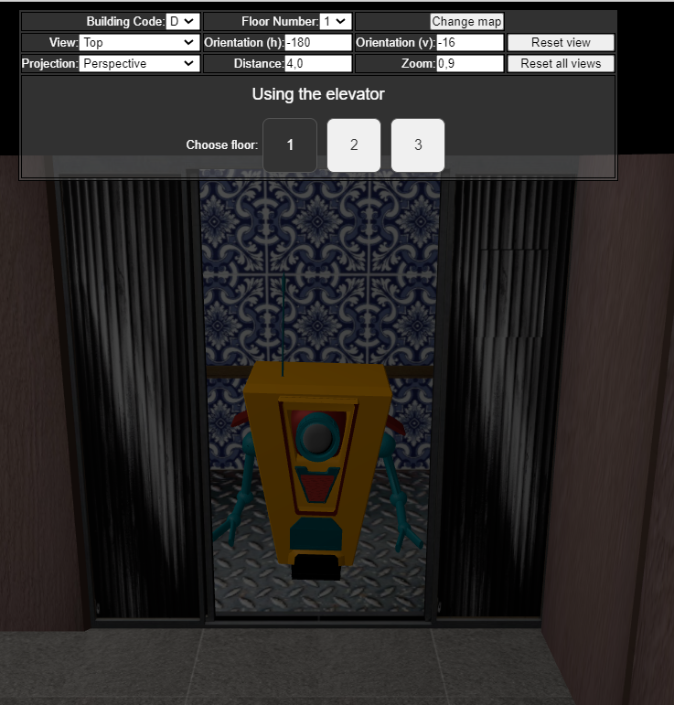
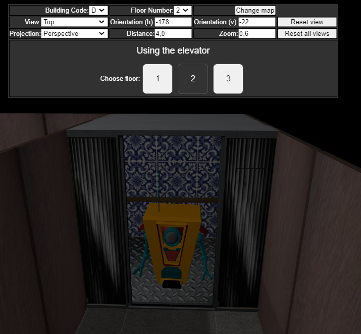

# US 608

Este documento contém a documentação relativa à *User Story (US)* 608.

## 1. Contexto

Esta *US* foi introduzida no *sprint* atual, e requer a possibilidade de escolher um piso ao entrar num elevador e 
transitar para o piso selecionado.
Esta *US* faz parte do módulo "Visualização 3D" e pertence à unidade curricular de **SGRAI**.

## 2. Requisitos

***US 608*** - Ao navegar interactivamente e ao entrar num elevador, deve ser possível escolher o piso a que se pretende aceder e transitar para esse piso.

Relativamente a este requisito, entendemos que, ao entrar no elevador, o utilizador deve deparar-se com um pequeno menu 
que apresenta os diferentes pisos servidos pelo elevador. Após selecionar um dos pisos disponíveis, o utilizador deverá 
transitar até ao piso escolhido.

### 2.1. Dependências encontradas

- **US 606** - Permitir a navegação interactiva (com o recurso ao teclado) do robot pelos diversos pisos dos diversos edifícios do campus.

  **Explicação:** Se não for possível realizar uma navegação interactiva com o *robot*, não é possível entrar no elevador.

### 2.2. Critérios de aceitação

**CA 1:** Apenas deverá ser possível escolher os pisos que o elevador em questão serve.

## 3. Análise

### 3.1. Respostas do cliente

Não foi necessário contactar com o cliente aquando da realização desta *US*.

## 4. Implementação

Na realização desta *US* foi utilizada a UI (e respetivos estilos) da visualização 3D que interage com o utilizador, o 
componente *FloorVisualizationComponent* e o serviço *ElevatorService*.

**Commits Relevantes**

[Listagem dos Commits realizados](https://1191296gg.atlassian.net/browse/S50-64)

## 5. Integração/Demonstração

Para aceder a esta funcionalidade na WebApp, deve-se através do menu aceder a 3D Visualization -> Interactive visualization.

Ao movimentar o *robot* pelo mapa, não é apresentado nenhum menu com as opções dos pisos servidos pelo elevador.

Ao entrar no elevador com o *robot*, um pequeno menu é exibido, permitindo a seleção do piso desejado de acordo com os pisos 
fornecidos pelo elevador.

Após escolher um dos pisos, ocorre uma transição para o andar selecionado, e o robot será posicionado dentro do elevador
no piso transitado.

## 6. Observações

Não existem observações relevantes a acrescentar.
