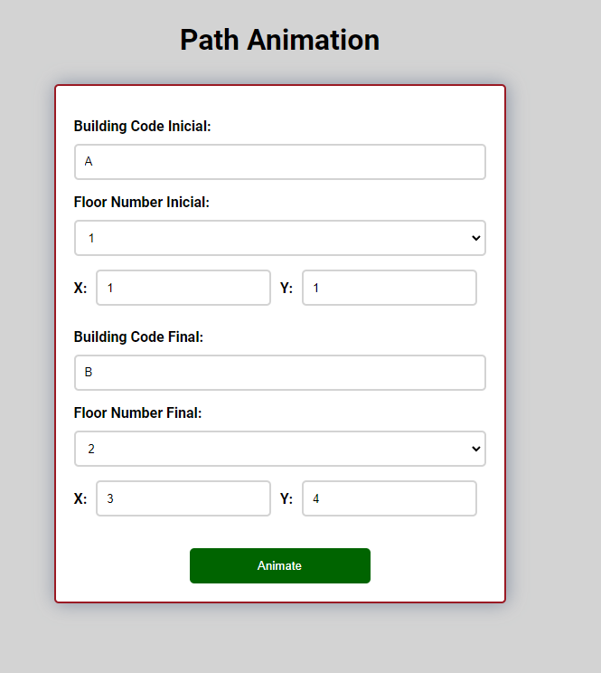

# US 609

Este documento contém a documentação relativa à *User Story (US)* 609.

## 1. Contexto

Esta *US* foi introduzida no *sprint* atual, e requer a possibilidade de animar a movimentação do robot segundo um determinado caminho.
Esta *US* faz parte do módulo "Visualização 3D" e pertence à unidade curricular de **SGRAI**.

## 2. Requisitos

***US 609*** - Animar o movimento automático do robot de um dado ponto de partida a um dado ponto de chegada, de acordo com a informação disponibilizada pelo módulo de planeamento de percurso.

Relativamente a este requisito, entendemos que, o utilizador especificará um edificio, andar e coordenadas de inicio e de fim,
depois o robot movimentar-se á do ponto inicial ao final sem interação do utilizador, utilizando as passagens e elevadores necessários.

### 2.1. Dependências encontradas

- **US 607** - Ao navegar interactivamente e ao chegar a uma passagem entre edifícios, deve transitar automaticamente para o piso adjacente.

  **Explicação:** Se não for possível realizar uma travessia por passageway não será possivel animar esse movimento.

- **US 608** - Ao navegar interactivamente e ao entrar num elevador, deve ser possível escolher o piso a que se pretende aceder e transitar para esse piso.

  **Explicação:** Se não for possível realizar uma travessia por elevador não será possivel animar esse movimento.

### 2.2. Critérios de aceitação

**CA 1:** Tem de ser especificado um ponto de origem e um ponto de chegada.

## 3. Análise

### 3.1. Respostas do cliente

> **Questão:** Gostaria de saber como é que o percurso automatico se procede. É o utilizador que chega ao módulo de visualização 3D e escolhe um ponto inicial e depois um final e o robot percorre esse percurso, ou é 
> através de uma tarefa que já foi aceite e o utilizador quer ver o percurso dessa tarefa?
>
> **Resposta:** A partir da US 500 "consultar plano de execução" o utilizador poderá ver a sequencia de tarefas a executar, por exemplo numa tabela. em cada linha dessa tabela deve existir uma acção que permita
> saltar para o módulo de visualização 3D e ver a animação do percurso relativo à tarefa seleccionada.

> **Questão:** Is the animation of the route something like a "preview" of the route that a robot would take (can be replayed as many times as wanted), or is it a live representation of a robot's task progress / 
> current position (data that would need to be calculated and kept track of in the backend)?
>
> **Resposta:** The animation is a preview of the route the robot will execute.

> **Questão:** Gostaria de saber o que deverá acontecer após ser terminada a visualização da tarefa. Será exibida uma mensagem que chegou ao fim, ou deverá ficar a fazer a mesma tarefa em ciclo?
>
> **Resposta:** Deverá ser mostrada uma mensagem e o módulo deve voltar ao modo de movimento interativo.

## 4. Implementação

Na realização desta *US* foi utilizada a UI (e respetivos estilos) da visualização 3D que interage com o utilizador,
o componente *PathAnimationComponent*.

**Commits Relevantes**

[Listagem dos Commits realizados](https://1191296gg.atlassian.net/browse/S50-65)

## 5. Integração/Demonstração

Para aceder a esta funcionalidade na WebApp, deve-se através do menu aceder a 3D Visualization -> Path animation.

Ao entrar na página aparece um forms para ser preenchido.

Ao preencher o forms e clicar no butão *Animate* levará para a visualização 3D.

Na visualização 3D haverá a opção de começar a animar ou de voltar para o menu.

Após a animação estar completa apresentará feedback visual adequado.

## 6. Observações

Não existem observações relevantes a acrescentar.