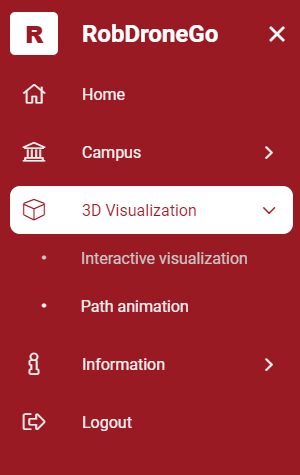
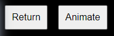
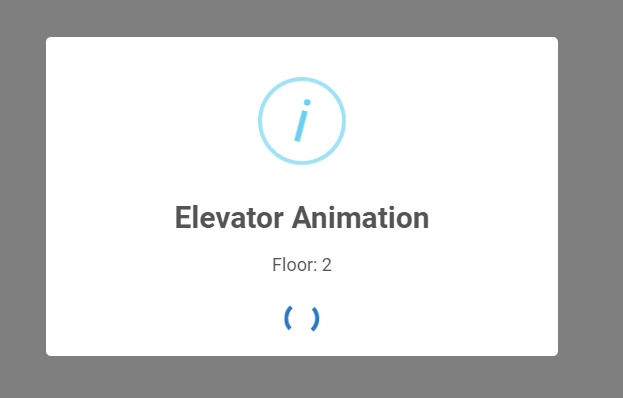

# US 611

Este documento contém a documentação relativa à *User Story (US)* 611.

## 1. Contexto

Esta *US* foi introduzida no *sprint* atual, e requer a apresentação de feedback adequado quando um elevador é utilizado de forma automática.
Esta *US* faz parte do módulo "Visualização 3D" e pertence à unidade curricular de **SGRAI**.

## 2. Requisitos

**US 611** - Ao navegar de forma automática com base no planeamento de percurso, a utilização de elevadores deve ter feedback visual adequado.

Relativamente a este requisito, entendemos que, ao um elevador entre pisos ser usado de forma automática deve ser apresentado feedback adequado.

### 2.1. Dependências encontradas

- **US 609** - Animar o movimento automático do robot de um dado ponto de partida a um dado ponto de chegada, de acordo com a informação disponibilizada pelo módulo de planeamento de percurso.

  **Explicação:** Se o robot não se movimentar automáticamente não usará uma passagem de forma automática.

### 2.2. Critérios de aceitação

**CA 1:** Deve ser apresentado feedback adequado.

## 3. Análise

### 3.1. Respostas do cliente

> **Questão:** Relativamente à [US 611] "A utilização de elevadores deve ter feedback visual adequado", não parece viável a ideia apresentada para a [US610] sendo que pop up já estaria 
> incluido na questão da seleção do piso. O que seria, desta forma, o feedback visual expectável na utilização de elevadores?
>
> **Resposta:** A pop up a perguntar qual o piso de destino é um feedback adequado, no entanto podem extender esse feedback mostrando uma animação do elevador em movimento para se 
> deslocar para o piso de destino.

## 4. Implementação

Na realização desta *US* foi utilizada a UI (e respetivos estilos) da visualização 3D que interage com o utilizador,
o componente *PathAnimationComponent*.

**Commits Relevantes**

[Listagem dos Commits realizados](https://1191296gg.atlassian.net/browse/S50-67)

## 5. Integração/Demonstração

Para aceder a esta funcionalidade na WebApp, deve-se através do menu aceder a 3D Visualization -> Path animation.

Na visualização 3D haverá a opção de começar a animar ou de voltar para o menu.

Feedback.

## 6. Observações

Não existem observações relevantes a acrescentar.
